Camera trap species exploration
================
Lain E. Pardo

## Description

This code provides a general protocol for exploring camera trap data
from Snapshot Safari Project.

This is based on the Snapshot safari project South Africa, but can be
applied to any camera based study. This is a sample script using a
snapshot report from Mountain Zebra S1. In order to use this script for
other sites, you have to adapt certain names in the arguments, but
specially in the outputs (e.g. csv tables, figures, etc).

In this exercise we are using several reserves, but can be easily
modified for a single reserve, maintaining the same structure. Use the
tab bottom (right top of this screen) to get to a particular section of
interest, however, some sections depends on previous sections.

#### note:

This is a work in progress if you want to contribute or find any issues
please let us know.

Please give credit to Lain E. Pardo, Snapshot Safari or WildEco Lab at
Nelson Mandela University. We are open to collaborations.

### Load packages

``` r
library(ggplot2)  
library(hrbrthemes)
library(tidyverse)
```

    ## -- Attaching packages --------------------------------------- tidyverse 1.3.1 --

    ## v tibble  3.1.4     v dplyr   1.0.7
    ## v tidyr   1.1.3     v stringr 1.4.0
    ## v readr   2.0.1     v forcats 0.5.1
    ## v purrr   0.3.4

    ## -- Conflicts ------------------------------------------ tidyverse_conflicts() --
    ## x dplyr::filter() masks stats::filter()
    ## x dplyr::lag()    masks stats::lag()

### load file

``` r
sp_rec <- read_csv("data_in/+sp_records_only_mammals_updated_temp.csv")
```

    ## New names:
    ## * `` -> ...1

    ## Rows: 19674 Columns: 16

    ## -- Column specification --------------------------------------------------------
    ## Delimiter: ","
    ## chr  (11): Reserve.Location, Camera.Site, Common.Name, Scientific.Name, Phot...
    ## dbl   (4): ...1, Number.of.Individuals, Roll, Consensus
    ## time  (1): Photo.Time

    ## 
    ## i Use `spec()` to retrieve the full column specification for this data.
    ## i Specify the column types or set `show_col_types = FALSE` to quiet this message.

## How many sites, species and records per reserves

``` r
unique(sp_rec$Common.Name)
```

    ##  [1] "giraffe"                 "zebraburchells"         
    ##  [3] "kudu"                    "impala"                 
    ##  [5] "warthog"                 "hyenaspotted"           
    ##  [7] "elephant"                "wildebeestblue"         
    ##  [9] "aardvarkantbear"         "hare"                   
    ## [11] "steenbok"                "duikercommon"           
    ## [13] "honeybadger"             "leopard"                
    ## [15] "baboon"                  "genetcommonsmallspotted"
    ## [17] "wilddog"                 "porcupine"              
    ## [19] "jackalsidestriped"       "grysbokcape"            
    ## [21] "rhinoceroswhite"         "bushpig"                
    ## [23] "lion"                    "bushbuck"               
    ## [25] "buffalo"                 "civet"                  
    ## [27] "nyala"                   "rhinocerosblack"        
    ## [29] "hippopotamus"            "waterbuck"              
    ## [31] "springbok"               "foxbateared"            
    ## [33] "jackalblackbacked"       "aardwolf"               
    ## [35] "gemsbokoryx"             "klipspringer"           
    ## [37] "rockhyraxdassie"         "hartebeestred"          
    ## [39] "zebramountain"           "polecatstriped"         
    ## [41] "hyenabrown"              "catafricanwild"         
    ## [43] "reedbuck"                "caracal"                
    ## [45] "sable"                   "monkeyvervet"           
    ## [47] "genetrustyspotted"       "blesbok"                
    ## [49] "wildebeestblack"         "eland"                  
    ## [51] "harescrub"               "mongooseyellow"         
    ## [53] "harespring"              "reedbuckmountain"       
    ## [55] "bontebok"                "rhebokgrey"             
    ## [57] "genetcapelargespotted"   "foxcape"                
    ## [59] "meerkatsuricate"         "cheetah"                
    ## [61] "catblackfooted"          "rodent"                 
    ## [63] "rhinoceros"              "mongooseslender"        
    ## [65] "serval"                  "tsessebe"               
    ## [67] "fallowdeer"              "weaselstriped"          
    ## [69] "mongoosebanded"          "mongoose"               
    ## [71] "antelope"                "zebra"                  
    ## [73] "mongoosedwarf"           "mongoosewhitetailed"    
    ## [75] "jackal"                  "roan"                   
    ## [77] "pangolin"                "squirrelground"

``` r
unique(sp_rec$Camera.Site)
```

    ##   [1] "APN_K011" "APN_K012" "APN_K013" "APN_K014" "APN_K021" "APN_K023"
    ##   [7] "APN_K024" "APN_K034" "APN_K041" "APN_K044" "APN_K051" "APN_K053"
    ##  [13] "APN_K062" "APN_K064" "APN_K073" "APN_K082" "AUG_C02"  "AUG_C03" 
    ##  [19] "AUG_C11"  "AUG_C13"  "AUG_C14"  "AUG_D01"  "AUG_D02"  "AUG_D03" 
    ##  [25] "AUG_D05"  "AUG_D06"  "AUG_D10"  "AUG_D11"  "AUG_D13"  "AUG_E05" 
    ##  [31] "AUG_E08"  "AUG_E09"  "AUG_E11"  "AUG_E12"  "AUG_E13"  "AUG_E14" 
    ##  [37] "BLO_A04"  "BLO_B02"  "BLO_B03"  "BLO_B04"  "BLO_B05"  "BLO_B06" 
    ##  [43] "BLO_C02"  "BLO_C03"  "BLO_C04"  "BLO_C05"  "BLO_C06"  "BLO_C07" 
    ##  [49] "BLO_D02"  "BLO_D03"  "BLO_D04"  "BLO_D05"  "BLO_D06"  "BLO_E04" 
    ##  [55] "CDB_A05"  "CDB_A06"  "CDB_B04"  "CDB_B06"  "CDB_B07"  "CDB_C03" 
    ##  [61] "CDB_C04"  "CDB_C05"  "CDB_C06"  "CDB_C07"  "CDB_D02"  "CDB_D03" 
    ##  [67] "CDB_D04"  "CDB_D05"  "CDB_D06"  "CDB_E02"  "CDB_E03"  "CDB_E04" 
    ##  [73] "CDB_E05"  "CDB_F03"  "DHP_A06"  "DHP_B06"  "DHP_B08"  "DHP_C07" 
    ##  [79] "DHP_D01"  "DHP_D02"  "DHP_D03"  "DHP_D05"  "DHP_E02"  "DHP_E03" 
    ##  [85] "DHP_E04"  "DHP_E05"  "DHP_F02"  "GOE_A01"  "GOE_A03"  "GOE_A04" 
    ##  [91] "GOE_A05"  "GOE_A06"  "GOE_A07"  "GOE_A08"  "GOE_A09"  "GOE_A10" 
    ##  [97] "GOE_A11"  "GOE_A12"  "GOE_A13"  "GOE_A14"  "GOE_A15"  "GOE_A16" 
    ## [103] "GOE_A17"  "GOE_A18"  "GOE_A19"  "GOE_A20"  "KAR_A01"  "KAR_A02" 
    ## [109] "KAR_A03"  "KAR_B01"  "KAR_B02"  "KAR_B03"  "KAR_C01"  "KAR_C02" 
    ## [115] "KAR_C03"  "KAR_C04"  "KAR_D01"  "KAR_D02"  "KAR_D03"  "KAR_D04" 
    ## [121] "KAR_E01"  "KAR_E02"  "KAR_E03"  "KAR_F01"  "KAR_F02"  "KAR_F03" 
    ## [127] "KGA_A01"  "KGA_A02"  "KGA_A03"  "KGA_A04"  "KGA_A05"  "KGA_A06" 
    ## [133] "KGA_A07"  "KGA_A08"  "KGA_A09"  "KGA_A10"  "KGA_A11"  "KGA_B01" 
    ## [139] "KGA_B02"  "KGA_B03"  "KGA_B04"  "KGA_B05"  "KGA_B06"  "KGA_B07" 
    ## [145] "KGA_B08"  "KGA_B09"  "KHA_A03"  "KHA_A04"  "KHA_A05"  "KHA_B02" 
    ## [151] "KHA_B03"  "KHA_B04"  "KHA_B05"  "KHA_B06"  "KHA_C02"  "KHA_C03" 
    ## [157] "KHA_C04"  "KHA_C05"  "KHA_C06"  "KHA_D02"  "KHA_D03"  "KHA_D04" 
    ## [163] "KHA_D05"  "KHA_D06"  "KHA_E03"  "KHA_E04"  "KRU_1"    "KRU_2"   
    ## [169] "KRU_3"    "KRU_4"    "KRU_5"    "KRU_6"    "KRU_7"    "KRU_8"   
    ## [175] "KRU_9"    "KRU_10"   "KRU_11"   "KRU_12"   "KRU_13"   "KRU_14"  
    ## [181] "KRU_15"   "KRU_16"   "KRU_18"   "KRU_19"   "KRU_20"   "KRU_22"  
    ## [187] "KRU_23"   "KRU_24"   "KRU_25"   "KRU_27"   "KRU_28"   "KRU_29"  
    ## [193] "KRU_30"   "KRU_34"   "KRU_35"   "KRU_36"   "KRU_41"   "KRU_42"  
    ## [199] "KRU_43"   "KRU_44"   "KRU_45"   "KRU_46"   "KRU_47"   "KRU_48"  
    ## [205] "KRU_49"   "MAD_A03"  "MAD_A04"  "MAD_A05"  "MAD_A06"  "MAD_B03" 
    ## [211] "MAD_B04"  "MAD_B05"  "MAD_B06"  "MAD_C04"  "MAD_C05"  "MAD_C06" 
    ## [217] "MAD_C07"  "MAD_D03"  "MAD_D04"  "MAD_D05"  "MAD_D06"  "MAD_D07" 
    ## [223] "MAD_E04"  "MAD_E06"  "MAD_E07"  "MAD_F03"  "MAD_F04"  "MAD_F05" 
    ## [229] "MAD_G04"  "MAD_G05"  "MAD_G06"  "MAD_G07"  "MAD_G08"  "MAD_H04" 
    ## [235] "MAD_H05"  "MAD_H06"  "MAD_H07"  "MAD_H08"  "MAD_H09"  "MAD_I04" 
    ## [241] "MAD_I05"  "MAD_I06"  "MAD_I07"  "MAD_I08"  "MAD_I09"  "MTZ_B04" 
    ## [247] "MTZ_B05"  "MTZ_B08"  "MTZ_C06"  "MTZ_C07"  "MTZ_C08"  "MTZ_D03" 
    ## [253] "MTZ_D04"  "MTZ_D05"  "MTZ_D06"  "MTZ_D07"  "MTZ_E03"  "MTZ_E04" 
    ## [259] "MTZ_E05"  "MTZ_E06"  "MTZ_F04"  "MTZ_F05"  "MTZ_G04"  "NAM_A01" 
    ## [265] "NAM_A02"  "NAM_A03"  "NAM_A04"  "NAM_A05"  "NAM_A06"  "NAM_A07" 
    ## [271] "NAM_A08"  "NAM_A09"  "NAM_A10"  "NAM_A11"  "NAM_A12"  "NAM_A13" 
    ## [277] "NAM_A14"  "NAM_A16"  "NAM_A17"  "NAM_A18"  "NAM_A19"  "NAM_A20" 
    ## [283] "PLN_A01"  "PLN_A02"  "PLN_A03"  "PLN_B01"  "PLN_B02"  "PLN_B03" 
    ## [289] "PLN_B04"  "PLN_B05"  "PLN_C01"  "PLN_C02"  "PLN_C03"  "PLN_C04" 
    ## [295] "PLN_C05"  "PLN_C06"  "PLN_D01"  "PLN_D02"  "PLN_D03"  "PLN_D04" 
    ## [301] "PLN_D05"  "PLN_E02"  "PLN_E03"  "PLN_E04"  "SOM_A2"   "SOM_B1"  
    ## [307] "SOM_C1"   "SOM_C4"   "SOM_C5"   "SOM_C6"   "SOM_D1"   "TAN_A01" 
    ## [313] "TAN_A02"  "TAN_A03"  "TAN_A04"  "TAN_A05"  "TAN_A06"  "TAN_A07" 
    ## [319] "TAN_A08"  "TAN_A09"  "TAN_A10"  "TAN_A11"  "TAN_A12"  "TAN_A13" 
    ## [325] "TAN_A14"  "TAN_A16"  "TAN_A17"  "TAN_B01"  "TAN_B02"  "TSW_KA02"
    ## [331] "TSW_KA03" "TSW_KA05" "TSW_KA06" "TSW_KA07" "TSW_KB02" "TSW_KB03"
    ## [337] "TSW_KB04" "TSW_KB05" "TSW_KB06" "TSW_KB07" "TSW_KC02" "TSW_KC03"
    ## [343] "TSW_KC04" "TSW_KC05" "TSW_KC06" "TSW_KC07" "TSW_KD02" "TSW_KD03"
    ## [349] "TSW_KD06" "TSW_LB02" "TSW_LB03" "TSW_LC01" "TSW_LC03" "TSW_LD02"
    ## [355] "TSW_LD03" "TSW_LE01" "TSW_LE02" "TSW_LE03" "VEN_A01"  "VEN_A02" 
    ## [361] "VEN_A03"  "VEN_A04"  "VEN_A05"  "VEN_B01"  "VEN_B02"  "VEN_B04" 
    ## [367] "VEN_B05"  "VEN_C01"  "VEN_C02"  "VEN_C04"  "VEN_C05"  "VEN_D01" 
    ## [373] "VEN_D02"  "VEN_D04"  "VEN_E02"

``` r
data_gral <- sp_rec %>% 
  group_by(Reserve.Location) %>% 
  summarise(sites = n_distinct(Camera.Site),
            No_spp = n_distinct(Common.Name), 
            events = n())
data_gral 
```

    ## # A tibble: 18 x 4
    ##    Reserve.Location sites No_spp events
    ##    <chr>            <int>  <int>  <int>
    ##  1 APN                 16     30    987
    ##  2 AUG                 20     18    284
    ##  3 BLO                 18     30   3626
    ##  4 CDB                 20     25   2108
    ##  5 DHP                 13     12    203
    ##  6 GOE                 19     12    329
    ##  7 KAR                 20     20    674
    ##  8 KGA                 20     24    531
    ##  9 KHA                 20     26    497
    ## 10 KRU                 39     27   1577
    ## 11 MAD                 40     41   2537
    ## 12 MTZ                 18     35   1263
    ## 13 NAM                 19     19    425
    ## 14 PLN                 22     40    920
    ## 15 SOM                  7     30    443
    ## 16 TAN                 18     14    151
    ## 17 TSW                 29     38   2035
    ## 18 VEN                 17     33   1084

``` r
#write.csv(data_gral, "data_out/gral_sites_spp.csv")
```

# Plot species records/events

``` r
sp_allsites <- sp_rec %>% 
  group_by(Common.Name) %>% 
  summarise (events = n())
#write.csv(sp_allsites , "data_out/sp_list_events.csv")

#library(forcats)

sp_allsites %>%
  mutate(Common.Name = fct_reorder(Common.Name, desc(events))) %>%
  ggplot(aes(x = Common.Name, y = events))  +
  geom_bar(stat = "identity") +
  theme(axis.text.x  = element_text(angle = 90,hjust = 1, vjust = 0.5),
        text = element_text(size=8))+ #working
  ggtitle("Independent events per spp (no std)")
```

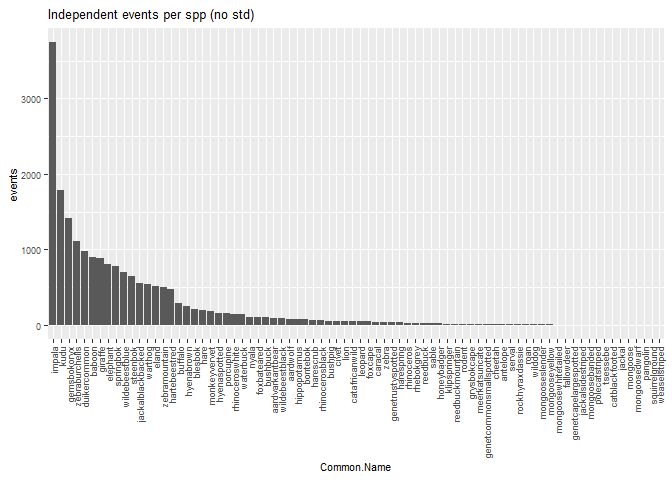<!-- -->

``` r
#ggsave("figures/events_per_sp.jpeg") 
```

# Plot species richness per reserve

``` r
sp_res <- data_gral %>%
  mutate(Reserve.Location = fct_reorder(Reserve.Location, desc(No_spp))) %>%
  ggplot(aes(x = Reserve.Location, y = No_spp))  +
  geom_bar(stat = "identity") +
  theme(axis.text.x  = element_text(angle = 90,hjust = 1, vjust = 0.5),
        text = element_text(size=8))+ #working
  ggtitle("Number of observed species per reserve")

sp_res
```

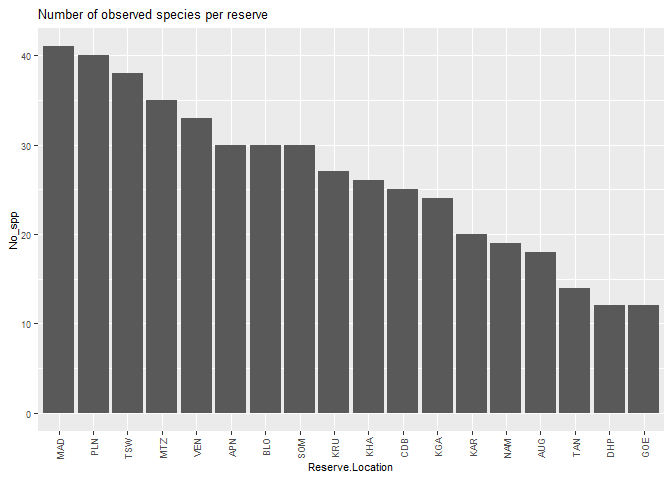<!-- -->

``` r
#ggsave("figures/sp_per_reserve.jpeg") 
```

## Events per specie per reserve

Make sure you are using independent records, if not interpret
accordingly. Also note that this is not taking into account effort (see
1_SNAPSHOT_source_functions.R)

``` r
sp_event <- plyr::ddply(sp_rec, c("Common.Name", "Reserve.Location"), summarise, 
                 events = n()) 
#plot it

sp_res_ev <- sp_event %>%
  mutate(Reserve.Location = fct_reorder(Reserve.Location, desc(events))) %>%
  ggplot(aes(x = Reserve.Location, y = events))  +
  geom_bar(stat = "identity") +
  theme(axis.text.x  = element_text(angle = 90,hjust = 1, vjust = 0.5),
        text = element_text(size=3)) + 
  facet_wrap("Common.Name", scales = "free") +
  ggtitle("Number events per species per reserve")
sp_res_ev
```

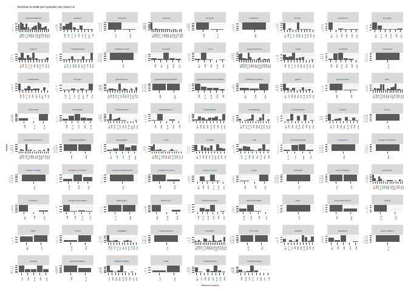<!-- -->

``` r
#ggsave("figures/events_per_sp_per_res.jpeg") 
```

## Try to separate it into different plots for visualization purposes

``` r
library(ggforce)
```

    ## Warning: package 'ggforce' was built under R version 4.0.5

``` r
class(sp_event$Common.Name)
```

    ## [1] "character"

``` r
sp_event$Common.Name <- as.factor(sp_event$Common.Name)

sp_res_ev2 <- sp_event %>%
  mutate(Reserve.Location = fct_reorder(Reserve.Location, desc(events))) %>%
  ggplot(aes(x = Reserve.Location, y = events))  +
  geom_bar(stat = "identity") +
  theme(axis.text.x  = element_text(angle = 90,hjust = 1, vjust = 0.5),
        text = element_text(size=6)) + 
  facet_wrap_paginate("Common.Name", ncol = 5, nrow = 5, page = 1, scales = "free") +
  ggtitle("Number events per species per reserve") #with this method I will need to copy and add "page = 2 for the other page and so on
sp_res_ev2
```

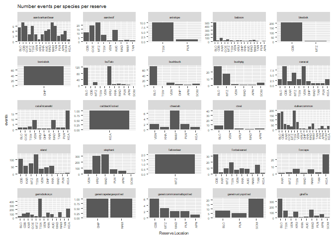<!-- -->

``` r
#ggsave("figures/events_per_sp_per_res_p1.jpeg")

#second page
sp_res_ev3 <- sp_event %>%
  mutate(Reserve.Location = fct_reorder(Reserve.Location, desc(events))) %>%
  ggplot(aes(x = Reserve.Location, y = events))  +
  geom_bar(stat = "identity") +
  theme(axis.text.x  = element_text(angle = 90,hjust = 1, vjust = 0.5),
        text = element_text(size=6)) + 
  facet_wrap_paginate("Common.Name", ncol = 5, nrow = 5, page = 2, scales = "free") +
  ggtitle("Number events per species per reserve")
sp_res_ev3
```

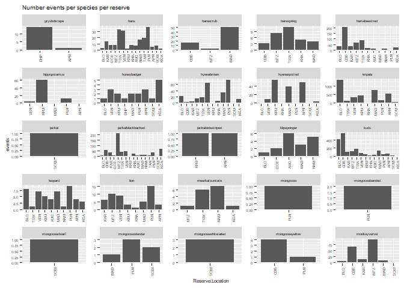<!-- -->

``` r
#ggsave("figures/events_per_sp_per_res_p2.jpeg")

#3th page
sp_res_ev4 <- sp_event %>%
  mutate(Reserve.Location = fct_reorder(Reserve.Location, desc(events))) %>%
  ggplot(aes(x = Reserve.Location, y = events))  +
  geom_bar(stat = "identity") +
  theme(axis.text.x  = element_text(angle = 90,hjust = 1, vjust = 0.5),
        text = element_text(size=6)) + 
  facet_wrap_paginate("Common.Name", ncol = 5, nrow = 5, page = 3, scales = "free") +
  ggtitle("Number events per species per reserve")
sp_res_ev4
```

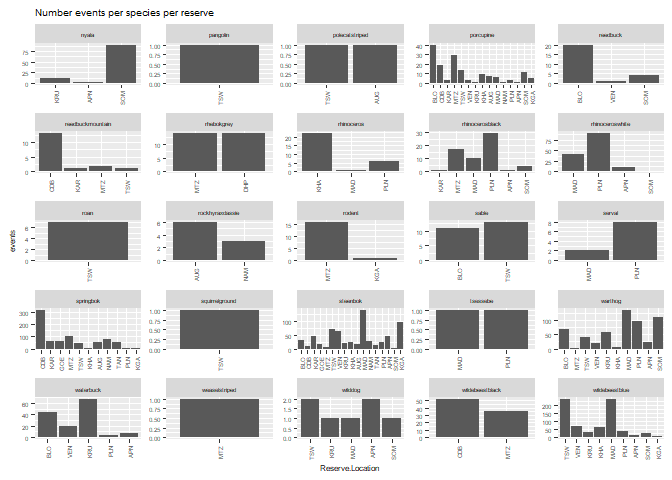<!-- -->

``` r
#ggsave("figures/events_per_sp_per_res_p3.jpeg") 

#page 4 not working,..had to set col=3 and nrow=1 and page 26 for the three species left

#four page
#par(mfrow = c(3, 1))
sp_res_ev5 <- sp_event %>%
  mutate(Reserve.Location = fct_reorder(Reserve.Location, desc(events))) %>%
  ggplot(aes(x = Reserve.Location, y = events))  +
  geom_bar(stat = "identity") +
  theme(axis.text.x  = element_text(angle = 90,hjust = 1, vjust = 0.5),
        text = element_text(size=6)) + 
  facet_wrap_paginate("Common.Name", ncol = 3, nrow = 1, page = 26, scales = "free") +
  ggtitle("Number events per species per reserve")
sp_res_ev5
```

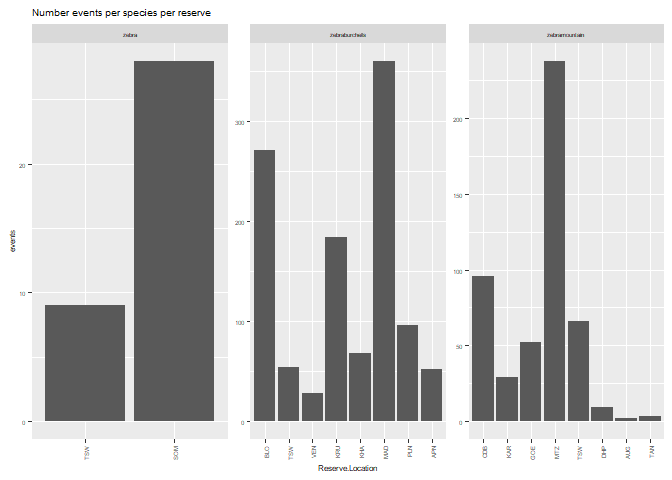<!-- -->

``` r
#
```

this plot is fine but a bit bulky lets try another representation

# Species vs reserve events matrix

if you have camera sites instead, just change Reserve.Location for your
camera site

``` r
det_tab <- tapply(sp_event$Common.Name,
                  list(sp_event$Common.Name,sp_event$Reserve.Location),
                  length) #give us only the presence
det_tab <- tapply(sp_rec$Common.Name,
                  list(sp_rec$Common.Name,sp_rec$Reserve.Location),
                  length)   
write.csv(det_tab, "data_out/sp_events_matrix.csv")
  

library(plot.matrix)
```

    ## Warning: package 'plot.matrix' was built under R version 4.0.5

``` r
par(mar=c(4,8,1,5))
plot(log(det_tab[order(apply(det_tab,1,max,na.rm=T),decreasing = TRUE),]), 
     col = viridis::viridis(30,option = "D"),
     axis.row = list(side=2, las=1, cex.axis=0.7), ylab="", main="") 
```

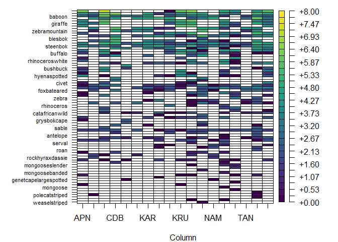<!-- -->

base plot, not supernice, let´s try ggplot better

# ggplot heat map for events per species

we can get a quick similarity matrix to see general patterns

``` r
#first change NA to zeros
det_tab[is.na(det_tab)] <- 0

# heatmap with similarity index 

heatm <-heatmap(det_tab) #this includes a , just confirm if values are scaled then... 
```

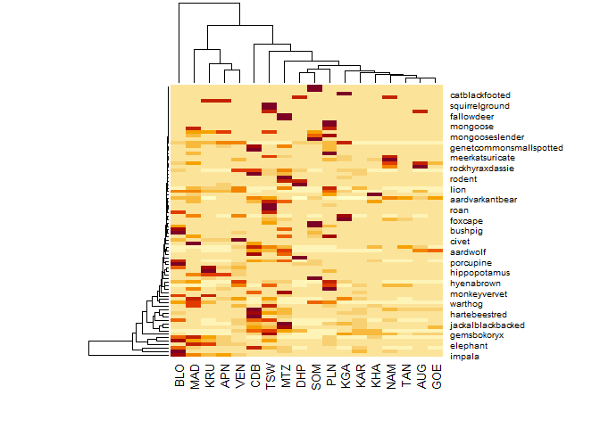<!-- -->

``` r
#seems to work only with matrix

#ggsave("figures/heat_map_simil.jpeg") #page 4 not working,..try later...***
```

but it is probably clearer to use another heatmap

``` r
det_tab.df <- as.data.frame(det_tab)
det_tab.df <- tibble::rownames_to_column(det_tab.df, "Species")


library(hrbrthemes)
library(viridis)
```

    ## Warning: package 'viridis' was built under R version 4.0.5

    ## Loading required package: viridisLite

    ## Warning: package 'viridisLite' was built under R version 4.0.5

``` r
temp <- det_tab.df %>%
  pivot_longer(!Species, names_to = "Reserve", values_to = "events")
range(temp$events)
```

    ## [1]    0 1362

``` r
## put correct format
det_tab.df %>%
  
  pivot_longer(!Species, names_to = "Reserve", values_to = "events") %>% 
  
  # create a new variable from count to discretized the events, otherwise the colours are meaningless
  
mutate(countfactor=cut(events,breaks=c(0,20,30,40,50, 150,300,450,600,750,900, max(events,na.rm=T)),
labels=c("0-20", "21-30","31-40","41-50","51-150","151-300","301-450","451-600","602-750",
         "750-900",">901"))) %>%
  
  # Viz
  ggplot(aes(Reserve, Species, fill = countfactor)) + #, color = terrain.colors(nrow(.))) + 
  geom_tile() +
  #theme(legend.position="none") +
  scale_fill_viridis(discrete=TRUE) +
  #scale_fill_gradientn(low="white", high="blue") +
  #scale_fill_distiller(palette = "BrBg") +
  theme_ipsum() +
  theme(axis.text.x  = element_text(angle = 90,hjust = 1, vjust = 0.5, size=8),
        axis.text.y  = element_text(size=5),
        text = element_text(size=2),
        legend.text=element_text(size=7,face="bold")) 
```

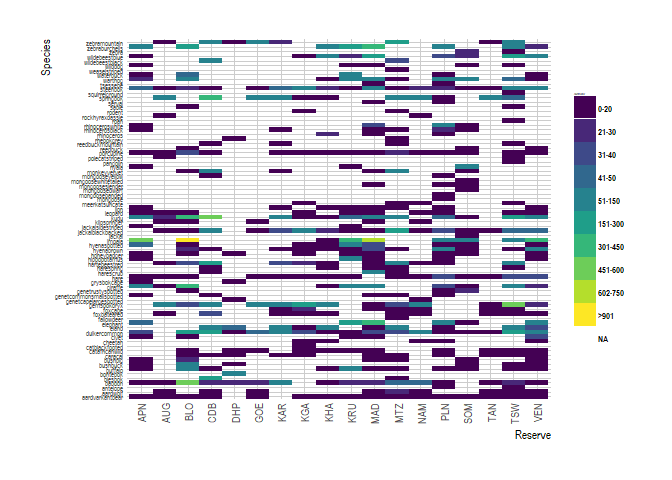<!-- -->

``` r
#ggsave("figures/heat_map_cats_events.jpeg") #
```

# Survey lenght

``` r
#change the date format, we need yyyy-mm-dd 

sp_rec$Photo.Date <- lubridate::parse_date_time(x = sp_rec$Photo.Date,
                                                       order = c("dmY", "Ymd","dmy"))


survey_lenght <- plyr::ddply(sp_rec, c("Reserve.Location", "Camera.Site"), # 
                          summarise,  
                          First.Photo.Date = min(as.Date(Photo.Date)),
                          Last.Photo.Date = max(as.Date(Photo.Date)),
                          Cam.Days = Last.Photo.Date-First.Photo.Date)  
head(survey_lenght)
```

    ##   Reserve.Location Camera.Site First.Photo.Date Last.Photo.Date Cam.Days
    ## 1              APN    APN_K011       2018-10-25      2018-12-12  48 days
    ## 2              APN    APN_K012       2018-10-25      2018-12-26  62 days
    ## 3              APN    APN_K013       2018-10-23      2019-01-22  91 days
    ## 4              APN    APN_K014       2018-10-26      2018-11-28  33 days
    ## 5              APN    APN_K021       2018-10-23      2019-01-25  94 days
    ## 6              APN    APN_K023       2018-10-23      2019-01-24  93 days

``` r
#write.csv(survey_lenght,"data_out/survey_lenght_all_updated_.csv")
```

## Plot survey lenght

### Approach one: from survey lenght

``` r
surv_1 <- survey_lenght %>% 
        ggplot() +
        geom_segment(aes(x= First.Photo.Date, xend = Last.Photo.Date, 
                   y = Camera.Site, yend = Camera.Site ))
surv_1
```

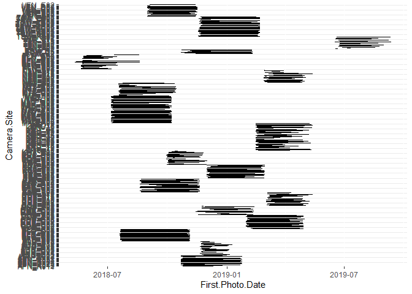<!-- -->

``` r
#way too many sites, difficult to see in one chart, but you can customize this
# each of the "groups" represent cameras within a reserve, we can see they were surveyed at 
# different times
```

### Approach two: from the species records

``` r
head(sp_rec)
```

    ## # A tibble: 6 x 16
    ##    ...1 Reserve.Location Camera.Site Common.Name    Scientific.Name         
    ##   <dbl> <chr>            <chr>       <chr>          <chr>                   
    ## 1  1121 APN              APN_K011    giraffe        Giraffa camelopardalis  
    ## 2  1122 APN              APN_K011    zebraburchells Equus quagga burchellii 
    ## 3  1123 APN              APN_K011    giraffe        Giraffa camelopardalis  
    ## 4  1124 APN              APN_K011    kudu           Tragelaphus strepsiceros
    ## 5  1125 APN              APN_K011    impala         Aepyceros melampus      
    ## 6  1126 APN              APN_K011    impala         Aepyceros melampus      
    ## # ... with 11 more variables: Photo.Date <dttm>, Photo.Time <time>,
    ## #   Number.of.Individuals <dbl>, Photo.ID <chr>, Season <chr>, Roll <dbl>,
    ## #   Zooniverse.Url.1 <chr>, Zooniverse.Url.2 <chr>, Zooniverse.Url.3 <chr>,
    ## #   Consensus <dbl>, DateTimeOriginal <chr>

``` r
sp_rec$DateTimeOriginal1
```

    ## Warning: Unknown or uninitialised column: `DateTimeOriginal1`.

    ## NULL

``` r
sp_rec$DateTimeOriginal <- as.POSIXct(sp_rec$DateTimeOriginal, format = "%d/%m/%Y %k:%M") # transform character to POSIXct = date-time
 
sp_rec %>%  ggplot() + 
  geom_point(aes(x = DateTimeOriginal, y = Camera.Site,
                                     col = Common.Name),
                                   alpha = 0.5, show.legend = FALSE) +
    scale_x_datetime(date_labels = "%d %b %y", # you can also use other date formatting codes (here I chose %d (day digits) %b (month abbreviation) and %y (year 2 last digits))
                 date_minor_breaks = "1 week", # you can also choose to change breaks to eg "1 week"
                 date_breaks = "2 months") +
    theme(axis.text.x = element_text(angle = 45, vjust = 1, hjust=1)) +
    xlab("Date") + ylab("Camera")
```

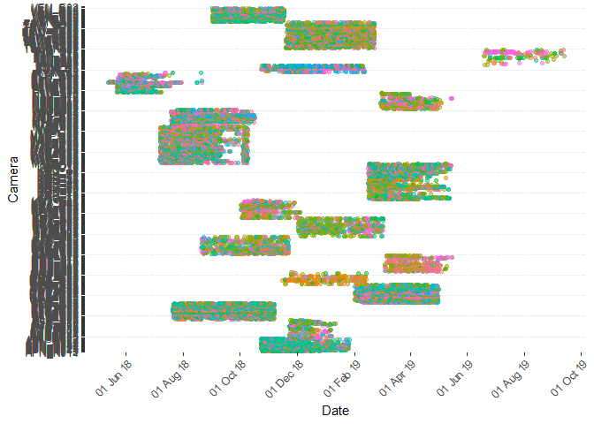<!-- -->

``` r
#ggsave("figures/survey_effort_all_points.jpeg")
#a lot of points too but better to see each point (species) and potential gaps
# if you want to put this figures into a report, then tidy it up
```

# Spatial splicit visualizations

we now want to use other covariates from other files, such as the
latitute and longitute, or scientific name, as we want to do some
spatial explicit maps see source functions to see how to include
scientific names into the species records

## Load species traits files

this contains the scientific name

``` r
traits <- read_csv("data_in/+traits_in_sp_records_updated.csv")
```

    ## Rows: 91 Columns: 14

    ## -- Column specification --------------------------------------------------------
    ## Delimiter: ","
    ## chr (12): Scien.Code, Comm.Code, Snapshot.Name, Common.Name, Scientific.Name...
    ## dbl  (2): id, Mass.kg

    ## 
    ## i Use `spec()` to retrieve the full column specification for this data.
    ## i Specify the column types or set `show_col_types = FALSE` to quiet this message.

## Check that the names in spp records match sp traits

show all unique entries of the scientific names in spp records that are
not in traits

``` r
unique(sp_rec$Scientific.Name)[!unique(sp_rec$Scientific.Name) %in% traits$Scientific.Name]
```

    ## [1] NA

``` r
unique(traits$Scientific.Name)
```

    ##  [1] "Orycteropus afer"              "Proteles cristata"            
    ##  [3] "Papio ursinus"                 "Damaliscus pygargus phillipsi"
    ##  [5] "Damaliscus pygargus pygargus"  "Syncerus caffer"              
    ##  [7] "Galago moholi"                 "Tragelaphus scriptus"         
    ##  [9] "Potamochoerus larvatus"        "Caracal caracal"              
    ## [11] "Felis silvestris"              "Felis nigripes"               
    ## [13] "Acinonyx jubatus"              "Civettictis civetta"          
    ## [15] "Madoqua kirkii"                "Sylvicapra grimmia"           
    ## [17] "Cephalophus natalensis"        "Taurotragus oryx"             
    ## [19] "Loxodonta africana"            "Dama dama"                    
    ## [21] "Otocyon megalotis"             "Vulpes chama"                 
    ## [23] "Nanger granti"                 "Eudorcas thomsonii"           
    ## [25] "Oryx gazella"                  "Genetta tigrina"              
    ## [27] "Genetta genetta"               "Genetta maculata"             
    ## [29] "Gerbillurus paeba"             "Giraffa camelopardalis"       
    ## [31] "Raphicerus melanotis"          "Raphicerus sharpei"           
    ## [33] "Lepus capensis"                "Lepus saxatilis"              
    ## [35] "Pedetes capensis"              "Alcelaphus buselaphus"        
    ## [37] "Atelerix frontalis"            "Hippopotamus amphibius"       
    ## [39] "Mellivora capensis"            "Parahyeana brunnea"           
    ## [41] "Crocuta crocuta"               "Aepyceros melampus"           
    ## [43] "Canis mesomelas"               "Canis adustus"                
    ## [45] "Oreotragus oreotragus"         "Tragelaphus strepsiceros"     
    ## [47] "Panthera pardus"               "Panthera leo"                 
    ## [49] "Suricata suricatta"            "Mungos mungo"                 
    ## [51] "Helogale parvula"              "Herpestes ichneumon"          
    ## [53] "Paracynictis selousi"          "Galerella sanguinea"          
    ## [55] "Galerella pulverulentus"       "Atilax paludinosus"           
    ## [57] "Ichneumia albicauda"           "Cynictis penicillata"         
    ## [59] "Rhynchogale melleri"           "Chlorocebus pygerythrus"      
    ## [61] "Tragelaphus angasii"           "Ourebia ourebi"               
    ## [63] "Aonyx capensis"                "Smutsia temminckii"           
    ## [65] "Ictonyx striatus"              "Hystrix africaeaustralis"     
    ## [67] "Pronolagus rupestris"          "Bunolagus monticularis"       
    ## [69] "Redunca arundinum"             "Redunca fulvorufula"          
    ## [71] "Pelea capreolus"               "Diceros bicornis"             
    ## [73] "Ceratotherium simum"           "Hippotragus equinus"          
    ## [75] "Procavia capensis"             "Hippotragus niger"            
    ## [77] "Leptailurus serval"            "Antidorcas marsupialis"       
    ## [79] "Xerus inauris"                 "Paraxerus cepapi"             
    ## [81] "Raphicerus campestris"         "Neotragus moschatus"          
    ## [83] "Damaliscus lunatus"            "Phacochoerus africanus"       
    ## [85] "Kobus ellipsiprymnus"          "Poecilogale albinucha"        
    ## [87] "Lycaon pictus"                 "Connochaetes gnou"            
    ## [89] "Connochaetes taurinus"         "Equus quagga burchellii"      
    ## [91] "Equus zebra"

show all unique entries of the snapshot names in spp records that are
not in traits

``` r
unique(sp_rec$Common.Name)[!unique(sp_rec$Common.Name) %in% traits$Snapshot.Name]
```

    ## [1] "rodent"     "rhinoceros" "mongoose"   "antelope"   "zebra"     
    ## [6] "jackal"

now with covariates file

## Load covariates

``` r
covars <- read_csv("data_in/+covariates_sites_fin_updated.csv")
```

    ## Rows: 377 Columns: 22

    ## -- Column specification --------------------------------------------------------
    ## Delimiter: ","
    ## chr   (9): Reserve.Location, Camera.Site, Cam.Brand, Flash, RSA.Vegetation, ...
    ## dbl  (11): ID, Cam.Days, Lat_Y, Long_X, Reserve.Area..km2., Stablishment.Yea...
    ## date  (2): Setup.Date, Last.Photo.Date

    ## 
    ## i Use `spec()` to retrieve the full column specification for this data.
    ## i Specify the column types or set `show_col_types = FALSE` to quiet this message.

``` r
# show all unique sites in spp records that are not covariates

unique(sp_rec$Camera.Site)[!unique(sp_rec$Camera.Site) %in% covars$Camera.Site]
```

    ## character(0)

``` r
# show all unique sites in covariates that are not in sp records
unique(covars$Camera.Site)[!unique(covars$Camera.Site) %in% sp_rec$Camera.Site]
```

    ## [1] "DHP_E01" "TAN_A15"

## Plot lat/long of species richness per site ———————–

``` r
sp_lat <- sp_rec %>% 
  group_by(Camera.Site) %>% 
  summarise(No_spp = n_distinct(Common.Name), 
            events = n())
sp_lat
```

    ## # A tibble: 375 x 3
    ##    Camera.Site No_spp events
    ##    <chr>        <int>  <int>
    ##  1 APN_K011         8     48
    ##  2 APN_K012        10     50
    ##  3 APN_K013        11     82
    ##  4 APN_K014         6     18
    ##  5 APN_K021        12    105
    ##  6 APN_K023        15    111
    ##  7 APN_K024        12     62
    ##  8 APN_K034        13     83
    ##  9 APN_K041        10     80
    ## 10 APN_K044         8    102
    ## # ... with 365 more rows

``` r
#add lat long to data_lat
lat_long <- covars[, c(3, 7:8)]

join <- left_join(sp_lat, lat_long, by = "Camera.Site")

#now plot
e <-ggplot(join, aes(Long_X, Lat_Y)) +
  geom_point(aes(size=No_spp, colour=No_spp),alpha=1) +
  scale_size_area() +
  ylab("Longitude") +
  xlab("Latitute") +
  guides(color= guide_legend("Species #"), size= guide_legend("Species #")) +
  scale_color_gradient(low = "skyblue", high = "blue")
e
```

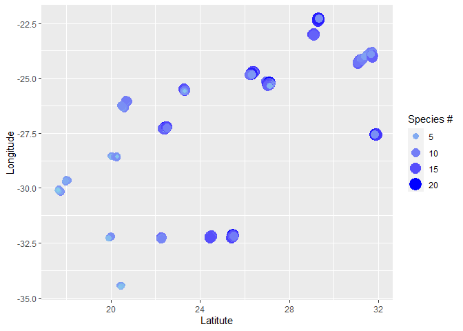<!-- -->

``` r
#not very informative, as cams overlap, would need to split each reserve, not necesary right now...
#save this to add sites, number sp and number of events to covariates file exploration
#but use this to paste it to covars so we can explore responses of richness and events per site
#that´s done in 3.explo_covars

#firt delet lat/long  in join to not repeat it
join <- join[,c(1:3)]
join_cov <- left_join(covars, join, by = "Camera.Site")

#save
#write.csv(join_cov , "data_out/covars_with_richness_events.csv")
```

# Spatial richness per reserve

plot reserve level variable and a single camera coordinate

``` r
lat_long2 <- covars[, c(2, 7:8)]

lat_long3 <- lat_long2 %>% 
  group_by(Reserve.Location) %>% 
  summarise(lat = Lat_Y[1], 
            long = Long_X[1])

join2 <- left_join(lat_long3, data_gral, by = "Reserve.Location")

write.csv(join2, "data_out/rich_reserve_lat_long.csv")

(f <-ggplot(join2, aes(long, lat)) + #try adding label = No_spp, but no geom_text
  geom_point(aes(size=No_spp, colour=No_spp),alpha=1) +
  geom_text(aes(label=Reserve.Location),hjust= -0.25, size = 2.5) + #try geom_text_repel() library(ggrepel)
  scale_size_area() +
  ylab("Longitude") +
  xlab("Latitute") +
  guides(color= guide_legend("Species #"), size= guide_legend("Species #")) +
  scale_color_gradient(low = "skyblue", high = "blue"))
```

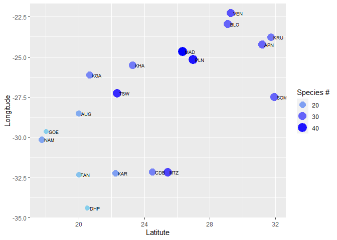<!-- -->

``` r
#ggsave("figures/sp_lat_long.jpeg") #
```

## Boxplot sp richness per reserve

``` r
join_cov %>%
  ggplot(aes(x= reorder(Reserve.Location, No_spp), y = No_spp, fill=Reserve.Location)) +
  geom_boxplot() +
  geom_jitter(color="black", size=0.2, alpha=0.5)+
  theme(legend.position = "none") +
  scale_color_viridis(discrete=TRUE) +
  labs(x = "Reserves", y = "Species richness")
```

    ## Warning: Removed 2 rows containing non-finite values (stat_boxplot).

    ## Warning: Removed 2 rows containing missing values (geom_point).

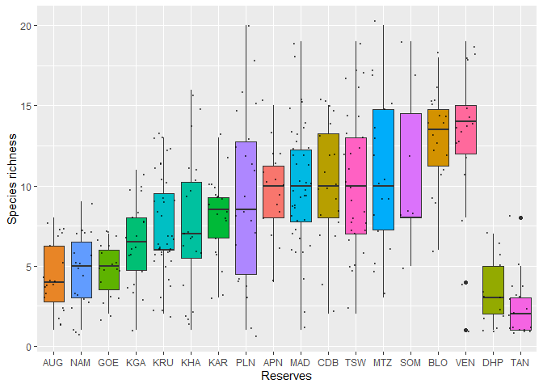<!-- -->

## Put terrain map in the background

# Load libraries

``` r
library(rgdal)
```

    ## Loading required package: sp

    ## Warning: package 'sp' was built under R version 4.0.5

    ## Please note that rgdal will be retired by the end of 2023,
    ## plan transition to sf/stars/terra functions using GDAL and PROJ
    ## at your earliest convenience.
    ## 
    ## rgdal: version: 1.5-26, (SVN revision 1148)
    ## Geospatial Data Abstraction Library extensions to R successfully loaded
    ## Loaded GDAL runtime: GDAL 3.2.1, released 2020/12/29
    ## Path to GDAL shared files: C:/Users/admin/Documents/R/win-library/4.0/rgdal/gdal
    ## GDAL binary built with GEOS: TRUE 
    ## Loaded PROJ runtime: Rel. 7.2.1, January 1st, 2021, [PJ_VERSION: 721]
    ## Path to PROJ shared files: C:/Users/admin/Documents/R/win-library/4.0/rgdal/proj
    ## PROJ CDN enabled: FALSE
    ## Linking to sp version:1.4-5
    ## To mute warnings of possible GDAL/OSR exportToProj4() degradation,
    ## use options("rgdal_show_exportToProj4_warnings"="none") before loading sp or rgdal.
    ## Overwritten PROJ_LIB was C:/Users/admin/Documents/R/win-library/4.0/rgdal/proj

``` r
library(ggmap)
```

    ## Warning: package 'ggmap' was built under R version 4.0.3

    ## Google's Terms of Service: https://cloud.google.com/maps-platform/terms/.

    ## Please cite ggmap if you use it! See citation("ggmap") for details.

``` r
library(raster)
```

    ## Warning: package 'raster' was built under R version 4.0.5

    ## 
    ## Attaching package: 'raster'

    ## The following object is masked from 'package:dplyr':
    ## 
    ##     select

    ## The following object is masked from 'package:tidyr':
    ## 
    ##     extract

``` r
library(hrbrthemes)
library(ggrepel)
```

    ## Warning: package 'ggrepel' was built under R version 4.0.5

#Definitions:

cf is the csv camera file for the site X cf_geo is the Spatial Points
Data Frame in WGS84 of cf The used background doesn’t need any API and
comes from Stamen map, type=terrain The loading can take few minutes. It
is normal cameras object represents the georeferenced cameras points

``` r
join2 <- read.csv("data_out/rich_reserve_lat_long.csv")

head(join2)
```

    ##   X Reserve.Location       lat     long sites No_spp events
    ## 1 1              APN -24.23569 31.18658    16     30    987
    ## 2 2              AUG -28.54306 20.02006    20     18    284
    ## 3 3              BLO -22.96079 29.09420    18     30   3626
    ## 4 4              CDB -32.17137 24.49324    20     25   2108
    ## 5 5              DHP -34.39777 20.53871    13     12    203
    ## 6 6              GOE -29.65453 18.02626    19     12    329

``` r
#Data loading (cf) and geospatialisation of the camera file (cf_geo)

cf <- join2
cf_geo <- join2

#Georeferencing of cf (Can be useful for other uses)

cf_geo$long <- as.numeric(cf_geo$long)
cf_geo$lat <- as.numeric(cf_geo$lat)

coordinates(cf_geo) <- ~ long + lat

proj4string(cf_geo) <- CRS("+proj=longlat +datum=WGS84")

#Background + ggplot = ggmap

#Extent

#The extent has to be manually set up considering the area by modulating the + and - values

left <- xmin(cf_geo)-0.6
right <- xmax(cf_geo)+0.8
bottom <- ymin(cf_geo)-0.4
top <- ymax(cf_geo)+0.4

#Basemap loading
#these are just different options of maps, let´s use only one

#basemap1 <- get_stamenmap(bbox= c(left=left,right=right,bottom=bottom,top=top),
#                                zoom=6, maptype = "terrain", crop=T, force=T,
#             style = feature:administrative.country|element:labels.text|visibility:off)
#
#basemap2 <- get_stamenmap(bbox= c(left=left,right=right,bottom=bottom,top=top),
#                          zoom=6, maptype = "terrain", crop=T, force=T,
#                          style featureType:administrative.country|elementType:labels.text|visibility:off)

basemap5 <- get_stamenmap(bbox= c(left=left,right=right,bottom=bottom,top=top),
                          zoom=6, maptype = "terrain", crop=T, force=T,
                          style=c(feature="administrative.country",element="labels",
                                  visibility="off"))
```

    ## Source : http://tile.stamen.com/terrain/6/35/35.png

    ## Source : http://tile.stamen.com/terrain/6/36/35.png

    ## Source : http://tile.stamen.com/terrain/6/37/35.png

    ## Source : http://tile.stamen.com/terrain/6/35/36.png

    ## Source : http://tile.stamen.com/terrain/6/36/36.png

    ## Source : http://tile.stamen.com/terrain/6/37/36.png

    ## Source : http://tile.stamen.com/terrain/6/35/37.png

    ## Source : http://tile.stamen.com/terrain/6/36/37.png

    ## Source : http://tile.stamen.com/terrain/6/37/37.png

    ## Source : http://tile.stamen.com/terrain/6/35/38.png

    ## Source : http://tile.stamen.com/terrain/6/36/38.png

    ## Source : http://tile.stamen.com/terrain/6/37/38.png

``` r
ggmap(basemap5, legend = "topleft") +
  geom_point(aes(x = long, y = lat, colour = No_spp, size = No_spp),data = cf, alpha = 1,) +
  geom_text_repel(aes(x =long, y =lat,label = Reserve.Location), hjust= -0.25, size = 3,
                  fontface = 'bold', color = 'black',  data = cf) + #try geom_text_repel() library(ggrepel)
  scale_size_area() +
  ylab("Longitude") +
  xlab("Latitute") +
  guides(color= guide_legend("Species #"), size= guide_legend("Species #")) +
  #scale_color_gradient(low = "skyblue", high = "blue") +
  scale_color_gradient(low = "blue", high = "red") +
  #scale_color_distiller(palette = "YlOrRd", direction = 1) +
  theme_bw()
```

    ## Warning in min(x): no non-missing arguments to min; returning Inf

    ## Warning in max(x): no non-missing arguments to max; returning -Inf

    ## Warning in min(x): no non-missing arguments to min; returning Inf

    ## Warning in max(x): no non-missing arguments to max; returning -Inf

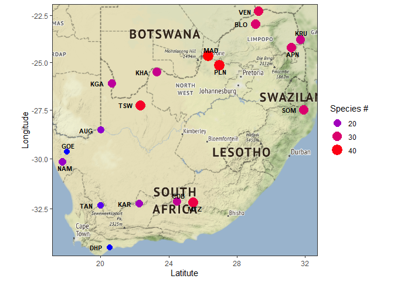<!-- -->

``` r
#ggsave("figures/sp_map_terrain.jpeg") #
```

# End–
