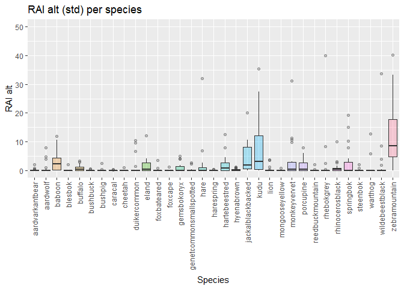

Build a general biodiversity report from Snapshot Camera trap data
================

## Description

This code provides a general protocol to build a tidy biodiversity
report from Snapshot Camera Trap records. This consists of a series of
general analysis including, species richness, relative abundance index
and useful visualizations. If you want only the results in a tidy html,
please refer to “3b_clean_biodiv_report” script. Other useful
visualizations can be found in 2_species_exploration

For more specific biodiversity analysis use script “biodiversity
analysis”. the input data is a species records table either with
Zooniverse format or manually created with Digikam.

OBJ: 1. clean table with standard sp names, cols and values 2. calculate
independence and create a temp file to get RAIs 3. create plots
(richness, RAI, etc)

### notes

It is important to familiarized with the customized functions in
1_SNAPSHOT_source_functions, there might be some extra steps that need
to be done by researches to accommodate data and also to double check.
For example, if the researcher needs very detailed number of individuals
and sex they must explore and adapt raw data accordingly. For instance,
due to the uncertainty of counting individuals by volunteers there are
some strings including a range of values (e.g. 11-51”. Since for this
code we need a single number, the formulation takes the minimum number,
but it is responsibility of the researcher to check this and adapt the
code according to their ecological system and needs.

This is a sample script using a snapshot report from Mountain Zebra S1.
In order to use this script for other sites, you have to adapt certain
names in the arguments, but specially in the outputs (e.g. csv tables,
figures, etc). It is important to have a clear idea of the sampling
periods…see also 2_species_exploration.

Please give credit to Lain E. Pardo, Snapshot Safari or WildEco Lab at
Nelson Mandela University if you use this tool.

This is a work in progress if you want to contribute or find any issues
please let us know.

## load libraries

``` r
library(readr) #read cols as character  
```

    ## Warning: package 'readr' was built under R version 4.0.5

``` r
library(readxl)
library(tidyverse)
```

    ## Warning: package 'tidyverse' was built under R version 4.0.5

    ## -- Attaching packages --------------------------------------- tidyverse 1.3.1 --

    ## v ggplot2 3.3.5     v dplyr   1.0.7
    ## v tibble  3.1.4     v stringr 1.4.0
    ## v tidyr   1.1.3     v forcats 0.5.1
    ## v purrr   0.3.4

    ## Warning: package 'ggplot2' was built under R version 4.0.5

    ## Warning: package 'tibble' was built under R version 4.0.5

    ## Warning: package 'tidyr' was built under R version 4.0.5

    ## Warning: package 'dplyr' was built under R version 4.0.5

    ## Warning: package 'forcats' was built under R version 4.0.5

    ## -- Conflicts ------------------------------------------ tidyverse_conflicts() --
    ## x dplyr::filter() masks stats::filter()
    ## x dplyr::lag()    masks stats::lag()

``` r
library(ggplot2)  
library(hrbrthemes)
library(lubridate)
```

    ## Warning: package 'lubridate' was built under R version 4.0.5

    ## 
    ## Attaching package: 'lubridate'

    ## The following objects are masked from 'package:base':
    ## 
    ##     date, intersect, setdiff, union

``` r
library(viridis)
```

    ## Warning: package 'viridis' was built under R version 4.0.5

    ## Loading required package: viridisLite

    ## Warning: package 'viridisLite' was built under R version 4.0.5

``` r
library(camtrapR) #for camera op matrix needed for other analysis
source("1_SNAPSHOT_source_functions.R") # customized functions are store here, this must be included in the working directory
```

## creating a single standard df to work with

note: if report comes from DIGIKAM start from : “# For roaming sites and
reports coming from DIGIKAM” start from lines xxx

### load file

``` r
rep_sp1 <- read_csv("data_in/MTZ_S1_full_report_0-50%_agreement_corrected_fin.csv") 
```

    ## New names:
    ## * `` -> ...27
    ## * `` -> ...28
    ## * `` -> ...29
    ## * `` -> ...30
    ## * `` -> ...31
    ## * ...

    ## Rows: 5629 Columns: 36

    ## -- Column specification --------------------------------------------------------
    ## Delimiter: ","
    ## chr  (11): capture_id, season, site, capture_time_local, zooniverse_url_0, z...
    ## dbl  (14): roll, capture, subject_id, question__standing, question__resting,...
    ## lgl  (10): ...27, ...28, ...29, ...30, ...31, ...32, ...33, ...34, ...35, ...36
    ## date  (1): capture_date_local

    ## 
    ## i Use `spec()` to retrieve the full column specification for this data.
    ## i Specify the column types or set `show_col_types = FALSE` to quiet this message.

``` r
#check names quickly
unique(rep_sp1$question__species)
```

    ##  [1] "zebramountain"           "ostrich"                
    ##  [3] "jackalblackbacked"       "baboon"                 
    ##  [5] "birdother"               "springbok"              
    ##  [7] "eland"                   "hare"                   
    ##  [9] "lionfemale"              "lionmale"               
    ## [11] "porcupine"               "hartebeestred"          
    ## [13] "gemsbokoryx"             "buffalo"                
    ## [15] "tortoise"                "kudu"                   
    ## [17] "secretarybird"           "cheetah"                
    ## [19] "hyenabrown"              "genetcommonsmallspotted"
    ## [21] "wildebeestblack"         "birdsofprey"            
    ## [23] "blesbok"                 "rhinocerosblack"        
    ## [25] "aardwolf"                "monkeyvervet"           
    ## [27] "rhebokgrey"              "bushpig"                
    ## [29] "foxcape"                 "unresolvable"           
    ## [31] "duikercommongrey"        "aardvarkantbear"        
    ## [33] "steenbok"                "caracal"                
    ## [35] "reptilesamphibians"      "warthog"                
    ## [37] "reedbuckmountain"        "foxbateared"            
    ## [39] "mongooseyellow"          "blank"                  
    ## [41] "bustardludwigs"          "craneblue"              
    ## [43] "bushbuck"                "unidentifiable"         
    ## [45] "harespring"

``` r
#standardize col number and names from original report before cbind

rep_sp <- cols_snap_std(rep_sp1) 

names(rep_sp)
```

    ##  [1] "capture_id"                      "season"                         
    ##  [3] "site"                            "roll"                           
    ##  [5] "capture"                         "capture_date_local"             
    ##  [7] "capture_time_local"              "zooniverse_url_0"               
    ##  [9] "zooniverse_url_1"                "zooniverse_url_2"               
    ## [11] "subject_id"                      "question__species"              
    ## [13] "question__count_max"             "question__count_median"         
    ## [15] "question__count_min"             "question__standing"             
    ## [17] "question__resting"               "question__moving"               
    ## [19] "question__eating"                "question__interacting"          
    ## [21] "question__young_present"         "question__horns_count_max"      
    ## [23] "question__horns_count_median"    "question__horns_count_min"      
    ## [25] "p_users_identified_this_species" "pielous_evenness_index"

``` r
class(rep_sp$question__count_median)
```

    ## [1] "character"

``` r
class(rep_sp$question__count_median)
```

    ## [1] "character"

``` r
unique(rep_sp$site)
```

    ##  [1] "B04" "B05" "C04" "C06" "C07" "C08" "D03" "D04" "D05" "D06" "D07" "E03"
    ## [13] "E04" "E05" "E06" "F04" "F05" "G04" "B08"

``` r
# check some columns, if there are or different strings to those in the snapshot source functions amend accordingly

colSums(is.na(rep_sp))
```

    ## Warning: One or more parsing issues, see `problems()` for details

    ##                      capture_id                          season 
    ##                               0                               0 
    ##                            site                            roll 
    ##                               0                               0 
    ##                         capture              capture_date_local 
    ##                               0                               0 
    ##              capture_time_local                zooniverse_url_0 
    ##                               0                               0 
    ##                zooniverse_url_1                zooniverse_url_2 
    ##                            5465                            5467 
    ##                      subject_id               question__species 
    ##                               0                               0 
    ##             question__count_max          question__count_median 
    ##                               7                               7 
    ##             question__count_min              question__standing 
    ##                               7                               7 
    ##               question__resting                question__moving 
    ##                               7                               7 
    ##                question__eating           question__interacting 
    ##                               7                               7 
    ##         question__young_present       question__horns_count_max 
    ##                              54                            5409 
    ##    question__horns_count_median       question__horns_count_min 
    ##                            5523                            5560 
    ## p_users_identified_this_species          pielous_evenness_index 
    ##                               0                               0

``` r
unique(rep_sp$question__count_median)
```

    ##  [1] "1"      "2"      "3"      "4"      "8"      "10"     "5"      "6"     
    ##  [9] "9"      "7"      "Nov-50" NA

``` r
unique(rep_sp$question__count_max) # 
```

    ##  [1] "1"      "3"      "2"      "Nov-50" "4"      "6"      "5"      "7"     
    ##  [9] "10"     "8"      "9"      "51+"    NA

``` r
#deal with NA
#THIS IS ASSUMING NA =1, please adapt according to your needs.
# important: Create DateTimeOriginal column for clean_table and other functions to work

rep_sp <-rep_sp %>% 
 mutate(question__count_median =replace_na(question__count_median, 1), 
       question__count_max = replace_na(question__count_max,1)) %>% 
  mutate(DateTimeOriginal = paste(capture_date_local, capture_time_local))

write.csv(rep_sp, "temp_rep_sp.csv")
```

### 1\_ standardize names of species

``` r
df <- standardise_names(rep_sp)
unique(df$question__species)
```

    ##  [1] "zebramountain"           "ostrich"                
    ##  [3] "jackalblackbacked"       "baboon"                 
    ##  [5] "birdother"               "springbok"              
    ##  [7] "eland"                   "hare"                   
    ##  [9] "lion"                    "porcupine"              
    ## [11] "hartebeestred"           "gemsbokoryx"            
    ## [13] "buffalo"                 "tortoise"               
    ## [15] "kudu"                    "secretarybird"          
    ## [17] "cheetah"                 "hyenabrown"             
    ## [19] "genetcommonsmallspotted" "wildebeestblack"        
    ## [21] "birdofprey"              "blesbok"                
    ## [23] "rhinocerosblack"         "aardwolf"               
    ## [25] "monkeyvervet"            "rhebokgrey"             
    ## [27] "bushpig"                 "foxcape"                
    ## [29] "unresolvable"            "duikercommon"           
    ## [31] "aardvarkantbear"         "steenbok"               
    ## [33] "caracal"                 "reptilesamphibians"     
    ## [35] "warthog"                 "reedbuckmountain"       
    ## [37] "foxbateared"             "mongooseyellow"         
    ## [39] "blank"                   "bustardludwigs"         
    ## [41] "craneblue"               "bushbuck"               
    ## [43] "harespring"

There might be some things more to check in the values or strings of
some columns. Although in function clean_table we deal with a lot of
this SNAPSHOT_source_functions.You might want to double check generic
terms such as “zebra” or “antelope” and change accordingly

### 2\_ Clean table

Here we standardize species names, filter out no animals (e.g. fire),
arrange some cols, force some strings to useful values, etc. There are
two arguments here, you can include by_catch data by adding FALSE to
rm_bycatch (birds etc, see formulation in the source functions to know
what criteria was used), and you can also put only presence absence

``` r
df.clean <- clean_table(df, rm_bycatch = FALSE, pres_abs = FALSE)
unique(df.clean$question__species)
```

    ##  [1] zebramountain           ostrich                 jackalblackbacked      
    ##  [4] baboon                  birdother               springbok              
    ##  [7] eland                   hare                    lion                   
    ## [10] porcupine               hartebeestred           gemsbokoryx            
    ## [13] buffalo                 tortoise                kudu                   
    ## [16] secretarybird           cheetah                 hyenabrown             
    ## [19] genetcommonsmallspotted wildebeestblack         birdofprey             
    ## [22] blesbok                 rhinocerosblack         aardwolf               
    ## [25] monkeyvervet            rhebokgrey              bushpig                
    ## [28] foxcape                 duikercommon            aardvarkantbear        
    ## [31] steenbok                caracal                 reptilesamphibians     
    ## [34] warthog                 reedbuckmountain        foxbateared            
    ## [37] mongooseyellow          bustardludwigs          craneblue              
    ## [40] bushbuck                harespring             
    ## 41 Levels: aardvarkantbear aardwolf baboon birdofprey birdother ... zebramountain

### 3\_ Get independent records only (60 mins threshold)

``` r
#  before reorder chronologically in case, so:

df.clean <- df.clean %>% dplyr::arrange(site, DateTimeOriginal)

indep_records <- indep60(df.clean) #this takes time depending on the size of your file

#save 
write.csv(indep_records, "data_out/MTZ_clean_indep_report_snap_form.csv")
```

``` r
#check spp again
unique(indep_records$site)
```

    ##  [1] "B04" "B05" "B08" "C04" "C06" "C07" "C08" "D03" "D04" "D05" "D06" "D07"
    ## [13] "E03" "E04" "E05" "E06" "F04" "F05" "G04"

``` r
unique(indep_records$question__species)
```

    ##  [1] zebramountain           ostrich                 jackalblackbacked      
    ##  [4] baboon                  birdother               springbok              
    ##  [7] hartebeestred           eland                   hare                   
    ## [10] lion                    porcupine               gemsbokoryx            
    ## [13] buffalo                 hyenabrown              tortoise               
    ## [16] kudu                    secretarybird           cheetah                
    ## [19] genetcommonsmallspotted harespring              wildebeestblack        
    ## [22] birdofprey              blesbok                 rhebokgrey             
    ## [25] rhinocerosblack         monkeyvervet            aardwolf               
    ## [28] bushbuck                reedbuckmountain        bushpig                
    ## [31] foxcape                 duikercommon            aardvarkantbear        
    ## [34] steenbok                caracal                 reptilesamphibians     
    ## [37] warthog                 foxbateared             mongooseyellow         
    ## [40] bustardludwigs          craneblue              
    ## 41 Levels: aardvarkantbear aardwolf baboon birdofprey birdother ... zebramountain

``` r
names(indep_records)
```

    ##  [1] "capture_id"                      "season"                         
    ##  [3] "site"                            "roll"                           
    ##  [5] "capture"                         "capture_date_local"             
    ##  [7] "capture_time_local"              "zooniverse_url_0"               
    ##  [9] "zooniverse_url_1"                "zooniverse_url_2"               
    ## [11] "subject_id"                      "question__species"              
    ## [13] "question__count_max"             "question__count_median"         
    ## [15] "question__count_min"             "question__standing"             
    ## [17] "question__resting"               "question__moving"               
    ## [19] "question__eating"                "question__interacting"          
    ## [21] "question__young_present"         "question__horns_count_max"      
    ## [23] "question__horns_count_median"    "question__horns_count_min"      
    ## [25] "p_users_identified_this_species" "pielous_evenness_index"         
    ## [27] "DateTimeOriginal"                "row_id"

### 4\_ need standard name for sites including col “site” and “season”

``` r
df1 <- separate(indep_records,season, c("code_loc", "season1"), sep = "_")  

df2 <-unite(df1, site_ID, code_loc, site, sep = "_",remove =FALSE) #

df2$site_ID <- as.factor(df2$site_ID) # need to convert to factor again
nlevels(df2$site_ID)
```

    ## [1] 19

``` r
names(df2)
```

    ##  [1] "capture_id"                      "site_ID"                        
    ##  [3] "code_loc"                        "season1"                        
    ##  [5] "site"                            "roll"                           
    ##  [7] "capture"                         "capture_date_local"             
    ##  [9] "capture_time_local"              "zooniverse_url_0"               
    ## [11] "zooniverse_url_1"                "zooniverse_url_2"               
    ## [13] "subject_id"                      "question__species"              
    ## [15] "question__count_max"             "question__count_median"         
    ## [17] "question__count_min"             "question__standing"             
    ## [19] "question__resting"               "question__moving"               
    ## [21] "question__eating"                "question__interacting"          
    ## [23] "question__young_present"         "question__horns_count_max"      
    ## [25] "question__horns_count_median"    "question__horns_count_min"      
    ## [27] "p_users_identified_this_species" "pielous_evenness_index"         
    ## [29] "DateTimeOriginal"                "row_id"

``` r
unique(df2$site_ID)
```

    ##  [1] MTZ_B04 MTZ_B05 MTZ_B08 MTZ_C04 MTZ_C06 MTZ_C07 MTZ_C08 MTZ_D03 MTZ_D04
    ## [10] MTZ_D05 MTZ_D06 MTZ_D07 MTZ_E03 MTZ_E04 MTZ_E05 MTZ_E06 MTZ_F04 MTZ_F05
    ## [19] MTZ_G04
    ## 19 Levels: MTZ_B04 MTZ_B05 MTZ_B08 MTZ_C04 MTZ_C06 MTZ_C07 MTZ_C08 ... MTZ_G04

### 5\_ add scientific name column

``` r
#read file with traits that also contains the scientific names to be pulled

scient_name <- read_csv("data_in/+traits_in_sp_records_updated.csv")
```

    ## Rows: 100 Columns: 24

    ## -- Column specification --------------------------------------------------------
    ## Delimiter: ","
    ## chr (17): Scien.Code, Comm.Code, Snapshot.Name, Common.Name, Scientific.Name...
    ## dbl  (7): #ID, Weight.Kg, W.Male, W.female, Activity.Cycle, Terrestriality, ...

    ## 
    ## i Use `spec()` to retrieve the full column specification for this data.
    ## i Specify the column types or set `show_col_types = FALSE` to quiet this message.

``` r
# --- Merge tables
# Select a subset of columns from scient_name table

scient_name_sub <- scient_name %>% dplyr::select(Snapshot.Name, Scientific.Name)

#add a common column to join

scient_name_sub$question__species <- scient_name_sub$Snapshot.Name

# Merge the 2 tables, keeping all data in new filtered report (df.filtered) in the left hand side table (data table 'table")

df2$question__species <- as.character(df2$question__species)

mergenames <- dplyr::left_join(df2, scient_name_sub, by = "question__species")
mergenames$question__species <- as.factor(mergenames$question__species) # coerce back to factors
names(mergenames)
```

    ##  [1] "capture_id"                      "site_ID"                        
    ##  [3] "code_loc"                        "season1"                        
    ##  [5] "site"                            "roll"                           
    ##  [7] "capture"                         "capture_date_local"             
    ##  [9] "capture_time_local"              "zooniverse_url_0"               
    ## [11] "zooniverse_url_1"                "zooniverse_url_2"               
    ## [13] "subject_id"                      "question__species"              
    ## [15] "question__count_max"             "question__count_median"         
    ## [17] "question__count_min"             "question__standing"             
    ## [19] "question__resting"               "question__moving"               
    ## [21] "question__eating"                "question__interacting"          
    ## [23] "question__young_present"         "question__horns_count_max"      
    ## [25] "question__horns_count_median"    "question__horns_count_min"      
    ## [27] "p_users_identified_this_species" "pielous_evenness_index"         
    ## [29] "DateTimeOriginal"                "row_id"                         
    ## [31] "Snapshot.Name"                   "Scientific.Name"

# 6\_ select variables of interest and change name col (original report +new cols)

``` r
final.df <- cols_need(mergenames)  #final clean df with independent records only, clear column names ready for use
names(final.df)
```

    ##  [1] "Reserve.Location"      "Camera.Site"           "Common.Name"          
    ##  [4] "Scientific.Name"       "Photo.Date"            "Photo.Time"           
    ##  [7] "Number.of.Individuals" "Photo.ID"              "Season"               
    ## [10] "Roll"                  "Zooniverse.Url.1"      "Zooniverse.Url.2"     
    ## [13] "Zooniverse.Url.3"      "Consensus"             "DateTimeOriginal"

``` r
#quickly inspect sp
(spmergedrep <- unique(final.df$Common.Name))
```

    ##  [1] zebramountain           ostrich                 jackalblackbacked      
    ##  [4] baboon                  birdother               springbok              
    ##  [7] hartebeestred           eland                   hare                   
    ## [10] lion                    porcupine               gemsbokoryx            
    ## [13] buffalo                 hyenabrown              tortoise               
    ## [16] kudu                    secretarybird           cheetah                
    ## [19] genetcommonsmallspotted harespring              wildebeestblack        
    ## [22] birdofprey              blesbok                 rhebokgrey             
    ## [25] rhinocerosblack         monkeyvervet            aardwolf               
    ## [28] bushbuck                reedbuckmountain        bushpig                
    ## [31] foxcape                 duikercommon            aardvarkantbear        
    ## [34] steenbok                caracal                 reptilesamphibians     
    ## [37] warthog                 foxbateared             mongooseyellow         
    ## [40] bustardludwigs          craneblue              
    ## 41 Levels: aardvarkantbear aardwolf baboon birdofprey birdother ... zebramountain

``` r
# save doc
write.csv(final.df,"data_out/MTZ_final_sp_rep_ind60_S_merged.csv")
```

FOR THE REPORTS WE NEED TO FILTER HERE WITHOUT THE BYCATCH…. and then
run the other part of the script

# RICHNESS AND RAI

#### 1. camera trap operation matrix —————————————–

basically the matrix of the design (cameras and days..) need: df with
sites, coordinates, start and end day of survey (minimum): the metadata
or covariates, need the species records cleaned

We will use the metadata table for this to put cam days and start, end
of survey. All sites must be there but will better filter by reserve
probably

``` r
cameras <- read_csv("data_in/1_Metadata_all_fixed_as_snapshot_TEMP_CSV.csv") #contains the covars/metadata too
```

    ## New names:
    ## * Visib.1 -> Visib.1...24
    ## * Visib.1 -> Visib.1...25
    ## * Visib.1 -> Visib.1...26

    ## Rows: 711 Columns: 53

    ## -- Column specification --------------------------------------------------------
    ## Delimiter: ","
    ## chr  (46): Reserve.Location, Code.Loc.Snap, Site.Original, Camera.Site.Conca...
    ## dbl   (4): id, Lat_Y, Long_X, Elevation
    ## lgl   (1): other.cols.in.metadata2
    ## date  (1): Setup.Date

    ## 
    ## i Use `spec()` to retrieve the full column specification for this data.
    ## i Specify the column types or set `show_col_types = FALSE` to quiet this message.

``` r
str(cameras)
```

    ## spec_tbl_df [711 x 53] (S3: spec_tbl_df/tbl_df/tbl/data.frame)
    ##  $ id                     : num [1:711] 1 2 3 4 5 6 7 8 9 10 ...
    ##  $ Reserve.Location       : chr [1:711] "Augrabies" "Augrabies" "Augrabies" "Augrabies" ...
    ##  $ Code.Loc.Snap          : chr [1:711] "AUG" "AUG" "AUG" "AUG" ...
    ##  $ Site.Original          : chr [1:711] "B02" "B03" "B04" "B06" ...
    ##  $ Camera.Site.Concatenate: chr [1:711] "AUG_B02" "AUG_B03" "AUG_B04" "AUG_B06" ...
    ##  $ Camera.Site.Std        : chr [1:711] "AUG_B02" "AUG_B03" "AUG_B04" "AUG_B06" ...
    ##  $ Setup.Date             : Date[1:711], format: "2018-11-25" "2018-11-25" ...
    ##  $ Setup.Time             : chr [1:711] "9:21" "8:50" "9:52" "10:34" ...
    ##  $ Lat_Y                  : num [1:711] -28.5 -28.5 -28.5 -28.5 -28.5 ...
    ##  $ Long_X                 : num [1:711] 20 20 20.1 20.1 20 ...
    ##  $ Cam.Brand              : chr [1:711] "Cuddeback" "Cuddeback" "Cuddeback" "Cuddeback" ...
    ##  $ Flash                  : chr [1:711] "IR - Black" "IR - Black" "IR - Black" "IR - Black" ...
    ##  $ Cam.Serial.No          : chr [1:711] NA NA NA NA ...
    ##  $ Height                 : chr [1:711] "50" "50" "50" "40" ...
    ##  $ Fixture                : chr [1:711] "Pole" "Pole" "Pole" "Pole" ...
    ##  $ DRXN                   : chr [1:711] "NW" "SE" "E" "S" ...
    ##  $ IMG# N                 : chr [1:711] "5622" "5617" "5627" "5582" ...
    ##  $ IMG# E                 : chr [1:711] "5623" "5618" "5628" "5583" ...
    ##  $ IMG# S                 : chr [1:711] "5624" "5619" "5629" "5584" ...
    ##  $ IMG# W                 : chr [1:711] "5625" "5620" "5630" "5585" ...
    ##  $ IMG# CT                : chr [1:711] "5626" "5621" "5631" "5586" ...
    ##  $ Habitat.Descriptor     : chr [1:711] "Dry river bed" "Dry river bed" "Dry river bed" "Drainage line" ...
    ##  $ Shade                  : chr [1:711] "0" "1" "0" "1" ...
    ##  $ Visib.1...24           : chr [1:711] "10" "26" "12" "16" ...
    ##  $ Visib.1...25           : num [1:711] 1 8 4 3 18 7 3 4 1 3 ...
    ##  $ Visib.1...26           : chr [1:711] "3" "4" "12" "11" ...
    ##  $ SITE_ID                : chr [1:711] "B02" "B03" "B04" "B06" ...
    ##  $ Dist.Tree.1            : chr [1:711] "1" "1" "1" "3" ...
    ##  $ Dist.Tree.2            : chr [1:711] "1" "2" "2" "1" ...
    ##  $ Dist.Tree.3            : chr [1:711] "3" "8" "8" "6" ...
    ##  $ Dist.Tree.4            : chr [1:711] "5" "4" "9" "5" ...
    ##  $ Dist.Tree.5            : chr [1:711] "4" "13" "3" "7" ...
    ##  $ Dist.Tree.6            : chr [1:711] "5" "13" "3" "5" ...
    ##  $ Dist.Tree.7            : chr [1:711] "8" "21" "5" "8" ...
    ##  $ Dist.Tree.8            : chr [1:711] "6" "13" "7" "9" ...
    ##  $ Dist.Tree.9            : chr [1:711] "13" "16" "10" "10" ...
    ##  $ Dist.Tree.10           : chr [1:711] "14" "17" "15" "12" ...
    ##  $ Dist.Road              : chr [1:711] "253" "100" "128" "260" ...
    ##  $ Dist.Water             : chr [1:711] NA NA NA NA ...
    ##  $ Dist.Outcrop           : chr [1:711] "220" "140" "180" "200" ...
    ##  $ Dist.Trail             : chr [1:711] NA NA NA NA ...
    ##  $ Gral.Comments          : chr [1:711] NA NA NA NA ...
    ##  $ other.cols.WATER (Km)P : chr [1:711] NA NA NA NA ...
    ##  $ other.cols.in.metadata2: logi [1:711] NA NA NA NA NA NA ...
    ##  $ Setup.Date.Original    : chr [1:711] "25-Nov-2018" "25-Nov-2018" "25-Nov-2018" "24-Nov-2018" ...
    ##  $ Management.Type        : chr [1:711] "National Park" "National Park" "National Park" "National Park" ...
    ##  $ Official.Name          : chr [1:711] "Augrabies Falls National Park" "Augrabies Falls National Park" "Augrabies Falls National Park" "Augrabies Falls National Park" ...
    ##  $ Country                : chr [1:711] "South Africa" "South Africa" "South Africa" "South Africa" ...
    ##  $ Province               : chr [1:711] "Northern Cape" "Northern Cape" "Northern Cape" "Northern Cape" ...
    ##  $ Municipality           : chr [1:711] "Kai !Garib" "Kai !Garib" "Kai !Garib" "Kai !Garib" ...
    ##  $ Vegetation             : chr [1:711] "NAMAQUALAND BROKEN VELD" "NAMAQUALAND BROKEN VELD" "NAMAQUALAND BROKEN VELD" "NAMAQUALAND BROKEN VELD" ...
    ##  $ Biome                  : chr [1:711] "Nama Karoo" "Nama Karoo" "Nama Karoo" "Nama Karoo" ...
    ##  $ Elevation              : num [1:711] 713 713 713 637 713 713 713 713 637 637 ...
    ##  - attr(*, "spec")=
    ##   .. cols(
    ##   ..   id = col_double(),
    ##   ..   Reserve.Location = col_character(),
    ##   ..   Code.Loc.Snap = col_character(),
    ##   ..   Site.Original = col_character(),
    ##   ..   Camera.Site.Concatenate = col_character(),
    ##   ..   Camera.Site.Std = col_character(),
    ##   ..   Setup.Date = col_date(format = ""),
    ##   ..   Setup.Time = col_character(),
    ##   ..   Lat_Y = col_double(),
    ##   ..   Long_X = col_double(),
    ##   ..   Cam.Brand = col_character(),
    ##   ..   Flash = col_character(),
    ##   ..   Cam.Serial.No = col_character(),
    ##   ..   Height = col_character(),
    ##   ..   Fixture = col_character(),
    ##   ..   DRXN = col_character(),
    ##   ..   `IMG# N` = col_character(),
    ##   ..   `IMG# E` = col_character(),
    ##   ..   `IMG# S` = col_character(),
    ##   ..   `IMG# W` = col_character(),
    ##   ..   `IMG# CT` = col_character(),
    ##   ..   Habitat.Descriptor = col_character(),
    ##   ..   Shade = col_character(),
    ##   ..   Visib.1...24 = col_character(),
    ##   ..   Visib.1...25 = col_number(),
    ##   ..   Visib.1...26 = col_character(),
    ##   ..   SITE_ID = col_character(),
    ##   ..   Dist.Tree.1 = col_character(),
    ##   ..   Dist.Tree.2 = col_character(),
    ##   ..   Dist.Tree.3 = col_character(),
    ##   ..   Dist.Tree.4 = col_character(),
    ##   ..   Dist.Tree.5 = col_character(),
    ##   ..   Dist.Tree.6 = col_character(),
    ##   ..   Dist.Tree.7 = col_character(),
    ##   ..   Dist.Tree.8 = col_character(),
    ##   ..   Dist.Tree.9 = col_character(),
    ##   ..   Dist.Tree.10 = col_character(),
    ##   ..   Dist.Road = col_character(),
    ##   ..   Dist.Water = col_character(),
    ##   ..   Dist.Outcrop = col_character(),
    ##   ..   Dist.Trail = col_character(),
    ##   ..   Gral.Comments = col_character(),
    ##   ..   `other.cols.WATER (Km)P` = col_character(),
    ##   ..   other.cols.in.metadata2 = col_logical(),
    ##   ..   Setup.Date.Original = col_character(),
    ##   ..   Management.Type = col_character(),
    ##   ..   Official.Name = col_character(),
    ##   ..   Country = col_character(),
    ##   ..   Province = col_character(),
    ##   ..   Municipality = col_character(),
    ##   ..   Vegetation = col_character(),
    ##   ..   Biome = col_character(),
    ##   ..   Elevation = col_double()
    ##   .. )
    ##  - attr(*, "problems")=<externalptr>

``` r
#unique(cameras$Camera.Site.Concatenate)
```

# 1. create the cols for effort start and end date, use first and last photo cols on spp reports final

#read file (fixed report)

``` r
spp_rec <- final.df
#or load it from the file we created (some times is better to avoid issues)
#spp_rec <- read_csv("data_out/MTZ_final_sp_rep_ind60_S_merged.csv") 
```

``` r
#quick explo
str(spp_rec)
```

    ## tibble [1,983 x 15] (S3: tbl_df/tbl/data.frame)
    ##  $ Reserve.Location     : chr [1:1983] "MTZ" "MTZ" "MTZ" "MTZ" ...
    ##  $ Camera.Site          : Factor w/ 19 levels "MTZ_B04","MTZ_B05",..: 1 1 1 1 1 1 1 1 1 1 ...
    ##  $ Common.Name          : Factor w/ 41 levels "aardvarkantbear",..: 41 29 29 41 24 24 29 3 24 41 ...
    ##  $ Scientific.Name      : chr [1:1983] "Equus zebra" NA NA "Equus zebra" ...
    ##  $ Photo.Date           : POSIXct[1:1983], format: "2017-08-23 19:00:00" "2017-08-26 19:00:00" ...
    ##  $ Photo.Time           : chr [1:1983] "12:18:04" "15:17:33" "16:24:15" "18:04:31" ...
    ##  $ Number.of.Individuals: num [1:1983] 1 1 1 3 1 1 2 2 1 3 ...
    ##  $ Photo.ID             : num [1:1983] 31547018 31518466 30119622 30782166 32731999 ...
    ##  $ Season               : chr [1:1983] "S1" "S1" "S1" "S1" ...
    ##  $ Roll                 : num [1:1983] 1 1 1 1 1 1 1 1 1 1 ...
    ##  $ Zooniverse.Url.1     : chr [1:1983] "https://panoptes-uploads.zooniverse.org/production/subject_location/efd7b1d6-5dbd-4729-92a1-45d4cfaf2caf.jpeg" "https://panoptes-uploads.zooniverse.org/production/subject_location/1ce6adb4-ef74-4ae3-9e90-ee7b4c2670c5.jpeg" "https://panoptes-uploads.zooniverse.org/production/subject_location/a8cdf34a-74be-4084-b30a-743954f93ee7.jpeg" "https://panoptes-uploads.zooniverse.org/production/subject_location/a888f549-b8bf-41b2-b4be-3ad5ee097029.jpeg" ...
    ##  $ Zooniverse.Url.2     : chr [1:1983] NA NA NA NA ...
    ##  $ Zooniverse.Url.3     : chr [1:1983] NA NA NA NA ...
    ##  $ Consensus            : num [1:1983] 0.78 0.88 1 0.89 1 1 1 0.8 0.6 0.7 ...
    ##  $ DateTimeOriginal     : POSIXct[1:1983], format: "2017-08-24 12:18:04" "2017-08-27 15:17:33" ...

``` r
class(spp_rec$Photo.Date)
```

    ## [1] "POSIXct" "POSIXt"

``` r
unique(spp_rec$Camera.Site)
```

    ##  [1] MTZ_B04 MTZ_B05 MTZ_B08 MTZ_C04 MTZ_C06 MTZ_C07 MTZ_C08 MTZ_D03 MTZ_D04
    ## [10] MTZ_D05 MTZ_D06 MTZ_D07 MTZ_E03 MTZ_E04 MTZ_E05 MTZ_E06 MTZ_F04 MTZ_F05
    ## [19] MTZ_G04
    ## 19 Levels: MTZ_B04 MTZ_B05 MTZ_B08 MTZ_C04 MTZ_C06 MTZ_C07 MTZ_C08 ... MTZ_G04

``` r
unique(spp_rec$Common.Name)
```

    ##  [1] zebramountain           ostrich                 jackalblackbacked      
    ##  [4] baboon                  birdother               springbok              
    ##  [7] hartebeestred           eland                   hare                   
    ## [10] lion                    porcupine               gemsbokoryx            
    ## [13] buffalo                 hyenabrown              tortoise               
    ## [16] kudu                    secretarybird           cheetah                
    ## [19] genetcommonsmallspotted harespring              wildebeestblack        
    ## [22] birdofprey              blesbok                 rhebokgrey             
    ## [25] rhinocerosblack         monkeyvervet            aardwolf               
    ## [28] bushbuck                reedbuckmountain        bushpig                
    ## [31] foxcape                 duikercommon            aardvarkantbear        
    ## [34] steenbok                caracal                 reptilesamphibians     
    ## [37] warthog                 foxbateared             mongooseyellow         
    ## [40] bustardludwigs          craneblue              
    ## 41 Levels: aardvarkantbear aardwolf baboon birdofprey birdother ... zebramountain

### filter out by catch

so work only with mammals for reports

``` r
BYCATCH <- c("birdofprey", "birdother", "bustardkori", "bustardludwigs", "guineafowl",
               "squirreltree", "reptilesamphibians", "human", "bustarddenhams",
               "secretarybird","tortoise", "domesticanimal", "ostrich", "bat",       "reptilesamphibians", "fowlguinea","spider", "reptile", "insect", "bustardludwig's","craneblue", "horse")

mammals <- filter(spp_rec,
              !(Common.Name %in% BYCATCH))
unique(mammals$Common.Name)
```

    ##  [1] zebramountain           jackalblackbacked       baboon                 
    ##  [4] springbok               hartebeestred           eland                  
    ##  [7] hare                    lion                    porcupine              
    ## [10] gemsbokoryx             buffalo                 hyenabrown             
    ## [13] kudu                    cheetah                 genetcommonsmallspotted
    ## [16] harespring              wildebeestblack         blesbok                
    ## [19] rhebokgrey              rhinocerosblack         monkeyvervet           
    ## [22] aardwolf                bushbuck                reedbuckmountain       
    ## [25] bushpig                 foxcape                 duikercommon           
    ## [28] aardvarkantbear         steenbok                caracal                
    ## [31] warthog                 foxbateared             mongooseyellow         
    ## 41 Levels: aardvarkantbear aardwolf baboon birdofprey birdother ... zebramountain

``` r
spp_rec <- mammals
```

### Check reports periods

``` r
spp_rec$Photo.Date <- as.Date(spp_rec$Photo.Date, format="%Y-%m-%d") 
spp_rec$DateTimeOriginal <- as.POSIXct(spp_rec$DateTimeOriginal)
class(spp_rec$Photo.Date)
```

    ## [1] "Date"

``` r
max(spp_rec$Photo.Date)
```

    ## [1] "2018-07-17"

``` r
min(spp_rec$Photo.Date)
```

    ## [1] "2017-08-23"

``` r
max(spp_rec$Photo.Date)
```

    ## [1] "2018-07-17"

# 

#using final spp report file cleaned with good var

``` r
unique(spp_rec$Reserve.Location)
```

    ## [1] "MTZ"

``` r
table(spp_rec$Camera.Site) 
```

    ## 
    ## MTZ_B04 MTZ_B05 MTZ_B08 MTZ_C04 MTZ_C06 MTZ_C07 MTZ_C08 MTZ_D03 MTZ_D04 MTZ_D05 
    ##     210     178       4      15     126      53     100      30     145      17 
    ## MTZ_D06 MTZ_D07 MTZ_E03 MTZ_E04 MTZ_E05 MTZ_E06 MTZ_F04 MTZ_F05 MTZ_G04 
    ##      51     102      55     162     145     122     168      26     120

``` r
# getting last picture date for all sites as end date of survey, if this is not the case,  change

#tibble with new cols of survey period
surv_lenght <- survey_period(spp_rec) #IF UNSURE ABOUT STARTING DATES
surv_lenght
```

    ## # A tibble: 19 x 4
    ##    Camera.Site First.Photo.Date Last.Photo.Date Act.Days
    ##    <fct>       <date>           <date>          <drtn>  
    ##  1 MTZ_B04     2017-08-24       2018-07-04      314 days
    ##  2 MTZ_B05     2017-09-01       2018-05-03      244 days
    ##  3 MTZ_B08     2018-05-03       2018-05-13       10 days
    ##  4 MTZ_C04     2017-08-26       2018-06-26      304 days
    ##  5 MTZ_C06     2017-08-23       2018-07-13      324 days
    ##  6 MTZ_C07     2017-09-03       2018-07-09      309 days
    ##  7 MTZ_C08     2018-03-28       2018-06-19       83 days
    ##  8 MTZ_D03     2018-03-28       2018-05-07       40 days
    ##  9 MTZ_D04     2017-08-23       2018-07-15      326 days
    ## 10 MTZ_D05     2017-08-24       2017-10-01       38 days
    ## 11 MTZ_D06     2017-08-27       2017-11-01       66 days
    ## 12 MTZ_D07     2017-08-25       2018-04-05      223 days
    ## 13 MTZ_E03     2018-03-28       2018-05-15       48 days
    ## 14 MTZ_E04     2017-08-24       2018-04-01      220 days
    ## 15 MTZ_E05     2017-08-23       2018-04-02      222 days
    ## 16 MTZ_E06     2017-08-24       2018-06-12      292 days
    ## 17 MTZ_F04     2017-08-24       2018-07-07      317 days
    ## 18 MTZ_F05     2017-11-02       2017-11-27       25 days
    ## 19 MTZ_G04     2017-08-24       2018-07-17      327 days

``` r
#surv_lenght <- survey_period2(spp_rec) 
```

note: if you are sure about the starting date then don´t use
“min(photo.date)as start date, use”Setup.Date” from cameras filter by
site (e.g.MTZ_Cams); use function “survey_period2”, then manually add
start date en mutate for subtraction to cam days, for example:

Working with the survey period demands deep exploration of data, be
mindful that there might be gaps between rolls, within roles or between
seasons and within seasons, so use exploration code for some
visualizations and set the begin and end of survey correctly

### merge survey effort (surv_lenght)

now merge this info (first,last photo,cam days as a column into the
cameras doc (metadata) explore this part carefully, there might be dates
that don´t match and errors can occur

``` r
#1. rename col Camera.Site to join with camera df (Camera.Site.Concatenate which is the one in cameras)

surv_lengh2 <- surv_lenght %>% rename(Camera.Site.Concatenate = Camera.Site)


# 2. standardize dates  in cameras
names(cameras)
```

    ##  [1] "id"                      "Reserve.Location"       
    ##  [3] "Code.Loc.Snap"           "Site.Original"          
    ##  [5] "Camera.Site.Concatenate" "Camera.Site.Std"        
    ##  [7] "Setup.Date"              "Setup.Time"             
    ##  [9] "Lat_Y"                   "Long_X"                 
    ## [11] "Cam.Brand"               "Flash"                  
    ## [13] "Cam.Serial.No"           "Height"                 
    ## [15] "Fixture"                 "DRXN"                   
    ## [17] "IMG# N"                  "IMG# E"                 
    ## [19] "IMG# S"                  "IMG# W"                 
    ## [21] "IMG# CT"                 "Habitat.Descriptor"     
    ## [23] "Shade"                   "Visib.1...24"           
    ## [25] "Visib.1...25"            "Visib.1...26"           
    ## [27] "SITE_ID"                 "Dist.Tree.1"            
    ## [29] "Dist.Tree.2"             "Dist.Tree.3"            
    ## [31] "Dist.Tree.4"             "Dist.Tree.5"            
    ## [33] "Dist.Tree.6"             "Dist.Tree.7"            
    ## [35] "Dist.Tree.8"             "Dist.Tree.9"            
    ## [37] "Dist.Tree.10"            "Dist.Road"              
    ## [39] "Dist.Water"              "Dist.Outcrop"           
    ## [41] "Dist.Trail"              "Gral.Comments"          
    ## [43] "other.cols.WATER (Km)P"  "other.cols.in.metadata2"
    ## [45] "Setup.Date.Original"     "Management.Type"        
    ## [47] "Official.Name"           "Country"                
    ## [49] "Province"                "Municipality"           
    ## [51] "Vegetation"              "Biome"                  
    ## [53] "Elevation"

``` r
class(cameras$Setup.Date)
```

    ## [1] "Date"

``` r
unique(cameras$Setup.Date)
```

    ##   [1] "2018-11-25" "2018-11-24" "2018-11-23" "2018-11-22" "2018-07-21"
    ##   [6] "2018-07-22" "2018-07-20" "2018-07-24" "2018-07-25" "2019-10-18"
    ##  [11] "2019-10-19" "2018-09-06" "2018-09-07" NA           "2018-09-05"
    ##  [16] "2018-09-04" "2018-09-08" "2018-12-03" "2018-12-04" "2019-03-04"
    ##  [21] "2019-03-05" "2018-05-22" "2018-11-13" "2018-05-21" "2018-05-23"
    ##  [26] "2018-11-27" "2019-01-12" "2018-11-28" "2019-01-15" "2019-01-16"
    ##  [31] "2018-07-19" "2019-07-20" "2018-06-12" "2018-06-13" "2018-06-11"
    ##  [36] "2018-06-14" "2018-06-21" "2018-06-20" "2019-01-20" "2018-06-24"
    ##  [41] "2018-06-25" "2018-06-23" "2018-03-27" "2018-03-26" "2018-03-28"
    ##  [46] "2019-02-27" "2019-02-28" "2019-02-05" "2019-06-17" "2019-06-18"
    ##  [51] "2019-06-19" "2018-11-18" "2018-11-19" "2018-11-20" "2017-10-07"
    ##  [56] "2018-05-31" "2018-06-02" "2019-07-21" "2019-08-14" "2019-08-17"
    ##  [61] "2019-08-10" "2019-08-01" "2018-06-05" "2018-06-06" "2018-06-04"
    ##  [66] "2018-06-01" "2018-06-07" "2018-06-09" "2017-04-16" "2017-04-11"
    ##  [71] "2019-02-14" "2018-06-18" "2019-06-14" "2019-08-07" "2019-06-16"
    ##  [76] "2019-08-09" "2019-09-04" "2019-08-27" "2019-09-06" "2019-08-16"
    ##  [81] "2017-06-28" "2017-06-29" "2017-06-30" "2017-07-01" "2017-07-02"
    ##  [86] "2017-07-03" "2017-07-04" "2017-07-05" "2017-07-06" "2017-07-07"
    ##  [91] "2017-07-08" "2017-07-09" "2017-07-10" "2017-07-11" "2017-07-12"
    ##  [96] "2017-07-13" "2018-07-13" "2018-10-02" "2018-10-01" "2018-08-31"
    ## [101] "2018-08-30" "2018-09-01" "2017-12-15" "2017-12-14" "2017-12-10"
    ## [106] "2019-10-05" "2019-10-06" "2019-10-07" "2019-10-08" "2020-03-07"

``` r
#cameras$parse_Setup_date <- lubridate::parse_date_time(x = cameras$Setup.Date,
                                               #       order = c("dmY", "Ymd","dmy"))#now done from input file..no need here

# join
join <- dplyr::left_join(cameras, surv_lengh2, by = "Camera.Site.Concatenate") #there are some NA as soon as I have all sites, there should be no NA

#here we have to filter by the reserve to avoid NA and other stuff in future analysis

MTZ_cams <- join %>%
  filter(Code.Loc.Snap == "MTZ")   # object to work with

colSums(is.na(MTZ_cams)) #for Somkhanda, there are 11 sites with 0 nights!!
```

    ##                      id        Reserve.Location           Code.Loc.Snap 
    ##                       0                       0                       0 
    ##           Site.Original Camera.Site.Concatenate         Camera.Site.Std 
    ##                       0                       0                       0 
    ##              Setup.Date              Setup.Time                   Lat_Y 
    ##                       0                       0                       0 
    ##                  Long_X               Cam.Brand                   Flash 
    ##                       0                       0                       1 
    ##           Cam.Serial.No                  Height                 Fixture 
    ##                       2                       0                       0 
    ##                    DRXN                  IMG# N                  IMG# E 
    ##                       0                       0                       0 
    ##                  IMG# S                  IMG# W                 IMG# CT 
    ##                       0                       0                       0 
    ##      Habitat.Descriptor                   Shade            Visib.1...24 
    ##                       0                       0                       0 
    ##            Visib.1...25            Visib.1...26                 SITE_ID 
    ##                       0                       0                       0 
    ##             Dist.Tree.1             Dist.Tree.2             Dist.Tree.3 
    ##                       0                       0                       0 
    ##             Dist.Tree.4             Dist.Tree.5             Dist.Tree.6 
    ##                       0                       0                       0 
    ##             Dist.Tree.7             Dist.Tree.8             Dist.Tree.9 
    ##                       0                       0                       0 
    ##            Dist.Tree.10               Dist.Road              Dist.Water 
    ##                       0                       0                      19 
    ##            Dist.Outcrop              Dist.Trail           Gral.Comments 
    ##                       0                       1                      19 
    ##  other.cols.WATER (Km)P other.cols.in.metadata2     Setup.Date.Original 
    ##                      19                      19                       0 
    ##         Management.Type           Official.Name                 Country 
    ##                       0                       0                       0 
    ##                Province            Municipality              Vegetation 
    ##                       0                       0                       0 
    ##                   Biome               Elevation        First.Photo.Date 
    ##                       0                       0                       0 
    ##         Last.Photo.Date                Act.Days 
    ##                       0                       0

``` r
MTZ_cams <-MTZ_cams %>% 
  filter(!is.na(MTZ_cams$Act.Days))


names(MTZ_cams)
```

    ##  [1] "id"                      "Reserve.Location"       
    ##  [3] "Code.Loc.Snap"           "Site.Original"          
    ##  [5] "Camera.Site.Concatenate" "Camera.Site.Std"        
    ##  [7] "Setup.Date"              "Setup.Time"             
    ##  [9] "Lat_Y"                   "Long_X"                 
    ## [11] "Cam.Brand"               "Flash"                  
    ## [13] "Cam.Serial.No"           "Height"                 
    ## [15] "Fixture"                 "DRXN"                   
    ## [17] "IMG# N"                  "IMG# E"                 
    ## [19] "IMG# S"                  "IMG# W"                 
    ## [21] "IMG# CT"                 "Habitat.Descriptor"     
    ## [23] "Shade"                   "Visib.1...24"           
    ## [25] "Visib.1...25"            "Visib.1...26"           
    ## [27] "SITE_ID"                 "Dist.Tree.1"            
    ## [29] "Dist.Tree.2"             "Dist.Tree.3"            
    ## [31] "Dist.Tree.4"             "Dist.Tree.5"            
    ## [33] "Dist.Tree.6"             "Dist.Tree.7"            
    ## [35] "Dist.Tree.8"             "Dist.Tree.9"            
    ## [37] "Dist.Tree.10"            "Dist.Road"              
    ## [39] "Dist.Water"              "Dist.Outcrop"           
    ## [41] "Dist.Trail"              "Gral.Comments"          
    ## [43] "other.cols.WATER (Km)P"  "other.cols.in.metadata2"
    ## [45] "Setup.Date.Original"     "Management.Type"        
    ## [47] "Official.Name"           "Country"                
    ## [49] "Province"                "Municipality"           
    ## [51] "Vegetation"              "Biome"                  
    ## [53] "Elevation"               "First.Photo.Date"       
    ## [55] "Last.Photo.Date"         "Act.Days"

``` r
class(MTZ_cams$Last.Photo.Date)
```

    ## [1] "Date"

``` r
class(MTZ_cams$First.Photo.Date)
```

    ## [1] "Date"

``` r
class(MTZ_cams$Camera.Site.Concatenate)
```

    ## [1] "character"

``` r
#Rename back MTZ_CAMS FOR Camera.Site

MTZ_cams <- MTZ_cams %>% rename(Camera.Site = Camera.Site.Concatenate)

class(MTZ_cams$Camera.Site)
```

    ## [1] "character"

``` r
unique(spp_rec$Common.Name) #
```

    ##  [1] zebramountain           jackalblackbacked       baboon                 
    ##  [4] springbok               hartebeestred           eland                  
    ##  [7] hare                    lion                    porcupine              
    ## [10] gemsbokoryx             buffalo                 hyenabrown             
    ## [13] kudu                    cheetah                 genetcommonsmallspotted
    ## [16] harespring              wildebeestblack         blesbok                
    ## [19] rhebokgrey              rhinocerosblack         monkeyvervet           
    ## [22] aardwolf                bushbuck                reedbuckmountain       
    ## [25] bushpig                 foxcape                 duikercommon           
    ## [28] aardvarkantbear         steenbok                caracal                
    ## [31] warthog                 foxbateared             mongooseyellow         
    ## 41 Levels: aardvarkantbear aardwolf baboon birdofprey birdother ... zebramountain

``` r
#temp file one reserve only with survey length and previous metadata

#write.csv(MTZ_cams, "data_out/MTZ/MTZ_cams.csv")
#MTZ_cams <- read_csv("data_out/MTZ/MTZ_cams.csv")

# name of stations
unique(MTZ_cams$Camera.Site) 
```

    ##  [1] "MTZ_B04" "MTZ_B05" "MTZ_B08" "MTZ_C04" "MTZ_C06" "MTZ_C07" "MTZ_C08"
    ##  [8] "MTZ_D03" "MTZ_D04" "MTZ_D05" "MTZ_D06" "MTZ_D07" "MTZ_E03" "MTZ_E04"
    ## [15] "MTZ_E05" "MTZ_E06" "MTZ_F04" "MTZ_F05" "MTZ_G04"

``` r
unique(spp_rec$Camera.Site)
```

    ##  [1] MTZ_B04 MTZ_B05 MTZ_B08 MTZ_C04 MTZ_C06 MTZ_C07 MTZ_C08 MTZ_D03 MTZ_D04
    ## [10] MTZ_D05 MTZ_D06 MTZ_D07 MTZ_E03 MTZ_E04 MTZ_E05 MTZ_E06 MTZ_F04 MTZ_F05
    ## [19] MTZ_G04
    ## 19 Levels: MTZ_B04 MTZ_B05 MTZ_B08 MTZ_C04 MTZ_C06 MTZ_C07 MTZ_C08 ... MTZ_G04

# 2. Operation matrix all sites

Check “2_species_exploration” of records for better plots

``` r
cam_op <- cameraOperation(CTtable = MTZ_cams,    
                          setupCol = "First.Photo.Date",
                          retrievalCol = "Last.Photo.Date",
                          stationCol = "Camera.Site",
                          writecsv = T,
                          hasProblems  = FALSE,
                          outDir = "data_out")
```

    ## CTtable was converted from tibble to data.frame

``` r
camopPlot <- function(camOp){
  which.tmp <- grep(as.Date(colnames(camOp)), pattern = "01$")
  label.tmp <- format(as.Date(colnames(camOp))[which.tmp], "%Y-%m")
  at.tmp <- which.tmp / ncol(camOp)
  
  image(t(as.matrix(camOp)), xaxt = "n", yaxt = "n", col = c("blue", "grey70"))
  axis(1, at = at.tmp, labels = label.tmp)
  axis(2, at = seq(from = 0, to = 1, length.out = nrow(camOp)), labels = rownames(camOp), cex.axis=0.6,
       las = 1,  xlab = "wt", ylab = "mpg")
   abline(v = at.tmp, col = rgb(0,0,0, 0.2))
  box()
}

jpeg(file="MTZ_camplot.jpeg", width =571, height = 421, res = 96)   
#check main folder for image and copy
camopPlot(cam_op)
 
#dev.off()
```

# 3. Survey summary reports for subsequent analyses

### call spp records object

``` r
survey_rep <- surveyReport(recordTable = spp_rec,
                            CTtable = MTZ_cams,
                            speciesCol = "Common.Name", 
                            stationCol = "Camera.Site",
                            setupCol = "First.Photo.Date", 
                            retrievalCol = "Last.Photo.Date",
                            recordDateTimeCol = "DateTimeOriginal",
                            CTHasProblems = F,
                            makezip = F, # 
                            sinkpath = "data_out") # 
```

    ## CTtable was converted from tibble to data.frame

    ## recordTable was converted from tibble to data.frame

    ## saved output to file 
    ## data_out/survey_report_2021-10-10.txt

Be careful, values in CTtable vs recordTable (stationcol) should match
if there are problems you can try:

``` r
# show all unique entries of the sites ID in spp records that are not in the _cams (cameras base)
del_cams <-unique(spp_rec$Camera.Site)[!unique(spp_rec$Camera.Site) %in% MTZ_cams$Camera.Site]
```

# REPORTS

### note: the report (survey_rep) is a list class with 5 elements:

survey_rep\[\[1\]\] #camera trap operation (similar to input but with
effort) survey_rep\[\[2\]\] #numMTZ of species by station!! IMPORMTZT
survey_rep\[\[3\]\] #numMTZ of events and numMTZ of stations by species
(rememMTZ not standardise by effort) survey_rep\[\[4\]\] #numMTZ of
species and events by station survey_rep\[\[5\]\] #equal to 4 except for
the fat that it contains unobserved species with n_eMTZts = 0

So save them to be able to retrieve them afterwards.

``` r
write.csv(survey_rep[[1]], "data_out/details_indiv_reports/1.MTZ_camtrap_operation.csv")
write.csv(survey_rep[[2]], "data_out/details_indiv_reports/2.MTZ_#spp_by_station.csv")
write.csv(survey_rep[[3]], "data_out/details_indiv_reports/3.MTZ_events+#station_by_spp.csv")
write.csv(survey_rep[[4]], "data_out/details_indiv_reports/4.MTZ_#spp+#events_by_station.csv")
write.csv(survey_rep[[5]], "data_out/details_indiv_reports/5.MTZ_#obs&notobsspp+#events_by_station.csv")
```

## General inventory

#### Number of observed species across the study area

``` r
r2 <- survey_rep[[2]]

ggplot(r2, aes(x = "", y= n_species)) + 
  geom_boxplot(alpha=0.3, width = 0.5, color = "blue",fill = "lightblue") +
  theme(legend.position="none") +
  ggtitle("Boxplot of observed species across sites") +
  geom_jitter(color="black", size=1, alpha=0.9) +
  labs(y="Number of species", x = "") +
  theme(plot.margin = unit(c(0.5,0.5,0.5,0.5),"cm")) 
```


``` r
ggsave((filename = "figures/MTZ_boxplot_sp_richness.jpg"))
```

    ## Saving 7 x 5 in image

## Number of species detected at each camera site (from report 2)

``` r
(fig_r2 <- spp_station_r2(r2))
```

<!-- -->

``` r
ggsave(filename = "figures/MTZ_barplot_sp_per_cam.jpg")
```

    ## Saving 7 x 5 in image

## Number of camera sites where species were detected (from report 3)

``` r
r3 <-survey_rep[[3]] 
(fig_r3 <- station_spp_r3(r3))
```

<!-- -->

``` r
ggsave(filename = "figures/MTZ_barplot_cams_per_species.jpg")
```

    ## Saving 7 x 5 in image

### Number of events per station from rep 3 (not stantardized by effort!!)

``` r
r3 <-survey_rep[[3]] 
(fig_r3 <- events_spp_r3(r3))
```

<!-- -->

``` r
ggsave(filename = "figures/MTZ_barplot_events_per_species.jpg")
```

    ## Saving 7 x 5 in image

## 5. Plot richness

the CTtable (cameras) must be just for each reserve otherwise will graph
all sites untidy

1st we need to have each site with its corresponding coordinates. #so
lets use report 2 (2.#spp_by_station)

``` r
spp_rich <- read.csv("data_out/details_indiv_reports/2.MTZ_#spp_by_station.csv", stringsAsFactors = FALSE) 
```

#add the location col from cameras/metadata (per reserve) #MTZ_cams \<-
read.csv(“data_out/MTZ/MTZ_cams.csv”)

``` r
lat.long <- select(MTZ_cams, "Camera.Site", "Lat_Y", "Long_X")
head(lat.long)
```

    ## # A tibble: 6 x 3
    ##   Camera.Site Lat_Y Long_X
    ##   <chr>       <dbl>  <dbl>
    ## 1 MTZ_B04     -32.2   25.4
    ## 2 MTZ_B05     -32.2   25.4
    ## 3 MTZ_B08     -32.3   25.4
    ## 4 MTZ_C04     -32.2   25.4
    ## 5 MTZ_C06     -32.2   25.4
    ## 6 MTZ_C07     -32.3   25.4

#merge by sites

``` r
mergesites <- dplyr::left_join(spp_rich, lat.long, by = "Camera.Site", row.names=NULL) 

#mergesites$Camera.Site <- as.factor(mergesites$Camera.Site) # coerce back to factors
str(mergesites)
```

    ## 'data.frame':    19 obs. of  5 variables:
    ##  $ X          : int  1 2 3 4 5 6 7 8 9 10 ...
    ##  $ Camera.Site: chr  "MTZ_B04" "MTZ_B05" "MTZ_B08" "MTZ_C04" ...
    ##  $ n_species  : int  15 9 1 8 15 6 13 6 18 8 ...
    ##  $ Lat_Y      : num  -32.2 -32.2 -32.3 -32.2 -32.2 ...
    ##  $ Long_X     : num  25.4 25.4 25.4 25.4 25.4 ...

``` r
#delete NA row
#mergesites <-mergesites %>%    #kruger had NA in coordinates one site
 #filter(!is.na(mergesites$Long_X))
#write.csv(mergesites, "data_out/MTZ/details_indiv_reports/2.MTZ_#spp_by_station+coord.csv", row.names = FALSE)

#mergesites <- read.csv("data_out/MTZ/2.#spp_by_station+coord.csv",  row.names = 1)

min(mergesites$Long_X) # 
```

    ## [1] 25.41295

``` r
max(mergesites$Long_X) #
```

    ## [1] 25.51562

``` r
min(mergesites$Lat_Y)
```

    ## [1] -32.28169

``` r
max(mergesites$Lat_Y)
```

    ## [1] -32.15953

## Spatial distribution of species richness

(basic scatter plot but tidy) To put a google maps in the background see
1_species_exploration

``` r
(spp_richnes_plot<- fig_sp_richness(mergesites))
```

<!-- -->

``` r
ggsave(filename = "figures/MTZ_Sp_richnes_cams.jpg")
```

    ## Saving 7 x 5 in image

# RAI (capture freq)

CAPTURE FREQUENCIES OR RAI (RELATIVE ABUNDANCE INDEX) STANDARIZED BY
EFFORT (OF STUDY AREA) we need the cam operation and rep5

``` r
effort<- read.csv("data_out/details_indiv_reports/1.MTZ_camtrap_operation.csv", header = TRUE) 

rep5 <- read.csv("data_out/details_indiv_reports/5.MTZ_#obs&notobsspp+#events_by_station.csv", header = TRUE)

str(effort)
```

    ## 'data.frame':    19 obs. of  9 variables:
    ##  $ X               : int  1 2 3 4 5 6 7 8 9 10 ...
    ##  $ Camera.Site     : chr  "MTZ_B04" "MTZ_B05" "MTZ_B08" "MTZ_C04" ...
    ##  $ setup_date      : chr  "2017-08-24" "2017-09-01" "2018-05-03" "2017-08-26" ...
    ##  $ first_image_date: chr  "2017-08-24" "2017-09-01" "2018-05-03" "2017-08-26" ...
    ##  $ last_image_date : chr  "2018-07-04" "2018-05-03" "2018-05-13" "2018-06-26" ...
    ##  $ retrieval_date  : chr  "2018-07-04" "2018-05-03" "2018-05-13" "2018-06-26" ...
    ##  $ n_nights_total  : int  314 244 10 304 324 309 83 40 326 38 ...
    ##  $ n_nights_active : int  314 244 10 304 324 309 83 40 326 38 ...
    ##  $ n_cameras       : int  1 1 1 1 1 1 1 1 1 1 ...

``` r
effort <- effort[,-1]

effort <- effort%>%
 filter(n_nights_active >0)  

rep5 <- rep5[,-1] 

#merge
new.mat <- merge(x = effort, y = rep5, by = "Camera.Site", all = TRUE)

write.csv(new.mat, "data_out/details_indiv_reports/MTZ_new.mat_for_RAI.csv")
#new.mat <- read.csv("data_out/MTZ/MTZ_new.mat_for_RAI")
```

## Basic information per species

This table include information about Relative Abundance Index or capture
frequencies standardized by effort at the grid level (RAI.Gral) and by
each camera trap effort (RAImean), as well as number of sites occupied
(Sites.Occ) and naive occupancy (Occ.Naive)

Here we have a df with important summary information, including
richness, events, naive occupancy, etc

``` r
#new.mat <- read_csv("data_out/MTZ_new.mat_for_RAI")
# compute RAI´S, occ, and other in one go
#RAI() = events (not real abundance col)

RAI_calc_table <- RAI_events(new.mat)

library(kableExtra)
```

    ## 
    ## Attaching package: 'kableExtra'

    ## The following object is masked from 'package:dplyr':
    ## 
    ##     group_rows

``` r
RAI_calc_table %>%
  kbl() %>%
  kable_paper("hover", full_width = F)
```

<table class=" lightable-paper lightable-hover" style="font-family: &quot;Arial Narrow&quot;, arial, helvetica, sans-serif; width: auto !important; margin-left: auto; margin-right: auto;">
<thead>
<tr>
<th style="text-align:left;">
Common.Name
</th>
<th style="text-align:right;">
Total.Cam.Sites
</th>
<th style="text-align:right;">
Cam.Days
</th>
<th style="text-align:right;">
Total.Count
</th>
<th style="text-align:right;">
RAI.Gral
</th>
<th style="text-align:right;">
RAImean
</th>
<th style="text-align:right;">
RAI.sd
</th>
<th style="text-align:right;">
Sites.Occ
</th>
<th style="text-align:right;">
Occ.Naive
</th>
</tr>
</thead>
<tbody>
<tr>
<td style="text-align:left;">
aardvarkantbear
</td>
<td style="text-align:right;">
19
</td>
<td style="text-align:right;">
3732
</td>
<td style="text-align:right;">
7
</td>
<td style="text-align:right;">
0.19
</td>
<td style="text-align:right;">
0.22
</td>
<td style="text-align:right;">
0.51
</td>
<td style="text-align:right;">
5
</td>
<td style="text-align:right;">
0.26
</td>
</tr>
<tr>
<td style="text-align:left;">
aardwolf
</td>
<td style="text-align:right;">
19
</td>
<td style="text-align:right;">
3732
</td>
<td style="text-align:right;">
36
</td>
<td style="text-align:right;">
0.96
</td>
<td style="text-align:right;">
0.97
</td>
<td style="text-align:right;">
2.20
</td>
<td style="text-align:right;">
5
</td>
<td style="text-align:right;">
0.26
</td>
</tr>
<tr>
<td style="text-align:left;">
baboon
</td>
<td style="text-align:right;">
19
</td>
<td style="text-align:right;">
3732
</td>
<td style="text-align:right;">
106
</td>
<td style="text-align:right;">
2.84
</td>
<td style="text-align:right;">
3.04
</td>
<td style="text-align:right;">
3.44
</td>
<td style="text-align:right;">
14
</td>
<td style="text-align:right;">
0.74
</td>
</tr>
<tr>
<td style="text-align:left;">
blesbok
</td>
<td style="text-align:right;">
19
</td>
<td style="text-align:right;">
3732
</td>
<td style="text-align:right;">
5
</td>
<td style="text-align:right;">
0.13
</td>
<td style="text-align:right;">
0.11
</td>
<td style="text-align:right;">
0.47
</td>
<td style="text-align:right;">
1
</td>
<td style="text-align:right;">
0.05
</td>
</tr>
<tr>
<td style="text-align:left;">
buffalo
</td>
<td style="text-align:right;">
19
</td>
<td style="text-align:right;">
3732
</td>
<td style="text-align:right;">
35
</td>
<td style="text-align:right;">
0.94
</td>
<td style="text-align:right;">
0.84
</td>
<td style="text-align:right;">
1.13
</td>
<td style="text-align:right;">
10
</td>
<td style="text-align:right;">
0.53
</td>
</tr>
<tr>
<td style="text-align:left;">
bushbuck
</td>
<td style="text-align:right;">
19
</td>
<td style="text-align:right;">
3732
</td>
<td style="text-align:right;">
3
</td>
<td style="text-align:right;">
0.08
</td>
<td style="text-align:right;">
0.05
</td>
<td style="text-align:right;">
0.16
</td>
<td style="text-align:right;">
2
</td>
<td style="text-align:right;">
0.11
</td>
</tr>
<tr>
<td style="text-align:left;">
bushpig
</td>
<td style="text-align:right;">
19
</td>
<td style="text-align:right;">
3732
</td>
<td style="text-align:right;">
3
</td>
<td style="text-align:right;">
0.08
</td>
<td style="text-align:right;">
0.14
</td>
<td style="text-align:right;">
0.55
</td>
<td style="text-align:right;">
2
</td>
<td style="text-align:right;">
0.11
</td>
</tr>
<tr>
<td style="text-align:left;">
caracal
</td>
<td style="text-align:right;">
19
</td>
<td style="text-align:right;">
3732
</td>
<td style="text-align:right;">
2
</td>
<td style="text-align:right;">
0.05
</td>
<td style="text-align:right;">
0.03
</td>
<td style="text-align:right;">
0.10
</td>
<td style="text-align:right;">
2
</td>
<td style="text-align:right;">
0.11
</td>
</tr>
<tr>
<td style="text-align:left;">
cheetah
</td>
<td style="text-align:right;">
19
</td>
<td style="text-align:right;">
3732
</td>
<td style="text-align:right;">
3
</td>
<td style="text-align:right;">
0.08
</td>
<td style="text-align:right;">
0.05
</td>
<td style="text-align:right;">
0.22
</td>
<td style="text-align:right;">
1
</td>
<td style="text-align:right;">
0.05
</td>
</tr>
<tr>
<td style="text-align:left;">
duikercommon
</td>
<td style="text-align:right;">
19
</td>
<td style="text-align:right;">
3732
</td>
<td style="text-align:right;">
43
</td>
<td style="text-align:right;">
1.15
</td>
<td style="text-align:right;">
1.50
</td>
<td style="text-align:right;">
3.37
</td>
<td style="text-align:right;">
5
</td>
<td style="text-align:right;">
0.26
</td>
</tr>
<tr>
<td style="text-align:left;">
eland
</td>
<td style="text-align:right;">
19
</td>
<td style="text-align:right;">
3732
</td>
<td style="text-align:right;">
52
</td>
<td style="text-align:right;">
1.39
</td>
<td style="text-align:right;">
1.86
</td>
<td style="text-align:right;">
2.85
</td>
<td style="text-align:right;">
13
</td>
<td style="text-align:right;">
0.68
</td>
</tr>
<tr>
<td style="text-align:left;">
foxbateared
</td>
<td style="text-align:right;">
19
</td>
<td style="text-align:right;">
3732
</td>
<td style="text-align:right;">
13
</td>
<td style="text-align:right;">
0.35
</td>
<td style="text-align:right;">
0.23
</td>
<td style="text-align:right;">
0.81
</td>
<td style="text-align:right;">
2
</td>
<td style="text-align:right;">
0.11
</td>
</tr>
<tr>
<td style="text-align:left;">
foxcape
</td>
<td style="text-align:right;">
19
</td>
<td style="text-align:right;">
3732
</td>
<td style="text-align:right;">
1
</td>
<td style="text-align:right;">
0.03
</td>
<td style="text-align:right;">
0.06
</td>
<td style="text-align:right;">
0.28
</td>
<td style="text-align:right;">
1
</td>
<td style="text-align:right;">
0.05
</td>
</tr>
<tr>
<td style="text-align:left;">
gemsbokoryx
</td>
<td style="text-align:right;">
19
</td>
<td style="text-align:right;">
3732
</td>
<td style="text-align:right;">
34
</td>
<td style="text-align:right;">
0.91
</td>
<td style="text-align:right;">
1.02
</td>
<td style="text-align:right;">
1.63
</td>
<td style="text-align:right;">
8
</td>
<td style="text-align:right;">
0.42
</td>
</tr>
<tr>
<td style="text-align:left;">
genetcommonsmallspotted
</td>
<td style="text-align:right;">
19
</td>
<td style="text-align:right;">
3732
</td>
<td style="text-align:right;">
9
</td>
<td style="text-align:right;">
0.24
</td>
<td style="text-align:right;">
0.31
</td>
<td style="text-align:right;">
0.76
</td>
<td style="text-align:right;">
5
</td>
<td style="text-align:right;">
0.26
</td>
</tr>
<tr>
<td style="text-align:left;">
hare
</td>
<td style="text-align:right;">
19
</td>
<td style="text-align:right;">
3732
</td>
<td style="text-align:right;">
44
</td>
<td style="text-align:right;">
1.18
</td>
<td style="text-align:right;">
2.50
</td>
<td style="text-align:right;">
7.33
</td>
<td style="text-align:right;">
9
</td>
<td style="text-align:right;">
0.47
</td>
</tr>
<tr>
<td style="text-align:left;">
harespring
</td>
<td style="text-align:right;">
19
</td>
<td style="text-align:right;">
3732
</td>
<td style="text-align:right;">
2
</td>
<td style="text-align:right;">
0.05
</td>
<td style="text-align:right;">
0.05
</td>
<td style="text-align:right;">
0.14
</td>
<td style="text-align:right;">
2
</td>
<td style="text-align:right;">
0.11
</td>
</tr>
<tr>
<td style="text-align:left;">
hartebeestred
</td>
<td style="text-align:right;">
19
</td>
<td style="text-align:right;">
3732
</td>
<td style="text-align:right;">
79
</td>
<td style="text-align:right;">
2.12
</td>
<td style="text-align:right;">
2.26
</td>
<td style="text-align:right;">
3.24
</td>
<td style="text-align:right;">
13
</td>
<td style="text-align:right;">
0.68
</td>
</tr>
<tr>
<td style="text-align:left;">
hyenabrown
</td>
<td style="text-align:right;">
19
</td>
<td style="text-align:right;">
3732
</td>
<td style="text-align:right;">
12
</td>
<td style="text-align:right;">
0.32
</td>
<td style="text-align:right;">
0.25
</td>
<td style="text-align:right;">
0.42
</td>
<td style="text-align:right;">
6
</td>
<td style="text-align:right;">
0.32
</td>
</tr>
<tr>
<td style="text-align:left;">
jackalblackbacked
</td>
<td style="text-align:right;">
19
</td>
<td style="text-align:right;">
3732
</td>
<td style="text-align:right;">
197
</td>
<td style="text-align:right;">
5.28
</td>
<td style="text-align:right;">
7.44
</td>
<td style="text-align:right;">
14.11
</td>
<td style="text-align:right;">
15
</td>
<td style="text-align:right;">
0.79
</td>
</tr>
<tr>
<td style="text-align:left;">
kudu
</td>
<td style="text-align:right;">
19
</td>
<td style="text-align:right;">
3732
</td>
<td style="text-align:right;">
178
</td>
<td style="text-align:right;">
4.77
</td>
<td style="text-align:right;">
7.86
</td>
<td style="text-align:right;">
10.10
</td>
<td style="text-align:right;">
16
</td>
<td style="text-align:right;">
0.84
</td>
</tr>
<tr>
<td style="text-align:left;">
lion
</td>
<td style="text-align:right;">
19
</td>
<td style="text-align:right;">
3732
</td>
<td style="text-align:right;">
22
</td>
<td style="text-align:right;">
0.59
</td>
<td style="text-align:right;">
0.49
</td>
<td style="text-align:right;">
1.16
</td>
<td style="text-align:right;">
5
</td>
<td style="text-align:right;">
0.26
</td>
</tr>
<tr>
<td style="text-align:left;">
mongooseyellow
</td>
<td style="text-align:right;">
19
</td>
<td style="text-align:right;">
3732
</td>
<td style="text-align:right;">
2
</td>
<td style="text-align:right;">
0.05
</td>
<td style="text-align:right;">
0.05
</td>
<td style="text-align:right;">
0.21
</td>
<td style="text-align:right;">
1
</td>
<td style="text-align:right;">
0.05
</td>
</tr>
<tr>
<td style="text-align:left;">
monkeyvervet
</td>
<td style="text-align:right;">
19
</td>
<td style="text-align:right;">
3732
</td>
<td style="text-align:right;">
110
</td>
<td style="text-align:right;">
2.95
</td>
<td style="text-align:right;">
3.84
</td>
<td style="text-align:right;">
7.68
</td>
<td style="text-align:right;">
10
</td>
<td style="text-align:right;">
0.53
</td>
</tr>
<tr>
<td style="text-align:left;">
porcupine
</td>
<td style="text-align:right;">
19
</td>
<td style="text-align:right;">
3732
</td>
<td style="text-align:right;">
53
</td>
<td style="text-align:right;">
1.42
</td>
<td style="text-align:right;">
1.65
</td>
<td style="text-align:right;">
2.39
</td>
<td style="text-align:right;">
11
</td>
<td style="text-align:right;">
0.58
</td>
</tr>
<tr>
<td style="text-align:left;">
reedbuckmountain
</td>
<td style="text-align:right;">
19
</td>
<td style="text-align:right;">
3732
</td>
<td style="text-align:right;">
2
</td>
<td style="text-align:right;">
0.05
</td>
<td style="text-align:right;">
0.13
</td>
<td style="text-align:right;">
0.48
</td>
<td style="text-align:right;">
2
</td>
<td style="text-align:right;">
0.11
</td>
</tr>
<tr>
<td style="text-align:left;">
rhebokgrey
</td>
<td style="text-align:right;">
19
</td>
<td style="text-align:right;">
3732
</td>
<td style="text-align:right;">
20
</td>
<td style="text-align:right;">
0.54
</td>
<td style="text-align:right;">
2.71
</td>
<td style="text-align:right;">
9.25
</td>
<td style="text-align:right;">
4
</td>
<td style="text-align:right;">
0.21
</td>
</tr>
<tr>
<td style="text-align:left;">
rhinocerosblack
</td>
<td style="text-align:right;">
19
</td>
<td style="text-align:right;">
3732
</td>
<td style="text-align:right;">
29
</td>
<td style="text-align:right;">
0.78
</td>
<td style="text-align:right;">
1.14
</td>
<td style="text-align:right;">
2.34
</td>
<td style="text-align:right;">
10
</td>
<td style="text-align:right;">
0.53
</td>
</tr>
<tr>
<td style="text-align:left;">
springbok
</td>
<td style="text-align:right;">
19
</td>
<td style="text-align:right;">
3732
</td>
<td style="text-align:right;">
147
</td>
<td style="text-align:right;">
3.94
</td>
<td style="text-align:right;">
3.25
</td>
<td style="text-align:right;">
5.75
</td>
<td style="text-align:right;">
9
</td>
<td style="text-align:right;">
0.47
</td>
</tr>
<tr>
<td style="text-align:left;">
steenbok
</td>
<td style="text-align:right;">
19
</td>
<td style="text-align:right;">
3732
</td>
<td style="text-align:right;">
4
</td>
<td style="text-align:right;">
0.11
</td>
<td style="text-align:right;">
0.16
</td>
<td style="text-align:right;">
0.51
</td>
<td style="text-align:right;">
2
</td>
<td style="text-align:right;">
0.11
</td>
</tr>
<tr>
<td style="text-align:left;">
warthog
</td>
<td style="text-align:right;">
19
</td>
<td style="text-align:right;">
3732
</td>
<td style="text-align:right;">
41
</td>
<td style="text-align:right;">
1.10
</td>
<td style="text-align:right;">
0.98
</td>
<td style="text-align:right;">
3.14
</td>
<td style="text-align:right;">
2
</td>
<td style="text-align:right;">
0.11
</td>
</tr>
<tr>
<td style="text-align:left;">
wildebeestblack
</td>
<td style="text-align:right;">
19
</td>
<td style="text-align:right;">
3732
</td>
<td style="text-align:right;">
117
</td>
<td style="text-align:right;">
3.14
</td>
<td style="text-align:right;">
2.54
</td>
<td style="text-align:right;">
7.81
</td>
<td style="text-align:right;">
5
</td>
<td style="text-align:right;">
0.26
</td>
</tr>
<tr>
<td style="text-align:left;">
zebramountain
</td>
<td style="text-align:right;">
19
</td>
<td style="text-align:right;">
3732
</td>
<td style="text-align:right;">
418
</td>
<td style="text-align:right;">
11.20
</td>
<td style="text-align:right;">
12.15
</td>
<td style="text-align:right;">
11.11
</td>
<td style="text-align:right;">
17
</td>
<td style="text-align:right;">
0.89
</td>
</tr>
</tbody>
</table>

``` r
write.csv(RAI_calc_table, "data_out/+MTZ_final_table_Calc.csv", row.names = FALSE)
```

### Bar Plot for RAI General

This plot shows the Relative abundance index (better called capture
frequencies) of all species, using the total camera days so comparison
should be taken cautiously

``` r
(fig_RAIgral <- RAI_gral_barplot(RAI_calc_table))
```

<!-- -->

``` r
ggsave(filename = "figures/MTZ_barplot_RAI.Gral_per_species.jpg")
```

    ## Saving 7 x 5 in image

### RAI alt (events) apply to new.mat

``` r
names(new.mat)
```

    ##  [1] "Camera.Site"      "setup_date"       "first_image_date" "last_image_date" 
    ##  [5] "retrieval_date"   "n_nights_total"   "n_nights_active"  "n_cameras"       
    ##  [9] "Common.Name"      "n_events"

``` r
RAIalt <- with(new.mat, round((n_events/n_nights_active)*100, 2))
table.2 <- cbind(new.mat, RAIalt)
table.2
```

    ##     Camera.Site setup_date first_image_date last_image_date retrieval_date
    ## 1       MTZ_B04 2017-08-24       2017-08-24      2018-07-04     2018-07-04
    ## 2       MTZ_B04 2017-08-24       2017-08-24      2018-07-04     2018-07-04
    ## 3       MTZ_B04 2017-08-24       2017-08-24      2018-07-04     2018-07-04
    ## 4       MTZ_B04 2017-08-24       2017-08-24      2018-07-04     2018-07-04
    ## 5       MTZ_B04 2017-08-24       2017-08-24      2018-07-04     2018-07-04
    ## 6       MTZ_B04 2017-08-24       2017-08-24      2018-07-04     2018-07-04
    ## 7       MTZ_B04 2017-08-24       2017-08-24      2018-07-04     2018-07-04
    ## 8       MTZ_B04 2017-08-24       2017-08-24      2018-07-04     2018-07-04
    ## 9       MTZ_B04 2017-08-24       2017-08-24      2018-07-04     2018-07-04
    ## 10      MTZ_B04 2017-08-24       2017-08-24      2018-07-04     2018-07-04
    ## 11      MTZ_B04 2017-08-24       2017-08-24      2018-07-04     2018-07-04
    ## 12      MTZ_B04 2017-08-24       2017-08-24      2018-07-04     2018-07-04
    ## 13      MTZ_B04 2017-08-24       2017-08-24      2018-07-04     2018-07-04
    ## 14      MTZ_B04 2017-08-24       2017-08-24      2018-07-04     2018-07-04
    ## 15      MTZ_B04 2017-08-24       2017-08-24      2018-07-04     2018-07-04
    ## 16      MTZ_B04 2017-08-24       2017-08-24      2018-07-04     2018-07-04
    ## 17      MTZ_B04 2017-08-24       2017-08-24      2018-07-04     2018-07-04
    ## 18      MTZ_B04 2017-08-24       2017-08-24      2018-07-04     2018-07-04
    ## 19      MTZ_B04 2017-08-24       2017-08-24      2018-07-04     2018-07-04
    ## 20      MTZ_B04 2017-08-24       2017-08-24      2018-07-04     2018-07-04
    ## 21      MTZ_B04 2017-08-24       2017-08-24      2018-07-04     2018-07-04
    ## 22      MTZ_B04 2017-08-24       2017-08-24      2018-07-04     2018-07-04
    ## 23      MTZ_B04 2017-08-24       2017-08-24      2018-07-04     2018-07-04
    ## 24      MTZ_B04 2017-08-24       2017-08-24      2018-07-04     2018-07-04
    ## 25      MTZ_B04 2017-08-24       2017-08-24      2018-07-04     2018-07-04
    ## 26      MTZ_B04 2017-08-24       2017-08-24      2018-07-04     2018-07-04
    ## 27      MTZ_B04 2017-08-24       2017-08-24      2018-07-04     2018-07-04
    ## 28      MTZ_B04 2017-08-24       2017-08-24      2018-07-04     2018-07-04
    ## 29      MTZ_B04 2017-08-24       2017-08-24      2018-07-04     2018-07-04
    ## 30      MTZ_B04 2017-08-24       2017-08-24      2018-07-04     2018-07-04
    ## 31      MTZ_B04 2017-08-24       2017-08-24      2018-07-04     2018-07-04
    ## 32      MTZ_B04 2017-08-24       2017-08-24      2018-07-04     2018-07-04
    ## 33      MTZ_B04 2017-08-24       2017-08-24      2018-07-04     2018-07-04
    ## 34      MTZ_B05 2017-09-01       2017-09-01      2018-05-03     2018-05-03
    ## 35      MTZ_B05 2017-09-01       2017-09-01      2018-05-03     2018-05-03
    ## 36      MTZ_B05 2017-09-01       2017-09-01      2018-05-03     2018-05-03
    ## 37      MTZ_B05 2017-09-01       2017-09-01      2018-05-03     2018-05-03
    ## 38      MTZ_B05 2017-09-01       2017-09-01      2018-05-03     2018-05-03
    ## 39      MTZ_B05 2017-09-01       2017-09-01      2018-05-03     2018-05-03
    ## 40      MTZ_B05 2017-09-01       2017-09-01      2018-05-03     2018-05-03
    ## 41      MTZ_B05 2017-09-01       2017-09-01      2018-05-03     2018-05-03
    ## 42      MTZ_B05 2017-09-01       2017-09-01      2018-05-03     2018-05-03
    ## 43      MTZ_B05 2017-09-01       2017-09-01      2018-05-03     2018-05-03
    ## 44      MTZ_B05 2017-09-01       2017-09-01      2018-05-03     2018-05-03
    ## 45      MTZ_B05 2017-09-01       2017-09-01      2018-05-03     2018-05-03
    ## 46      MTZ_B05 2017-09-01       2017-09-01      2018-05-03     2018-05-03
    ## 47      MTZ_B05 2017-09-01       2017-09-01      2018-05-03     2018-05-03
    ## 48      MTZ_B05 2017-09-01       2017-09-01      2018-05-03     2018-05-03
    ## 49      MTZ_B05 2017-09-01       2017-09-01      2018-05-03     2018-05-03
    ## 50      MTZ_B05 2017-09-01       2017-09-01      2018-05-03     2018-05-03
    ## 51      MTZ_B05 2017-09-01       2017-09-01      2018-05-03     2018-05-03
    ## 52      MTZ_B05 2017-09-01       2017-09-01      2018-05-03     2018-05-03
    ## 53      MTZ_B05 2017-09-01       2017-09-01      2018-05-03     2018-05-03
    ## 54      MTZ_B05 2017-09-01       2017-09-01      2018-05-03     2018-05-03
    ## 55      MTZ_B05 2017-09-01       2017-09-01      2018-05-03     2018-05-03
    ## 56      MTZ_B05 2017-09-01       2017-09-01      2018-05-03     2018-05-03
    ## 57      MTZ_B05 2017-09-01       2017-09-01      2018-05-03     2018-05-03
    ## 58      MTZ_B05 2017-09-01       2017-09-01      2018-05-03     2018-05-03
    ## 59      MTZ_B05 2017-09-01       2017-09-01      2018-05-03     2018-05-03
    ## 60      MTZ_B05 2017-09-01       2017-09-01      2018-05-03     2018-05-03
    ## 61      MTZ_B05 2017-09-01       2017-09-01      2018-05-03     2018-05-03
    ## 62      MTZ_B05 2017-09-01       2017-09-01      2018-05-03     2018-05-03
    ## 63      MTZ_B05 2017-09-01       2017-09-01      2018-05-03     2018-05-03
    ## 64      MTZ_B05 2017-09-01       2017-09-01      2018-05-03     2018-05-03
    ## 65      MTZ_B05 2017-09-01       2017-09-01      2018-05-03     2018-05-03
    ## 66      MTZ_B05 2017-09-01       2017-09-01      2018-05-03     2018-05-03
    ## 67      MTZ_B08 2018-05-03       2018-05-03      2018-05-13     2018-05-13
    ## 68      MTZ_B08 2018-05-03       2018-05-03      2018-05-13     2018-05-13
    ## 69      MTZ_B08 2018-05-03       2018-05-03      2018-05-13     2018-05-13
    ## 70      MTZ_B08 2018-05-03       2018-05-03      2018-05-13     2018-05-13
    ## 71      MTZ_B08 2018-05-03       2018-05-03      2018-05-13     2018-05-13
    ## 72      MTZ_B08 2018-05-03       2018-05-03      2018-05-13     2018-05-13
    ## 73      MTZ_B08 2018-05-03       2018-05-03      2018-05-13     2018-05-13
    ## 74      MTZ_B08 2018-05-03       2018-05-03      2018-05-13     2018-05-13
    ## 75      MTZ_B08 2018-05-03       2018-05-03      2018-05-13     2018-05-13
    ## 76      MTZ_B08 2018-05-03       2018-05-03      2018-05-13     2018-05-13
    ## 77      MTZ_B08 2018-05-03       2018-05-03      2018-05-13     2018-05-13
    ## 78      MTZ_B08 2018-05-03       2018-05-03      2018-05-13     2018-05-13
    ## 79      MTZ_B08 2018-05-03       2018-05-03      2018-05-13     2018-05-13
    ## 80      MTZ_B08 2018-05-03       2018-05-03      2018-05-13     2018-05-13
    ## 81      MTZ_B08 2018-05-03       2018-05-03      2018-05-13     2018-05-13
    ## 82      MTZ_B08 2018-05-03       2018-05-03      2018-05-13     2018-05-13
    ## 83      MTZ_B08 2018-05-03       2018-05-03      2018-05-13     2018-05-13
    ## 84      MTZ_B08 2018-05-03       2018-05-03      2018-05-13     2018-05-13
    ## 85      MTZ_B08 2018-05-03       2018-05-03      2018-05-13     2018-05-13
    ## 86      MTZ_B08 2018-05-03       2018-05-03      2018-05-13     2018-05-13
    ## 87      MTZ_B08 2018-05-03       2018-05-03      2018-05-13     2018-05-13
    ## 88      MTZ_B08 2018-05-03       2018-05-03      2018-05-13     2018-05-13
    ## 89      MTZ_B08 2018-05-03       2018-05-03      2018-05-13     2018-05-13
    ## 90      MTZ_B08 2018-05-03       2018-05-03      2018-05-13     2018-05-13
    ## 91      MTZ_B08 2018-05-03       2018-05-03      2018-05-13     2018-05-13
    ## 92      MTZ_B08 2018-05-03       2018-05-03      2018-05-13     2018-05-13
    ## 93      MTZ_B08 2018-05-03       2018-05-03      2018-05-13     2018-05-13
    ## 94      MTZ_B08 2018-05-03       2018-05-03      2018-05-13     2018-05-13
    ## 95      MTZ_B08 2018-05-03       2018-05-03      2018-05-13     2018-05-13
    ## 96      MTZ_B08 2018-05-03       2018-05-03      2018-05-13     2018-05-13
    ## 97      MTZ_B08 2018-05-03       2018-05-03      2018-05-13     2018-05-13
    ## 98      MTZ_B08 2018-05-03       2018-05-03      2018-05-13     2018-05-13
    ## 99      MTZ_B08 2018-05-03       2018-05-03      2018-05-13     2018-05-13
    ## 100     MTZ_C04 2017-08-26       2017-08-26      2018-06-26     2018-06-26
    ## 101     MTZ_C04 2017-08-26       2017-08-26      2018-06-26     2018-06-26
    ## 102     MTZ_C04 2017-08-26       2017-08-26      2018-06-26     2018-06-26
    ## 103     MTZ_C04 2017-08-26       2017-08-26      2018-06-26     2018-06-26
    ## 104     MTZ_C04 2017-08-26       2017-08-26      2018-06-26     2018-06-26
    ## 105     MTZ_C04 2017-08-26       2017-08-26      2018-06-26     2018-06-26
    ## 106     MTZ_C04 2017-08-26       2017-08-26      2018-06-26     2018-06-26
    ## 107     MTZ_C04 2017-08-26       2017-08-26      2018-06-26     2018-06-26
    ## 108     MTZ_C04 2017-08-26       2017-08-26      2018-06-26     2018-06-26
    ## 109     MTZ_C04 2017-08-26       2017-08-26      2018-06-26     2018-06-26
    ## 110     MTZ_C04 2017-08-26       2017-08-26      2018-06-26     2018-06-26
    ## 111     MTZ_C04 2017-08-26       2017-08-26      2018-06-26     2018-06-26
    ## 112     MTZ_C04 2017-08-26       2017-08-26      2018-06-26     2018-06-26
    ## 113     MTZ_C04 2017-08-26       2017-08-26      2018-06-26     2018-06-26
    ## 114     MTZ_C04 2017-08-26       2017-08-26      2018-06-26     2018-06-26
    ## 115     MTZ_C04 2017-08-26       2017-08-26      2018-06-26     2018-06-26
    ## 116     MTZ_C04 2017-08-26       2017-08-26      2018-06-26     2018-06-26
    ## 117     MTZ_C04 2017-08-26       2017-08-26      2018-06-26     2018-06-26
    ## 118     MTZ_C04 2017-08-26       2017-08-26      2018-06-26     2018-06-26
    ## 119     MTZ_C04 2017-08-26       2017-08-26      2018-06-26     2018-06-26
    ## 120     MTZ_C04 2017-08-26       2017-08-26      2018-06-26     2018-06-26
    ## 121     MTZ_C04 2017-08-26       2017-08-26      2018-06-26     2018-06-26
    ## 122     MTZ_C04 2017-08-26       2017-08-26      2018-06-26     2018-06-26
    ## 123     MTZ_C04 2017-08-26       2017-08-26      2018-06-26     2018-06-26
    ## 124     MTZ_C04 2017-08-26       2017-08-26      2018-06-26     2018-06-26
    ## 125     MTZ_C04 2017-08-26       2017-08-26      2018-06-26     2018-06-26
    ## 126     MTZ_C04 2017-08-26       2017-08-26      2018-06-26     2018-06-26
    ## 127     MTZ_C04 2017-08-26       2017-08-26      2018-06-26     2018-06-26
    ## 128     MTZ_C04 2017-08-26       2017-08-26      2018-06-26     2018-06-26
    ## 129     MTZ_C04 2017-08-26       2017-08-26      2018-06-26     2018-06-26
    ## 130     MTZ_C04 2017-08-26       2017-08-26      2018-06-26     2018-06-26
    ## 131     MTZ_C04 2017-08-26       2017-08-26      2018-06-26     2018-06-26
    ## 132     MTZ_C04 2017-08-26       2017-08-26      2018-06-26     2018-06-26
    ## 133     MTZ_C06 2017-08-23       2017-08-23      2018-07-13     2018-07-13
    ## 134     MTZ_C06 2017-08-23       2017-08-23      2018-07-13     2018-07-13
    ## 135     MTZ_C06 2017-08-23       2017-08-23      2018-07-13     2018-07-13
    ## 136     MTZ_C06 2017-08-23       2017-08-23      2018-07-13     2018-07-13
    ## 137     MTZ_C06 2017-08-23       2017-08-23      2018-07-13     2018-07-13
    ## 138     MTZ_C06 2017-08-23       2017-08-23      2018-07-13     2018-07-13
    ## 139     MTZ_C06 2017-08-23       2017-08-23      2018-07-13     2018-07-13
    ## 140     MTZ_C06 2017-08-23       2017-08-23      2018-07-13     2018-07-13
    ## 141     MTZ_C06 2017-08-23       2017-08-23      2018-07-13     2018-07-13
    ## 142     MTZ_C06 2017-08-23       2017-08-23      2018-07-13     2018-07-13
    ## 143     MTZ_C06 2017-08-23       2017-08-23      2018-07-13     2018-07-13
    ## 144     MTZ_C06 2017-08-23       2017-08-23      2018-07-13     2018-07-13
    ## 145     MTZ_C06 2017-08-23       2017-08-23      2018-07-13     2018-07-13
    ## 146     MTZ_C06 2017-08-23       2017-08-23      2018-07-13     2018-07-13
    ## 147     MTZ_C06 2017-08-23       2017-08-23      2018-07-13     2018-07-13
    ## 148     MTZ_C06 2017-08-23       2017-08-23      2018-07-13     2018-07-13
    ## 149     MTZ_C06 2017-08-23       2017-08-23      2018-07-13     2018-07-13
    ## 150     MTZ_C06 2017-08-23       2017-08-23      2018-07-13     2018-07-13
    ## 151     MTZ_C06 2017-08-23       2017-08-23      2018-07-13     2018-07-13
    ## 152     MTZ_C06 2017-08-23       2017-08-23      2018-07-13     2018-07-13
    ## 153     MTZ_C06 2017-08-23       2017-08-23      2018-07-13     2018-07-13
    ## 154     MTZ_C06 2017-08-23       2017-08-23      2018-07-13     2018-07-13
    ## 155     MTZ_C06 2017-08-23       2017-08-23      2018-07-13     2018-07-13
    ## 156     MTZ_C06 2017-08-23       2017-08-23      2018-07-13     2018-07-13
    ## 157     MTZ_C06 2017-08-23       2017-08-23      2018-07-13     2018-07-13
    ## 158     MTZ_C06 2017-08-23       2017-08-23      2018-07-13     2018-07-13
    ## 159     MTZ_C06 2017-08-23       2017-08-23      2018-07-13     2018-07-13
    ## 160     MTZ_C06 2017-08-23       2017-08-23      2018-07-13     2018-07-13
    ## 161     MTZ_C06 2017-08-23       2017-08-23      2018-07-13     2018-07-13
    ## 162     MTZ_C06 2017-08-23       2017-08-23      2018-07-13     2018-07-13
    ## 163     MTZ_C06 2017-08-23       2017-08-23      2018-07-13     2018-07-13
    ## 164     MTZ_C06 2017-08-23       2017-08-23      2018-07-13     2018-07-13
    ## 165     MTZ_C06 2017-08-23       2017-08-23      2018-07-13     2018-07-13
    ## 166     MTZ_C07 2017-09-03       2017-09-03      2018-07-09     2018-07-09
    ## 167     MTZ_C07 2017-09-03       2017-09-03      2018-07-09     2018-07-09
    ## 168     MTZ_C07 2017-09-03       2017-09-03      2018-07-09     2018-07-09
    ## 169     MTZ_C07 2017-09-03       2017-09-03      2018-07-09     2018-07-09
    ## 170     MTZ_C07 2017-09-03       2017-09-03      2018-07-09     2018-07-09
    ## 171     MTZ_C07 2017-09-03       2017-09-03      2018-07-09     2018-07-09
    ## 172     MTZ_C07 2017-09-03       2017-09-03      2018-07-09     2018-07-09
    ## 173     MTZ_C07 2017-09-03       2017-09-03      2018-07-09     2018-07-09
    ## 174     MTZ_C07 2017-09-03       2017-09-03      2018-07-09     2018-07-09
    ## 175     MTZ_C07 2017-09-03       2017-09-03      2018-07-09     2018-07-09
    ## 176     MTZ_C07 2017-09-03       2017-09-03      2018-07-09     2018-07-09
    ## 177     MTZ_C07 2017-09-03       2017-09-03      2018-07-09     2018-07-09
    ## 178     MTZ_C07 2017-09-03       2017-09-03      2018-07-09     2018-07-09
    ## 179     MTZ_C07 2017-09-03       2017-09-03      2018-07-09     2018-07-09
    ## 180     MTZ_C07 2017-09-03       2017-09-03      2018-07-09     2018-07-09
    ## 181     MTZ_C07 2017-09-03       2017-09-03      2018-07-09     2018-07-09
    ## 182     MTZ_C07 2017-09-03       2017-09-03      2018-07-09     2018-07-09
    ## 183     MTZ_C07 2017-09-03       2017-09-03      2018-07-09     2018-07-09
    ## 184     MTZ_C07 2017-09-03       2017-09-03      2018-07-09     2018-07-09
    ## 185     MTZ_C07 2017-09-03       2017-09-03      2018-07-09     2018-07-09
    ## 186     MTZ_C07 2017-09-03       2017-09-03      2018-07-09     2018-07-09
    ## 187     MTZ_C07 2017-09-03       2017-09-03      2018-07-09     2018-07-09
    ## 188     MTZ_C07 2017-09-03       2017-09-03      2018-07-09     2018-07-09
    ## 189     MTZ_C07 2017-09-03       2017-09-03      2018-07-09     2018-07-09
    ## 190     MTZ_C07 2017-09-03       2017-09-03      2018-07-09     2018-07-09
    ## 191     MTZ_C07 2017-09-03       2017-09-03      2018-07-09     2018-07-09
    ## 192     MTZ_C07 2017-09-03       2017-09-03      2018-07-09     2018-07-09
    ## 193     MTZ_C07 2017-09-03       2017-09-03      2018-07-09     2018-07-09
    ## 194     MTZ_C07 2017-09-03       2017-09-03      2018-07-09     2018-07-09
    ## 195     MTZ_C07 2017-09-03       2017-09-03      2018-07-09     2018-07-09
    ## 196     MTZ_C07 2017-09-03       2017-09-03      2018-07-09     2018-07-09
    ## 197     MTZ_C07 2017-09-03       2017-09-03      2018-07-09     2018-07-09
    ## 198     MTZ_C07 2017-09-03       2017-09-03      2018-07-09     2018-07-09
    ## 199     MTZ_C08 2018-03-28       2018-03-28      2018-06-19     2018-06-19
    ## 200     MTZ_C08 2018-03-28       2018-03-28      2018-06-19     2018-06-19
    ## 201     MTZ_C08 2018-03-28       2018-03-28      2018-06-19     2018-06-19
    ## 202     MTZ_C08 2018-03-28       2018-03-28      2018-06-19     2018-06-19
    ## 203     MTZ_C08 2018-03-28       2018-03-28      2018-06-19     2018-06-19
    ## 204     MTZ_C08 2018-03-28       2018-03-28      2018-06-19     2018-06-19
    ## 205     MTZ_C08 2018-03-28       2018-03-28      2018-06-19     2018-06-19
    ## 206     MTZ_C08 2018-03-28       2018-03-28      2018-06-19     2018-06-19
    ## 207     MTZ_C08 2018-03-28       2018-03-28      2018-06-19     2018-06-19
    ## 208     MTZ_C08 2018-03-28       2018-03-28      2018-06-19     2018-06-19
    ## 209     MTZ_C08 2018-03-28       2018-03-28      2018-06-19     2018-06-19
    ## 210     MTZ_C08 2018-03-28       2018-03-28      2018-06-19     2018-06-19
    ## 211     MTZ_C08 2018-03-28       2018-03-28      2018-06-19     2018-06-19
    ## 212     MTZ_C08 2018-03-28       2018-03-28      2018-06-19     2018-06-19
    ## 213     MTZ_C08 2018-03-28       2018-03-28      2018-06-19     2018-06-19
    ## 214     MTZ_C08 2018-03-28       2018-03-28      2018-06-19     2018-06-19
    ## 215     MTZ_C08 2018-03-28       2018-03-28      2018-06-19     2018-06-19
    ## 216     MTZ_C08 2018-03-28       2018-03-28      2018-06-19     2018-06-19
    ## 217     MTZ_C08 2018-03-28       2018-03-28      2018-06-19     2018-06-19
    ## 218     MTZ_C08 2018-03-28       2018-03-28      2018-06-19     2018-06-19
    ## 219     MTZ_C08 2018-03-28       2018-03-28      2018-06-19     2018-06-19
    ## 220     MTZ_C08 2018-03-28       2018-03-28      2018-06-19     2018-06-19
    ## 221     MTZ_C08 2018-03-28       2018-03-28      2018-06-19     2018-06-19
    ## 222     MTZ_C08 2018-03-28       2018-03-28      2018-06-19     2018-06-19
    ## 223     MTZ_C08 2018-03-28       2018-03-28      2018-06-19     2018-06-19
    ## 224     MTZ_C08 2018-03-28       2018-03-28      2018-06-19     2018-06-19
    ## 225     MTZ_C08 2018-03-28       2018-03-28      2018-06-19     2018-06-19
    ## 226     MTZ_C08 2018-03-28       2018-03-28      2018-06-19     2018-06-19
    ## 227     MTZ_C08 2018-03-28       2018-03-28      2018-06-19     2018-06-19
    ## 228     MTZ_C08 2018-03-28       2018-03-28      2018-06-19     2018-06-19
    ## 229     MTZ_C08 2018-03-28       2018-03-28      2018-06-19     2018-06-19
    ## 230     MTZ_C08 2018-03-28       2018-03-28      2018-06-19     2018-06-19
    ## 231     MTZ_C08 2018-03-28       2018-03-28      2018-06-19     2018-06-19
    ## 232     MTZ_D03 2018-03-28       2018-03-28      2018-05-07     2018-05-07
    ## 233     MTZ_D03 2018-03-28       2018-03-28      2018-05-07     2018-05-07
    ## 234     MTZ_D03 2018-03-28       2018-03-28      2018-05-07     2018-05-07
    ## 235     MTZ_D03 2018-03-28       2018-03-28      2018-05-07     2018-05-07
    ## 236     MTZ_D03 2018-03-28       2018-03-28      2018-05-07     2018-05-07
    ## 237     MTZ_D03 2018-03-28       2018-03-28      2018-05-07     2018-05-07
    ## 238     MTZ_D03 2018-03-28       2018-03-28      2018-05-07     2018-05-07
    ## 239     MTZ_D03 2018-03-28       2018-03-28      2018-05-07     2018-05-07
    ## 240     MTZ_D03 2018-03-28       2018-03-28      2018-05-07     2018-05-07
    ## 241     MTZ_D03 2018-03-28       2018-03-28      2018-05-07     2018-05-07
    ## 242     MTZ_D03 2018-03-28       2018-03-28      2018-05-07     2018-05-07
    ## 243     MTZ_D03 2018-03-28       2018-03-28      2018-05-07     2018-05-07
    ## 244     MTZ_D03 2018-03-28       2018-03-28      2018-05-07     2018-05-07
    ## 245     MTZ_D03 2018-03-28       2018-03-28      2018-05-07     2018-05-07
    ## 246     MTZ_D03 2018-03-28       2018-03-28      2018-05-07     2018-05-07
    ## 247     MTZ_D03 2018-03-28       2018-03-28      2018-05-07     2018-05-07
    ## 248     MTZ_D03 2018-03-28       2018-03-28      2018-05-07     2018-05-07
    ## 249     MTZ_D03 2018-03-28       2018-03-28      2018-05-07     2018-05-07
    ## 250     MTZ_D03 2018-03-28       2018-03-28      2018-05-07     2018-05-07
    ## 251     MTZ_D03 2018-03-28       2018-03-28      2018-05-07     2018-05-07
    ## 252     MTZ_D03 2018-03-28       2018-03-28      2018-05-07     2018-05-07
    ## 253     MTZ_D03 2018-03-28       2018-03-28      2018-05-07     2018-05-07
    ## 254     MTZ_D03 2018-03-28       2018-03-28      2018-05-07     2018-05-07
    ## 255     MTZ_D03 2018-03-28       2018-03-28      2018-05-07     2018-05-07
    ## 256     MTZ_D03 2018-03-28       2018-03-28      2018-05-07     2018-05-07
    ## 257     MTZ_D03 2018-03-28       2018-03-28      2018-05-07     2018-05-07
    ## 258     MTZ_D03 2018-03-28       2018-03-28      2018-05-07     2018-05-07
    ## 259     MTZ_D03 2018-03-28       2018-03-28      2018-05-07     2018-05-07
    ## 260     MTZ_D03 2018-03-28       2018-03-28      2018-05-07     2018-05-07
    ## 261     MTZ_D03 2018-03-28       2018-03-28      2018-05-07     2018-05-07
    ## 262     MTZ_D03 2018-03-28       2018-03-28      2018-05-07     2018-05-07
    ## 263     MTZ_D03 2018-03-28       2018-03-28      2018-05-07     2018-05-07
    ## 264     MTZ_D03 2018-03-28       2018-03-28      2018-05-07     2018-05-07
    ## 265     MTZ_D04 2017-08-23       2017-08-23      2018-07-15     2018-07-15
    ## 266     MTZ_D04 2017-08-23       2017-08-23      2018-07-15     2018-07-15
    ## 267     MTZ_D04 2017-08-23       2017-08-23      2018-07-15     2018-07-15
    ## 268     MTZ_D04 2017-08-23       2017-08-23      2018-07-15     2018-07-15
    ## 269     MTZ_D04 2017-08-23       2017-08-23      2018-07-15     2018-07-15
    ## 270     MTZ_D04 2017-08-23       2017-08-23      2018-07-15     2018-07-15
    ## 271     MTZ_D04 2017-08-23       2017-08-23      2018-07-15     2018-07-15
    ## 272     MTZ_D04 2017-08-23       2017-08-23      2018-07-15     2018-07-15
    ## 273     MTZ_D04 2017-08-23       2017-08-23      2018-07-15     2018-07-15
    ## 274     MTZ_D04 2017-08-23       2017-08-23      2018-07-15     2018-07-15
    ## 275     MTZ_D04 2017-08-23       2017-08-23      2018-07-15     2018-07-15
    ## 276     MTZ_D04 2017-08-23       2017-08-23      2018-07-15     2018-07-15
    ## 277     MTZ_D04 2017-08-23       2017-08-23      2018-07-15     2018-07-15
    ## 278     MTZ_D04 2017-08-23       2017-08-23      2018-07-15     2018-07-15
    ## 279     MTZ_D04 2017-08-23       2017-08-23      2018-07-15     2018-07-15
    ## 280     MTZ_D04 2017-08-23       2017-08-23      2018-07-15     2018-07-15
    ## 281     MTZ_D04 2017-08-23       2017-08-23      2018-07-15     2018-07-15
    ## 282     MTZ_D04 2017-08-23       2017-08-23      2018-07-15     2018-07-15
    ## 283     MTZ_D04 2017-08-23       2017-08-23      2018-07-15     2018-07-15
    ## 284     MTZ_D04 2017-08-23       2017-08-23      2018-07-15     2018-07-15
    ## 285     MTZ_D04 2017-08-23       2017-08-23      2018-07-15     2018-07-15
    ## 286     MTZ_D04 2017-08-23       2017-08-23      2018-07-15     2018-07-15
    ## 287     MTZ_D04 2017-08-23       2017-08-23      2018-07-15     2018-07-15
    ## 288     MTZ_D04 2017-08-23       2017-08-23      2018-07-15     2018-07-15
    ## 289     MTZ_D04 2017-08-23       2017-08-23      2018-07-15     2018-07-15
    ## 290     MTZ_D04 2017-08-23       2017-08-23      2018-07-15     2018-07-15
    ## 291     MTZ_D04 2017-08-23       2017-08-23      2018-07-15     2018-07-15
    ## 292     MTZ_D04 2017-08-23       2017-08-23      2018-07-15     2018-07-15
    ## 293     MTZ_D04 2017-08-23       2017-08-23      2018-07-15     2018-07-15
    ## 294     MTZ_D04 2017-08-23       2017-08-23      2018-07-15     2018-07-15
    ## 295     MTZ_D04 2017-08-23       2017-08-23      2018-07-15     2018-07-15
    ## 296     MTZ_D04 2017-08-23       2017-08-23      2018-07-15     2018-07-15
    ## 297     MTZ_D04 2017-08-23       2017-08-23      2018-07-15     2018-07-15
    ## 298     MTZ_D05 2017-08-24       2017-08-24      2017-10-01     2017-10-01
    ## 299     MTZ_D05 2017-08-24       2017-08-24      2017-10-01     2017-10-01
    ## 300     MTZ_D05 2017-08-24       2017-08-24      2017-10-01     2017-10-01
    ## 301     MTZ_D05 2017-08-24       2017-08-24      2017-10-01     2017-10-01
    ## 302     MTZ_D05 2017-08-24       2017-08-24      2017-10-01     2017-10-01
    ## 303     MTZ_D05 2017-08-24       2017-08-24      2017-10-01     2017-10-01
    ## 304     MTZ_D05 2017-08-24       2017-08-24      2017-10-01     2017-10-01
    ## 305     MTZ_D05 2017-08-24       2017-08-24      2017-10-01     2017-10-01
    ## 306     MTZ_D05 2017-08-24       2017-08-24      2017-10-01     2017-10-01
    ## 307     MTZ_D05 2017-08-24       2017-08-24      2017-10-01     2017-10-01
    ## 308     MTZ_D05 2017-08-24       2017-08-24      2017-10-01     2017-10-01
    ## 309     MTZ_D05 2017-08-24       2017-08-24      2017-10-01     2017-10-01
    ## 310     MTZ_D05 2017-08-24       2017-08-24      2017-10-01     2017-10-01
    ## 311     MTZ_D05 2017-08-24       2017-08-24      2017-10-01     2017-10-01
    ## 312     MTZ_D05 2017-08-24       2017-08-24      2017-10-01     2017-10-01
    ## 313     MTZ_D05 2017-08-24       2017-08-24      2017-10-01     2017-10-01
    ## 314     MTZ_D05 2017-08-24       2017-08-24      2017-10-01     2017-10-01
    ## 315     MTZ_D05 2017-08-24       2017-08-24      2017-10-01     2017-10-01
    ## 316     MTZ_D05 2017-08-24       2017-08-24      2017-10-01     2017-10-01
    ## 317     MTZ_D05 2017-08-24       2017-08-24      2017-10-01     2017-10-01
    ## 318     MTZ_D05 2017-08-24       2017-08-24      2017-10-01     2017-10-01
    ## 319     MTZ_D05 2017-08-24       2017-08-24      2017-10-01     2017-10-01
    ## 320     MTZ_D05 2017-08-24       2017-08-24      2017-10-01     2017-10-01
    ## 321     MTZ_D05 2017-08-24       2017-08-24      2017-10-01     2017-10-01
    ## 322     MTZ_D05 2017-08-24       2017-08-24      2017-10-01     2017-10-01
    ## 323     MTZ_D05 2017-08-24       2017-08-24      2017-10-01     2017-10-01
    ## 324     MTZ_D05 2017-08-24       2017-08-24      2017-10-01     2017-10-01
    ## 325     MTZ_D05 2017-08-24       2017-08-24      2017-10-01     2017-10-01
    ## 326     MTZ_D05 2017-08-24       2017-08-24      2017-10-01     2017-10-01
    ## 327     MTZ_D05 2017-08-24       2017-08-24      2017-10-01     2017-10-01
    ## 328     MTZ_D05 2017-08-24       2017-08-24      2017-10-01     2017-10-01
    ## 329     MTZ_D05 2017-08-24       2017-08-24      2017-10-01     2017-10-01
    ## 330     MTZ_D05 2017-08-24       2017-08-24      2017-10-01     2017-10-01
    ## 331     MTZ_D06 2017-08-27       2017-08-27      2017-11-01     2017-11-01
    ## 332     MTZ_D06 2017-08-27       2017-08-27      2017-11-01     2017-11-01
    ## 333     MTZ_D06 2017-08-27       2017-08-27      2017-11-01     2017-11-01
    ## 334     MTZ_D06 2017-08-27       2017-08-27      2017-11-01     2017-11-01
    ## 335     MTZ_D06 2017-08-27       2017-08-27      2017-11-01     2017-11-01
    ## 336     MTZ_D06 2017-08-27       2017-08-27      2017-11-01     2017-11-01
    ## 337     MTZ_D06 2017-08-27       2017-08-27      2017-11-01     2017-11-01
    ## 338     MTZ_D06 2017-08-27       2017-08-27      2017-11-01     2017-11-01
    ## 339     MTZ_D06 2017-08-27       2017-08-27      2017-11-01     2017-11-01
    ## 340     MTZ_D06 2017-08-27       2017-08-27      2017-11-01     2017-11-01
    ## 341     MTZ_D06 2017-08-27       2017-08-27      2017-11-01     2017-11-01
    ## 342     MTZ_D06 2017-08-27       2017-08-27      2017-11-01     2017-11-01
    ## 343     MTZ_D06 2017-08-27       2017-08-27      2017-11-01     2017-11-01
    ## 344     MTZ_D06 2017-08-27       2017-08-27      2017-11-01     2017-11-01
    ## 345     MTZ_D06 2017-08-27       2017-08-27      2017-11-01     2017-11-01
    ## 346     MTZ_D06 2017-08-27       2017-08-27      2017-11-01     2017-11-01
    ## 347     MTZ_D06 2017-08-27       2017-08-27      2017-11-01     2017-11-01
    ## 348     MTZ_D06 2017-08-27       2017-08-27      2017-11-01     2017-11-01
    ## 349     MTZ_D06 2017-08-27       2017-08-27      2017-11-01     2017-11-01
    ## 350     MTZ_D06 2017-08-27       2017-08-27      2017-11-01     2017-11-01
    ## 351     MTZ_D06 2017-08-27       2017-08-27      2017-11-01     2017-11-01
    ## 352     MTZ_D06 2017-08-27       2017-08-27      2017-11-01     2017-11-01
    ## 353     MTZ_D06 2017-08-27       2017-08-27      2017-11-01     2017-11-01
    ## 354     MTZ_D06 2017-08-27       2017-08-27      2017-11-01     2017-11-01
    ## 355     MTZ_D06 2017-08-27       2017-08-27      2017-11-01     2017-11-01
    ## 356     MTZ_D06 2017-08-27       2017-08-27      2017-11-01     2017-11-01
    ## 357     MTZ_D06 2017-08-27       2017-08-27      2017-11-01     2017-11-01
    ## 358     MTZ_D06 2017-08-27       2017-08-27      2017-11-01     2017-11-01
    ## 359     MTZ_D06 2017-08-27       2017-08-27      2017-11-01     2017-11-01
    ## 360     MTZ_D06 2017-08-27       2017-08-27      2017-11-01     2017-11-01
    ## 361     MTZ_D06 2017-08-27       2017-08-27      2017-11-01     2017-11-01
    ## 362     MTZ_D06 2017-08-27       2017-08-27      2017-11-01     2017-11-01
    ## 363     MTZ_D06 2017-08-27       2017-08-27      2017-11-01     2017-11-01
    ## 364     MTZ_D07 2017-08-25       2017-08-25      2018-04-05     2018-04-05
    ## 365     MTZ_D07 2017-08-25       2017-08-25      2018-04-05     2018-04-05
    ## 366     MTZ_D07 2017-08-25       2017-08-25      2018-04-05     2018-04-05
    ## 367     MTZ_D07 2017-08-25       2017-08-25      2018-04-05     2018-04-05
    ## 368     MTZ_D07 2017-08-25       2017-08-25      2018-04-05     2018-04-05
    ## 369     MTZ_D07 2017-08-25       2017-08-25      2018-04-05     2018-04-05
    ## 370     MTZ_D07 2017-08-25       2017-08-25      2018-04-05     2018-04-05
    ## 371     MTZ_D07 2017-08-25       2017-08-25      2018-04-05     2018-04-05
    ## 372     MTZ_D07 2017-08-25       2017-08-25      2018-04-05     2018-04-05
    ## 373     MTZ_D07 2017-08-25       2017-08-25      2018-04-05     2018-04-05
    ## 374     MTZ_D07 2017-08-25       2017-08-25      2018-04-05     2018-04-05
    ## 375     MTZ_D07 2017-08-25       2017-08-25      2018-04-05     2018-04-05
    ## 376     MTZ_D07 2017-08-25       2017-08-25      2018-04-05     2018-04-05
    ## 377     MTZ_D07 2017-08-25       2017-08-25      2018-04-05     2018-04-05
    ## 378     MTZ_D07 2017-08-25       2017-08-25      2018-04-05     2018-04-05
    ## 379     MTZ_D07 2017-08-25       2017-08-25      2018-04-05     2018-04-05
    ## 380     MTZ_D07 2017-08-25       2017-08-25      2018-04-05     2018-04-05
    ## 381     MTZ_D07 2017-08-25       2017-08-25      2018-04-05     2018-04-05
    ## 382     MTZ_D07 2017-08-25       2017-08-25      2018-04-05     2018-04-05
    ## 383     MTZ_D07 2017-08-25       2017-08-25      2018-04-05     2018-04-05
    ## 384     MTZ_D07 2017-08-25       2017-08-25      2018-04-05     2018-04-05
    ## 385     MTZ_D07 2017-08-25       2017-08-25      2018-04-05     2018-04-05
    ## 386     MTZ_D07 2017-08-25       2017-08-25      2018-04-05     2018-04-05
    ## 387     MTZ_D07 2017-08-25       2017-08-25      2018-04-05     2018-04-05
    ## 388     MTZ_D07 2017-08-25       2017-08-25      2018-04-05     2018-04-05
    ## 389     MTZ_D07 2017-08-25       2017-08-25      2018-04-05     2018-04-05
    ## 390     MTZ_D07 2017-08-25       2017-08-25      2018-04-05     2018-04-05
    ## 391     MTZ_D07 2017-08-25       2017-08-25      2018-04-05     2018-04-05
    ## 392     MTZ_D07 2017-08-25       2017-08-25      2018-04-05     2018-04-05
    ## 393     MTZ_D07 2017-08-25       2017-08-25      2018-04-05     2018-04-05
    ## 394     MTZ_D07 2017-08-25       2017-08-25      2018-04-05     2018-04-05
    ## 395     MTZ_D07 2017-08-25       2017-08-25      2018-04-05     2018-04-05
    ## 396     MTZ_D07 2017-08-25       2017-08-25      2018-04-05     2018-04-05
    ## 397     MTZ_E03 2018-03-28       2018-03-28      2018-05-15     2018-05-15
    ## 398     MTZ_E03 2018-03-28       2018-03-28      2018-05-15     2018-05-15
    ## 399     MTZ_E03 2018-03-28       2018-03-28      2018-05-15     2018-05-15
    ## 400     MTZ_E03 2018-03-28       2018-03-28      2018-05-15     2018-05-15
    ## 401     MTZ_E03 2018-03-28       2018-03-28      2018-05-15     2018-05-15
    ## 402     MTZ_E03 2018-03-28       2018-03-28      2018-05-15     2018-05-15
    ## 403     MTZ_E03 2018-03-28       2018-03-28      2018-05-15     2018-05-15
    ## 404     MTZ_E03 2018-03-28       2018-03-28      2018-05-15     2018-05-15
    ## 405     MTZ_E03 2018-03-28       2018-03-28      2018-05-15     2018-05-15
    ## 406     MTZ_E03 2018-03-28       2018-03-28      2018-05-15     2018-05-15
    ## 407     MTZ_E03 2018-03-28       2018-03-28      2018-05-15     2018-05-15
    ## 408     MTZ_E03 2018-03-28       2018-03-28      2018-05-15     2018-05-15
    ## 409     MTZ_E03 2018-03-28       2018-03-28      2018-05-15     2018-05-15
    ## 410     MTZ_E03 2018-03-28       2018-03-28      2018-05-15     2018-05-15
    ## 411     MTZ_E03 2018-03-28       2018-03-28      2018-05-15     2018-05-15
    ## 412     MTZ_E03 2018-03-28       2018-03-28      2018-05-15     2018-05-15
    ## 413     MTZ_E03 2018-03-28       2018-03-28      2018-05-15     2018-05-15
    ## 414     MTZ_E03 2018-03-28       2018-03-28      2018-05-15     2018-05-15
    ## 415     MTZ_E03 2018-03-28       2018-03-28      2018-05-15     2018-05-15
    ## 416     MTZ_E03 2018-03-28       2018-03-28      2018-05-15     2018-05-15
    ## 417     MTZ_E03 2018-03-28       2018-03-28      2018-05-15     2018-05-15
    ## 418     MTZ_E03 2018-03-28       2018-03-28      2018-05-15     2018-05-15
    ## 419     MTZ_E03 2018-03-28       2018-03-28      2018-05-15     2018-05-15
    ## 420     MTZ_E03 2018-03-28       2018-03-28      2018-05-15     2018-05-15
    ## 421     MTZ_E03 2018-03-28       2018-03-28      2018-05-15     2018-05-15
    ## 422     MTZ_E03 2018-03-28       2018-03-28      2018-05-15     2018-05-15
    ## 423     MTZ_E03 2018-03-28       2018-03-28      2018-05-15     2018-05-15
    ## 424     MTZ_E03 2018-03-28       2018-03-28      2018-05-15     2018-05-15
    ## 425     MTZ_E03 2018-03-28       2018-03-28      2018-05-15     2018-05-15
    ## 426     MTZ_E03 2018-03-28       2018-03-28      2018-05-15     2018-05-15
    ## 427     MTZ_E03 2018-03-28       2018-03-28      2018-05-15     2018-05-15
    ## 428     MTZ_E03 2018-03-28       2018-03-28      2018-05-15     2018-05-15
    ## 429     MTZ_E03 2018-03-28       2018-03-28      2018-05-15     2018-05-15
    ## 430     MTZ_E04 2017-08-24       2017-08-24      2018-04-01     2018-04-01
    ## 431     MTZ_E04 2017-08-24       2017-08-24      2018-04-01     2018-04-01
    ## 432     MTZ_E04 2017-08-24       2017-08-24      2018-04-01     2018-04-01
    ## 433     MTZ_E04 2017-08-24       2017-08-24      2018-04-01     2018-04-01
    ## 434     MTZ_E04 2017-08-24       2017-08-24      2018-04-01     2018-04-01
    ## 435     MTZ_E04 2017-08-24       2017-08-24      2018-04-01     2018-04-01
    ## 436     MTZ_E04 2017-08-24       2017-08-24      2018-04-01     2018-04-01
    ## 437     MTZ_E04 2017-08-24       2017-08-24      2018-04-01     2018-04-01
    ## 438     MTZ_E04 2017-08-24       2017-08-24      2018-04-01     2018-04-01
    ## 439     MTZ_E04 2017-08-24       2017-08-24      2018-04-01     2018-04-01
    ## 440     MTZ_E04 2017-08-24       2017-08-24      2018-04-01     2018-04-01
    ## 441     MTZ_E04 2017-08-24       2017-08-24      2018-04-01     2018-04-01
    ## 442     MTZ_E04 2017-08-24       2017-08-24      2018-04-01     2018-04-01
    ## 443     MTZ_E04 2017-08-24       2017-08-24      2018-04-01     2018-04-01
    ## 444     MTZ_E04 2017-08-24       2017-08-24      2018-04-01     2018-04-01
    ## 445     MTZ_E04 2017-08-24       2017-08-24      2018-04-01     2018-04-01
    ## 446     MTZ_E04 2017-08-24       2017-08-24      2018-04-01     2018-04-01
    ## 447     MTZ_E04 2017-08-24       2017-08-24      2018-04-01     2018-04-01
    ## 448     MTZ_E04 2017-08-24       2017-08-24      2018-04-01     2018-04-01
    ## 449     MTZ_E04 2017-08-24       2017-08-24      2018-04-01     2018-04-01
    ## 450     MTZ_E04 2017-08-24       2017-08-24      2018-04-01     2018-04-01
    ## 451     MTZ_E04 2017-08-24       2017-08-24      2018-04-01     2018-04-01
    ## 452     MTZ_E04 2017-08-24       2017-08-24      2018-04-01     2018-04-01
    ## 453     MTZ_E04 2017-08-24       2017-08-24      2018-04-01     2018-04-01
    ## 454     MTZ_E04 2017-08-24       2017-08-24      2018-04-01     2018-04-01
    ## 455     MTZ_E04 2017-08-24       2017-08-24      2018-04-01     2018-04-01
    ## 456     MTZ_E04 2017-08-24       2017-08-24      2018-04-01     2018-04-01
    ## 457     MTZ_E04 2017-08-24       2017-08-24      2018-04-01     2018-04-01
    ## 458     MTZ_E04 2017-08-24       2017-08-24      2018-04-01     2018-04-01
    ## 459     MTZ_E04 2017-08-24       2017-08-24      2018-04-01     2018-04-01
    ## 460     MTZ_E04 2017-08-24       2017-08-24      2018-04-01     2018-04-01
    ## 461     MTZ_E04 2017-08-24       2017-08-24      2018-04-01     2018-04-01
    ## 462     MTZ_E04 2017-08-24       2017-08-24      2018-04-01     2018-04-01
    ## 463     MTZ_E05 2017-08-23       2017-08-23      2018-04-02     2018-04-02
    ## 464     MTZ_E05 2017-08-23       2017-08-23      2018-04-02     2018-04-02
    ## 465     MTZ_E05 2017-08-23       2017-08-23      2018-04-02     2018-04-02
    ## 466     MTZ_E05 2017-08-23       2017-08-23      2018-04-02     2018-04-02
    ## 467     MTZ_E05 2017-08-23       2017-08-23      2018-04-02     2018-04-02
    ## 468     MTZ_E05 2017-08-23       2017-08-23      2018-04-02     2018-04-02
    ## 469     MTZ_E05 2017-08-23       2017-08-23      2018-04-02     2018-04-02
    ## 470     MTZ_E05 2017-08-23       2017-08-23      2018-04-02     2018-04-02
    ## 471     MTZ_E05 2017-08-23       2017-08-23      2018-04-02     2018-04-02
    ## 472     MTZ_E05 2017-08-23       2017-08-23      2018-04-02     2018-04-02
    ## 473     MTZ_E05 2017-08-23       2017-08-23      2018-04-02     2018-04-02
    ## 474     MTZ_E05 2017-08-23       2017-08-23      2018-04-02     2018-04-02
    ## 475     MTZ_E05 2017-08-23       2017-08-23      2018-04-02     2018-04-02
    ## 476     MTZ_E05 2017-08-23       2017-08-23      2018-04-02     2018-04-02
    ## 477     MTZ_E05 2017-08-23       2017-08-23      2018-04-02     2018-04-02
    ## 478     MTZ_E05 2017-08-23       2017-08-23      2018-04-02     2018-04-02
    ## 479     MTZ_E05 2017-08-23       2017-08-23      2018-04-02     2018-04-02
    ## 480     MTZ_E05 2017-08-23       2017-08-23      2018-04-02     2018-04-02
    ## 481     MTZ_E05 2017-08-23       2017-08-23      2018-04-02     2018-04-02
    ## 482     MTZ_E05 2017-08-23       2017-08-23      2018-04-02     2018-04-02
    ## 483     MTZ_E05 2017-08-23       2017-08-23      2018-04-02     2018-04-02
    ## 484     MTZ_E05 2017-08-23       2017-08-23      2018-04-02     2018-04-02
    ## 485     MTZ_E05 2017-08-23       2017-08-23      2018-04-02     2018-04-02
    ## 486     MTZ_E05 2017-08-23       2017-08-23      2018-04-02     2018-04-02
    ## 487     MTZ_E05 2017-08-23       2017-08-23      2018-04-02     2018-04-02
    ## 488     MTZ_E05 2017-08-23       2017-08-23      2018-04-02     2018-04-02
    ## 489     MTZ_E05 2017-08-23       2017-08-23      2018-04-02     2018-04-02
    ## 490     MTZ_E05 2017-08-23       2017-08-23      2018-04-02     2018-04-02
    ## 491     MTZ_E05 2017-08-23       2017-08-23      2018-04-02     2018-04-02
    ## 492     MTZ_E05 2017-08-23       2017-08-23      2018-04-02     2018-04-02
    ## 493     MTZ_E05 2017-08-23       2017-08-23      2018-04-02     2018-04-02
    ## 494     MTZ_E05 2017-08-23       2017-08-23      2018-04-02     2018-04-02
    ## 495     MTZ_E05 2017-08-23       2017-08-23      2018-04-02     2018-04-02
    ## 496     MTZ_E06 2017-08-24       2017-08-24      2018-06-12     2018-06-12
    ## 497     MTZ_E06 2017-08-24       2017-08-24      2018-06-12     2018-06-12
    ## 498     MTZ_E06 2017-08-24       2017-08-24      2018-06-12     2018-06-12
    ## 499     MTZ_E06 2017-08-24       2017-08-24      2018-06-12     2018-06-12
    ## 500     MTZ_E06 2017-08-24       2017-08-24      2018-06-12     2018-06-12
    ## 501     MTZ_E06 2017-08-24       2017-08-24      2018-06-12     2018-06-12
    ## 502     MTZ_E06 2017-08-24       2017-08-24      2018-06-12     2018-06-12
    ## 503     MTZ_E06 2017-08-24       2017-08-24      2018-06-12     2018-06-12
    ## 504     MTZ_E06 2017-08-24       2017-08-24      2018-06-12     2018-06-12
    ## 505     MTZ_E06 2017-08-24       2017-08-24      2018-06-12     2018-06-12
    ## 506     MTZ_E06 2017-08-24       2017-08-24      2018-06-12     2018-06-12
    ## 507     MTZ_E06 2017-08-24       2017-08-24      2018-06-12     2018-06-12
    ## 508     MTZ_E06 2017-08-24       2017-08-24      2018-06-12     2018-06-12
    ## 509     MTZ_E06 2017-08-24       2017-08-24      2018-06-12     2018-06-12
    ## 510     MTZ_E06 2017-08-24       2017-08-24      2018-06-12     2018-06-12
    ## 511     MTZ_E06 2017-08-24       2017-08-24      2018-06-12     2018-06-12
    ## 512     MTZ_E06 2017-08-24       2017-08-24      2018-06-12     2018-06-12
    ## 513     MTZ_E06 2017-08-24       2017-08-24      2018-06-12     2018-06-12
    ## 514     MTZ_E06 2017-08-24       2017-08-24      2018-06-12     2018-06-12
    ## 515     MTZ_E06 2017-08-24       2017-08-24      2018-06-12     2018-06-12
    ## 516     MTZ_E06 2017-08-24       2017-08-24      2018-06-12     2018-06-12
    ## 517     MTZ_E06 2017-08-24       2017-08-24      2018-06-12     2018-06-12
    ## 518     MTZ_E06 2017-08-24       2017-08-24      2018-06-12     2018-06-12
    ## 519     MTZ_E06 2017-08-24       2017-08-24      2018-06-12     2018-06-12
    ## 520     MTZ_E06 2017-08-24       2017-08-24      2018-06-12     2018-06-12
    ## 521     MTZ_E06 2017-08-24       2017-08-24      2018-06-12     2018-06-12
    ## 522     MTZ_E06 2017-08-24       2017-08-24      2018-06-12     2018-06-12
    ## 523     MTZ_E06 2017-08-24       2017-08-24      2018-06-12     2018-06-12
    ## 524     MTZ_E06 2017-08-24       2017-08-24      2018-06-12     2018-06-12
    ## 525     MTZ_E06 2017-08-24       2017-08-24      2018-06-12     2018-06-12
    ## 526     MTZ_E06 2017-08-24       2017-08-24      2018-06-12     2018-06-12
    ## 527     MTZ_E06 2017-08-24       2017-08-24      2018-06-12     2018-06-12
    ## 528     MTZ_E06 2017-08-24       2017-08-24      2018-06-12     2018-06-12
    ## 529     MTZ_F04 2017-08-24       2017-08-24      2018-07-07     2018-07-07
    ## 530     MTZ_F04 2017-08-24       2017-08-24      2018-07-07     2018-07-07
    ## 531     MTZ_F04 2017-08-24       2017-08-24      2018-07-07     2018-07-07
    ## 532     MTZ_F04 2017-08-24       2017-08-24      2018-07-07     2018-07-07
    ## 533     MTZ_F04 2017-08-24       2017-08-24      2018-07-07     2018-07-07
    ## 534     MTZ_F04 2017-08-24       2017-08-24      2018-07-07     2018-07-07
    ## 535     MTZ_F04 2017-08-24       2017-08-24      2018-07-07     2018-07-07
    ## 536     MTZ_F04 2017-08-24       2017-08-24      2018-07-07     2018-07-07
    ## 537     MTZ_F04 2017-08-24       2017-08-24      2018-07-07     2018-07-07
    ## 538     MTZ_F04 2017-08-24       2017-08-24      2018-07-07     2018-07-07
    ## 539     MTZ_F04 2017-08-24       2017-08-24      2018-07-07     2018-07-07
    ## 540     MTZ_F04 2017-08-24       2017-08-24      2018-07-07     2018-07-07
    ## 541     MTZ_F04 2017-08-24       2017-08-24      2018-07-07     2018-07-07
    ## 542     MTZ_F04 2017-08-24       2017-08-24      2018-07-07     2018-07-07
    ## 543     MTZ_F04 2017-08-24       2017-08-24      2018-07-07     2018-07-07
    ## 544     MTZ_F04 2017-08-24       2017-08-24      2018-07-07     2018-07-07
    ## 545     MTZ_F04 2017-08-24       2017-08-24      2018-07-07     2018-07-07
    ## 546     MTZ_F04 2017-08-24       2017-08-24      2018-07-07     2018-07-07
    ## 547     MTZ_F04 2017-08-24       2017-08-24      2018-07-07     2018-07-07
    ## 548     MTZ_F04 2017-08-24       2017-08-24      2018-07-07     2018-07-07
    ## 549     MTZ_F04 2017-08-24       2017-08-24      2018-07-07     2018-07-07
    ## 550     MTZ_F04 2017-08-24       2017-08-24      2018-07-07     2018-07-07
    ## 551     MTZ_F04 2017-08-24       2017-08-24      2018-07-07     2018-07-07
    ## 552     MTZ_F04 2017-08-24       2017-08-24      2018-07-07     2018-07-07
    ## 553     MTZ_F04 2017-08-24       2017-08-24      2018-07-07     2018-07-07
    ## 554     MTZ_F04 2017-08-24       2017-08-24      2018-07-07     2018-07-07
    ## 555     MTZ_F04 2017-08-24       2017-08-24      2018-07-07     2018-07-07
    ## 556     MTZ_F04 2017-08-24       2017-08-24      2018-07-07     2018-07-07
    ## 557     MTZ_F04 2017-08-24       2017-08-24      2018-07-07     2018-07-07
    ## 558     MTZ_F04 2017-08-24       2017-08-24      2018-07-07     2018-07-07
    ## 559     MTZ_F04 2017-08-24       2017-08-24      2018-07-07     2018-07-07
    ## 560     MTZ_F04 2017-08-24       2017-08-24      2018-07-07     2018-07-07
    ## 561     MTZ_F04 2017-08-24       2017-08-24      2018-07-07     2018-07-07
    ## 562     MTZ_F05 2017-11-02       2017-11-02      2017-11-27     2017-11-27
    ## 563     MTZ_F05 2017-11-02       2017-11-02      2017-11-27     2017-11-27
    ## 564     MTZ_F05 2017-11-02       2017-11-02      2017-11-27     2017-11-27
    ## 565     MTZ_F05 2017-11-02       2017-11-02      2017-11-27     2017-11-27
    ## 566     MTZ_F05 2017-11-02       2017-11-02      2017-11-27     2017-11-27
    ## 567     MTZ_F05 2017-11-02       2017-11-02      2017-11-27     2017-11-27
    ## 568     MTZ_F05 2017-11-02       2017-11-02      2017-11-27     2017-11-27
    ## 569     MTZ_F05 2017-11-02       2017-11-02      2017-11-27     2017-11-27
    ## 570     MTZ_F05 2017-11-02       2017-11-02      2017-11-27     2017-11-27
    ## 571     MTZ_F05 2017-11-02       2017-11-02      2017-11-27     2017-11-27
    ## 572     MTZ_F05 2017-11-02       2017-11-02      2017-11-27     2017-11-27
    ## 573     MTZ_F05 2017-11-02       2017-11-02      2017-11-27     2017-11-27
    ## 574     MTZ_F05 2017-11-02       2017-11-02      2017-11-27     2017-11-27
    ## 575     MTZ_F05 2017-11-02       2017-11-02      2017-11-27     2017-11-27
    ## 576     MTZ_F05 2017-11-02       2017-11-02      2017-11-27     2017-11-27
    ## 577     MTZ_F05 2017-11-02       2017-11-02      2017-11-27     2017-11-27
    ## 578     MTZ_F05 2017-11-02       2017-11-02      2017-11-27     2017-11-27
    ## 579     MTZ_F05 2017-11-02       2017-11-02      2017-11-27     2017-11-27
    ## 580     MTZ_F05 2017-11-02       2017-11-02      2017-11-27     2017-11-27
    ## 581     MTZ_F05 2017-11-02       2017-11-02      2017-11-27     2017-11-27
    ## 582     MTZ_F05 2017-11-02       2017-11-02      2017-11-27     2017-11-27
    ## 583     MTZ_F05 2017-11-02       2017-11-02      2017-11-27     2017-11-27
    ## 584     MTZ_F05 2017-11-02       2017-11-02      2017-11-27     2017-11-27
    ## 585     MTZ_F05 2017-11-02       2017-11-02      2017-11-27     2017-11-27
    ## 586     MTZ_F05 2017-11-02       2017-11-02      2017-11-27     2017-11-27
    ## 587     MTZ_F05 2017-11-02       2017-11-02      2017-11-27     2017-11-27
    ## 588     MTZ_F05 2017-11-02       2017-11-02      2017-11-27     2017-11-27
    ## 589     MTZ_F05 2017-11-02       2017-11-02      2017-11-27     2017-11-27
    ## 590     MTZ_F05 2017-11-02       2017-11-02      2017-11-27     2017-11-27
    ## 591     MTZ_F05 2017-11-02       2017-11-02      2017-11-27     2017-11-27
    ## 592     MTZ_F05 2017-11-02       2017-11-02      2017-11-27     2017-11-27
    ## 593     MTZ_F05 2017-11-02       2017-11-02      2017-11-27     2017-11-27
    ## 594     MTZ_F05 2017-11-02       2017-11-02      2017-11-27     2017-11-27
    ## 595     MTZ_G04 2017-08-24       2017-08-24      2018-07-17     2018-07-17
    ## 596     MTZ_G04 2017-08-24       2017-08-24      2018-07-17     2018-07-17
    ## 597     MTZ_G04 2017-08-24       2017-08-24      2018-07-17     2018-07-17
    ## 598     MTZ_G04 2017-08-24       2017-08-24      2018-07-17     2018-07-17
    ## 599     MTZ_G04 2017-08-24       2017-08-24      2018-07-17     2018-07-17
    ## 600     MTZ_G04 2017-08-24       2017-08-24      2018-07-17     2018-07-17
    ## 601     MTZ_G04 2017-08-24       2017-08-24      2018-07-17     2018-07-17
    ## 602     MTZ_G04 2017-08-24       2017-08-24      2018-07-17     2018-07-17
    ## 603     MTZ_G04 2017-08-24       2017-08-24      2018-07-17     2018-07-17
    ## 604     MTZ_G04 2017-08-24       2017-08-24      2018-07-17     2018-07-17
    ## 605     MTZ_G04 2017-08-24       2017-08-24      2018-07-17     2018-07-17
    ## 606     MTZ_G04 2017-08-24       2017-08-24      2018-07-17     2018-07-17
    ## 607     MTZ_G04 2017-08-24       2017-08-24      2018-07-17     2018-07-17
    ## 608     MTZ_G04 2017-08-24       2017-08-24      2018-07-17     2018-07-17
    ## 609     MTZ_G04 2017-08-24       2017-08-24      2018-07-17     2018-07-17
    ## 610     MTZ_G04 2017-08-24       2017-08-24      2018-07-17     2018-07-17
    ## 611     MTZ_G04 2017-08-24       2017-08-24      2018-07-17     2018-07-17
    ## 612     MTZ_G04 2017-08-24       2017-08-24      2018-07-17     2018-07-17
    ## 613     MTZ_G04 2017-08-24       2017-08-24      2018-07-17     2018-07-17
    ## 614     MTZ_G04 2017-08-24       2017-08-24      2018-07-17     2018-07-17
    ## 615     MTZ_G04 2017-08-24       2017-08-24      2018-07-17     2018-07-17
    ## 616     MTZ_G04 2017-08-24       2017-08-24      2018-07-17     2018-07-17
    ## 617     MTZ_G04 2017-08-24       2017-08-24      2018-07-17     2018-07-17
    ## 618     MTZ_G04 2017-08-24       2017-08-24      2018-07-17     2018-07-17
    ## 619     MTZ_G04 2017-08-24       2017-08-24      2018-07-17     2018-07-17
    ## 620     MTZ_G04 2017-08-24       2017-08-24      2018-07-17     2018-07-17
    ## 621     MTZ_G04 2017-08-24       2017-08-24      2018-07-17     2018-07-17
    ## 622     MTZ_G04 2017-08-24       2017-08-24      2018-07-17     2018-07-17
    ## 623     MTZ_G04 2017-08-24       2017-08-24      2018-07-17     2018-07-17
    ## 624     MTZ_G04 2017-08-24       2017-08-24      2018-07-17     2018-07-17
    ## 625     MTZ_G04 2017-08-24       2017-08-24      2018-07-17     2018-07-17
    ## 626     MTZ_G04 2017-08-24       2017-08-24      2018-07-17     2018-07-17
    ## 627     MTZ_G04 2017-08-24       2017-08-24      2018-07-17     2018-07-17
    ##     n_nights_total n_nights_active n_cameras             Common.Name n_events
    ## 1              314             314         1         aardvarkantbear        0
    ## 2              314             314         1                aardwolf        0
    ## 3              314             314         1                  baboon       14
    ## 4              314             314         1                 blesbok        0
    ## 5              314             314         1                 buffalo        1
    ## 6              314             314         1                bushbuck        0
    ## 7              314             314         1                 bushpig        0
    ## 8              314             314         1                 caracal        0
    ## 9              314             314         1                 cheetah        3
    ## 10             314             314         1            duikercommon        0
    ## 11             314             314         1                   eland       10
    ## 12             314             314         1             foxbateared        0
    ## 13             314             314         1                 foxcape        0
    ## 14             314             314         1             gemsbokoryx        1
    ## 15             314             314         1 genetcommonsmallspotted        1
    ## 16             314             314         1                    hare        3
    ## 17             314             314         1              harespring        0
    ## 18             314             314         1           hartebeestred        6
    ## 19             314             314         1              hyenabrown        3
    ## 20             314             314         1       jackalblackbacked       11
    ## 21             314             314         1                    kudu        2
    ## 22             314             314         1                    lion        1
    ## 23             314             314         1          mongooseyellow        0
    ## 24             314             314         1            monkeyvervet        0
    ## 25             314             314         1               porcupine       15
    ## 26             314             314         1        reedbuckmountain        0
    ## 27             314             314         1              rhebokgrey        0
    ## 28             314             314         1         rhinocerosblack        0
    ## 29             314             314         1               springbok       13
    ## 30             314             314         1                steenbok        0
    ## 31             314             314         1                 warthog        0
    ## 32             314             314         1         wildebeestblack        0
    ## 33             314             314         1           zebramountain      126
    ## 34             244             244         1         aardvarkantbear        0
    ## 35             244             244         1                aardwolf        0
    ## 36             244             244         1                  baboon        0
    ## 37             244             244         1                 blesbok        5
    ## 38             244             244         1                 buffalo        6
    ## 39             244             244         1                bushbuck        0
    ## 40             244             244         1                 bushpig        0
    ## 41             244             244         1                 caracal        0
    ## 42             244             244         1                 cheetah        0
    ## 43             244             244         1            duikercommon        0
    ## 44             244             244         1                   eland        0
    ## 45             244             244         1             foxbateared        0
    ## 46             244             244         1                 foxcape        0
    ## 47             244             244         1             gemsbokoryx        0
    ## 48             244             244         1 genetcommonsmallspotted        0
    ## 49             244             244         1                    hare       17
    ## 50             244             244         1              harespring        1
    ## 51             244             244         1           hartebeestred        2
    ## 52             244             244         1              hyenabrown        0
    ## 53             244             244         1       jackalblackbacked        4
    ## 54             244             244         1                    kudu        0
    ## 55             244             244         1                    lion        0
    ## 56             244             244         1          mongooseyellow        0
    ## 57             244             244         1            monkeyvervet        0
    ## 58             244             244         1               porcupine        0
    ## 59             244             244         1        reedbuckmountain        0
    ## 60             244             244         1              rhebokgrey        0
    ## 61             244             244         1         rhinocerosblack        0
    ## 62             244             244         1               springbok       47
    ## 63             244             244         1                steenbok        0
    ## 64             244             244         1                 warthog        0
    ## 65             244             244         1         wildebeestblack       82
    ## 66             244             244         1           zebramountain       14
    ## 67              10              10         1         aardvarkantbear        0
    ## 68              10              10         1                aardwolf        0
    ## 69              10              10         1                  baboon        0
    ## 70              10              10         1                 blesbok        0
    ## 71              10              10         1                 buffalo        0
    ## 72              10              10         1                bushbuck        0
    ## 73              10              10         1                 bushpig        0
    ## 74              10              10         1                 caracal        0
    ## 75              10              10         1                 cheetah        0
    ## 76              10              10         1            duikercommon        0
    ## 77              10              10         1                   eland        0
    ## 78              10              10         1             foxbateared        0
    ## 79              10              10         1                 foxcape        0
    ## 80              10              10         1             gemsbokoryx        0
    ## 81              10              10         1 genetcommonsmallspotted        0
    ## 82              10              10         1                    hare        0
    ## 83              10              10         1              harespring        0
    ## 84              10              10         1           hartebeestred        0
    ## 85              10              10         1              hyenabrown        0
    ## 86              10              10         1       jackalblackbacked        0
    ## 87              10              10         1                    kudu        0
    ## 88              10              10         1                    lion        0
    ## 89              10              10         1          mongooseyellow        0
    ## 90              10              10         1            monkeyvervet        0
    ## 91              10              10         1               porcupine        0
    ## 92              10              10         1        reedbuckmountain        0
    ## 93              10              10         1              rhebokgrey        4
    ## 94              10              10         1         rhinocerosblack        0
    ## 95              10              10         1               springbok        0
    ## 96              10              10         1                steenbok        0
    ## 97              10              10         1                 warthog        0
    ## 98              10              10         1         wildebeestblack        0
    ## 99              10              10         1           zebramountain        0
    ## 100            304             304         1         aardvarkantbear        0
    ## 101            304             304         1                aardwolf        0
    ## 102            304             304         1                  baboon        6
    ## 103            304             304         1                 blesbok        0
    ## 104            304             304         1                 buffalo        0
    ## 105            304             304         1                bushbuck        0
    ## 106            304             304         1                 bushpig        0
    ## 107            304             304         1                 caracal        0
    ## 108            304             304         1                 cheetah        0
    ## 109            304             304         1            duikercommon        0
    ## 110            304             304         1                   eland        1
    ## 111            304             304         1             foxbateared        0
    ## 112            304             304         1                 foxcape        0
    ## 113            304             304         1             gemsbokoryx        0
    ## 114            304             304         1 genetcommonsmallspotted        0
    ## 115            304             304         1                    hare        1
    ## 116            304             304         1              harespring        0
    ## 117            304             304         1           hartebeestred        0
    ## 118            304             304         1              hyenabrown        0
    ## 119            304             304         1       jackalblackbacked        1
    ## 120            304             304         1                    kudu        1
    ## 121            304             304         1                    lion        0
    ## 122            304             304         1          mongooseyellow        0
    ## 123            304             304         1            monkeyvervet        1
    ## 124            304             304         1               porcupine        0
    ## 125            304             304         1        reedbuckmountain        0
    ## 126            304             304         1              rhebokgrey        0
    ## 127            304             304         1         rhinocerosblack        1
    ## 128            304             304         1               springbok        0
    ## 129            304             304         1                steenbok        0
    ## 130            304             304         1                 warthog        0
    ## 131            304             304         1         wildebeestblack        0
    ## 132            304             304         1           zebramountain        3
    ## 133            324             324         1         aardvarkantbear        0
    ## 134            324             324         1                aardwolf       26
    ## 135            324             324         1                  baboon        8
    ## 136            324             324         1                 blesbok        0
    ## 137            324             324         1                 buffalo        0
    ## 138            324             324         1                bushbuck        2
    ## 139            324             324         1                 bushpig        0
    ## 140            324             324         1                 caracal        0
    ## 141            324             324         1                 cheetah        0
    ## 142            324             324         1            duikercommon        0
    ## 143            324             324         1                   eland        5
    ## 144            324             324         1             foxbateared        0
    ## 145            324             324         1                 foxcape        0
    ## 146            324             324         1             gemsbokoryx        5
    ## 147            324             324         1 genetcommonsmallspotted        1
    ## 148            324             324         1                    hare        4
    ## 149            324             324         1              harespring        0
    ## 150            324             324         1           hartebeestred        5
    ## 151            324             324         1              hyenabrown        3
    ## 152            324             324         1       jackalblackbacked       27
    ## 153            324             324         1                    kudu        9
    ## 154            324             324         1                    lion        0
    ## 155            324             324         1          mongooseyellow        0
    ## 156            324             324         1            monkeyvervet        3
    ## 157            324             324         1               porcupine        3
    ## 158            324             324         1        reedbuckmountain        0
    ## 159            324             324         1              rhebokgrey        0
    ## 160            324             324         1         rhinocerosblack        3
    ## 161            324             324         1               springbok        0
    ## 162            324             324         1                steenbok        0
    ## 163            324             324         1                 warthog        0
    ## 164            324             324         1         wildebeestblack        0
    ## 165            324             324         1           zebramountain       22
    ## 166            309             309         1         aardvarkantbear        0
    ## 167            309             309         1                aardwolf        0
    ## 168            309             309         1                  baboon        7
    ## 169            309             309         1                 blesbok        0
    ## 170            309             309         1                 buffalo        0
    ## 171            309             309         1                bushbuck        0
    ## 172            309             309         1                 bushpig        0
    ## 173            309             309         1                 caracal        0
    ## 174            309             309         1                 cheetah        0
    ## 175            309             309         1            duikercommon        0
    ## 176            309             309         1                   eland        0
    ## 177            309             309         1             foxbateared        0
    ## 178            309             309         1                 foxcape        0
    ## 179            309             309         1             gemsbokoryx        0
    ## 180            309             309         1 genetcommonsmallspotted        0
    ## 181            309             309         1                    hare        0
    ## 182            309             309         1              harespring        0
    ## 183            309             309         1           hartebeestred        0
    ## 184            309             309         1              hyenabrown        0
    ## 185            309             309         1       jackalblackbacked        0
    ## 186            309             309         1                    kudu        3
    ## 187            309             309         1                    lion        0
    ## 188            309             309         1          mongooseyellow        0
    ## 189            309             309         1            monkeyvervet        0
    ## 190            309             309         1               porcupine        1
    ## 191            309             309         1        reedbuckmountain        1
    ## 192            309             309         1              rhebokgrey        8
    ## 193            309             309         1         rhinocerosblack        0
    ## 194            309             309         1               springbok        0
    ## 195            309             309         1                steenbok        0
    ## 196            309             309         1                 warthog        0
    ## 197            309             309         1         wildebeestblack        0
    ## 198            309             309         1           zebramountain       33
    ## 199             83              83         1         aardvarkantbear        0
    ## 200             83              83         1                aardwolf        4
    ## 201             83              83         1                  baboon        2
    ## 202             83              83         1                 blesbok        0
    ## 203             83              83         1                 buffalo        1
    ## 204             83              83         1                bushbuck        0
    ## 205             83              83         1                 bushpig        2
    ## 206             83              83         1                 caracal        0
    ## 207             83              83         1                 cheetah        0
    ## 208             83              83         1            duikercommon        0
    ## 209             83              83         1                   eland        0
    ## 210             83              83         1             foxbateared        0
    ## 211             83              83         1                 foxcape        1
    ## 212             83              83         1             gemsbokoryx        0
    ## 213             83              83         1 genetcommonsmallspotted        0
    ## 214             83              83         1                    hare        0
    ## 215             83              83         1              harespring        0
    ## 216             83              83         1           hartebeestred        2
    ## 217             83              83         1              hyenabrown        1
    ## 218             83              83         1       jackalblackbacked       51
    ## 219             83              83         1                    kudu        2
    ## 220             83              83         1                    lion        1
    ## 221             83              83         1          mongooseyellow        0
    ## 222             83              83         1            monkeyvervet        0
    ## 223             83              83         1               porcupine        5
    ## 224             83              83         1        reedbuckmountain        0
    ## 225             83              83         1              rhebokgrey        7
    ## 226             83              83         1         rhinocerosblack        0
    ## 227             83              83         1               springbok        0
    ## 228             83              83         1                steenbok        0
    ## 229             83              83         1                 warthog        0
    ## 230             83              83         1         wildebeestblack        0
    ## 231             83              83         1           zebramountain       21
    ## 232             40              40         1         aardvarkantbear        0
    ## 233             40              40         1                aardwolf        0
    ## 234             40              40         1                  baboon        0
    ## 235             40              40         1                 blesbok        0
    ## 236             40              40         1                 buffalo        0
    ## 237             40              40         1                bushbuck        0
    ## 238             40              40         1                 bushpig        0
    ## 239             40              40         1                 caracal        0
    ## 240             40              40         1                 cheetah        0
    ## 241             40              40         1            duikercommon        0
    ## 242             40              40         1                   eland        1
    ## 243             40              40         1             foxbateared        0
    ## 244             40              40         1                 foxcape        0
    ## 245             40              40         1             gemsbokoryx        2
    ## 246             40              40         1 genetcommonsmallspotted        0
    ## 247             40              40         1                    hare        0
    ## 248             40              40         1              harespring        0
    ## 249             40              40         1           hartebeestred        5
    ## 250             40              40         1              hyenabrown        0
    ## 251             40              40         1       jackalblackbacked        0
    ## 252             40              40         1                    kudu       11
    ## 253             40              40         1                    lion        0
    ## 254             40              40         1          mongooseyellow        0
    ## 255             40              40         1            monkeyvervet        0
    ## 256             40              40         1               porcupine        0
    ## 257             40              40         1        reedbuckmountain        0
    ## 258             40              40         1              rhebokgrey        0
    ## 259             40              40         1         rhinocerosblack        4
    ## 260             40              40         1               springbok        0
    ## 261             40              40         1                steenbok        0
    ## 262             40              40         1                 warthog        0
    ## 263             40              40         1         wildebeestblack        0
    ## 264             40              40         1           zebramountain        7
    ## 265            326             326         1         aardvarkantbear        3
    ## 266            326             326         1                aardwolf        2
    ## 267            326             326         1                  baboon        3
    ## 268            326             326         1                 blesbok        0
    ## 269            326             326         1                 buffalo        3
    ## 270            326             326         1                bushbuck        0
    ## 271            326             326         1                 bushpig        0
    ## 272            326             326         1                 caracal        1
    ## 273            326             326         1                 cheetah        0
    ## 274            326             326         1            duikercommon        1
    ## 275            326             326         1                   eland        5
    ## 276            326             326         1             foxbateared        0
    ## 277            326             326         1                 foxcape        0
    ## 278            326             326         1             gemsbokoryx       13
    ## 279            326             326         1 genetcommonsmallspotted        0
    ## 280            326             326         1                    hare        3
    ## 281            326             326         1              harespring        0
    ## 282            326             326         1           hartebeestred       15
    ## 283            326             326         1              hyenabrown        3
    ## 284            326             326         1       jackalblackbacked       27
    ## 285            326             326         1                    kudu       10
    ## 286            326             326         1                    lion        0
    ## 287            326             326         1          mongooseyellow        0
    ## 288            326             326         1            monkeyvervet        8
    ## 289            326             326         1               porcupine        3
    ## 290            326             326         1        reedbuckmountain        0
    ## 291            326             326         1              rhebokgrey        0
    ## 292            326             326         1         rhinocerosblack        0
    ## 293            326             326         1               springbok        3
    ## 294            326             326         1                steenbok        3
    ## 295            326             326         1                 warthog        0
    ## 296            326             326         1         wildebeestblack        0
    ## 297            326             326         1           zebramountain       39
    ## 298             38              38         1         aardvarkantbear        0
    ## 299             38              38         1                aardwolf        0
    ## 300             38              38         1                  baboon        0
    ## 301             38              38         1                 blesbok        0
    ## 302             38              38         1                 buffalo        0
    ## 303             38              38         1                bushbuck        0
    ## 304             38              38         1                 bushpig        0
    ## 305             38              38         1                 caracal        0
    ## 306             38              38         1                 cheetah        0
    ## 307             38              38         1            duikercommon        0
    ## 308             38              38         1                   eland        1
    ## 309             38              38         1             foxbateared        0
    ## 310             38              38         1                 foxcape        0
    ## 311             38              38         1             gemsbokoryx        0
    ## 312             38              38         1 genetcommonsmallspotted        1
    ## 313             38              38         1                    hare        1
    ## 314             38              38         1              harespring        0
    ## 315             38              38         1           hartebeestred        0
    ## 316             38              38         1              hyenabrown        0
    ## 317             38              38         1       jackalblackbacked        4
    ## 318             38              38         1                    kudu        6
    ## 319             38              38         1                    lion        0
    ## 320             38              38         1          mongooseyellow        0
    ## 321             38              38         1            monkeyvervet        1
    ## 322             38              38         1               porcupine        0
    ## 323             38              38         1        reedbuckmountain        0
    ## 324             38              38         1              rhebokgrey        0
    ## 325             38              38         1         rhinocerosblack        1
    ## 326             38              38         1               springbok        0
    ## 327             38              38         1                steenbok        0
    ## 328             38              38         1                 warthog        0
    ## 329             38              38         1         wildebeestblack        0
    ## 330             38              38         1           zebramountain        2
    ## 331             66              66         1         aardvarkantbear        0
    ## 332             66              66         1                aardwolf        0
    ## 333             66              66         1                  baboon        7
    ## 334             66              66         1                 blesbok        0
    ## 335             66              66         1                 buffalo        2
    ## 336             66              66         1                bushbuck        0
    ## 337             66              66         1                 bushpig        0
    ## 338             66              66         1                 caracal        0
    ## 339             66              66         1                 cheetah        0
    ## 340             66              66         1            duikercommon        1
    ## 341             66              66         1                   eland        8
    ## 342             66              66         1             foxbateared        0
    ## 343             66              66         1                 foxcape        0
    ## 344             66              66         1             gemsbokoryx        0
    ## 345             66              66         1 genetcommonsmallspotted        0
    ## 346             66              66         1                    hare        0
    ## 347             66              66         1              harespring        0
    ## 348             66              66         1           hartebeestred        0
    ## 349             66              66         1              hyenabrown        0
    ## 350             66              66         1       jackalblackbacked        0
    ## 351             66              66         1                    kudu       11
    ## 352             66              66         1                    lion        0
    ## 353             66              66         1          mongooseyellow        0
    ## 354             66              66         1            monkeyvervet        0
    ## 355             66              66         1               porcupine        0
    ## 356             66              66         1        reedbuckmountain        0
    ## 357             66              66         1              rhebokgrey        0
    ## 358             66              66         1         rhinocerosblack        0
    ## 359             66              66         1               springbok        0
    ## 360             66              66         1                steenbok        0
    ## 361             66              66         1                 warthog        0
    ## 362             66              66         1         wildebeestblack        0
    ## 363             66              66         1           zebramountain       22
    ## 364            223             223         1         aardvarkantbear        1
    ## 365            223             223         1                aardwolf        0
    ## 366            223             223         1                  baboon       11
    ## 367            223             223         1                 blesbok        0
    ## 368            223             223         1                 buffalo        5
    ## 369            223             223         1                bushbuck        0
    ## 370            223             223         1                 bushpig        0
    ## 371            223             223         1                 caracal        0
    ## 372            223             223         1                 cheetah        0
    ## 373            223             223         1            duikercommon       15
    ## 374            223             223         1                   eland        1
    ## 375            223             223         1             foxbateared        0
    ## 376            223             223         1                 foxcape        0
    ## 377            223             223         1             gemsbokoryx        0
    ## 378            223             223         1 genetcommonsmallspotted        5
    ## 379            223             223         1                    hare        0
    ## 380            223             223         1              harespring        0
    ## 381            223             223         1           hartebeestred        1
    ## 382            223             223         1              hyenabrown        0
    ## 383            223             223         1       jackalblackbacked        5
    ## 384            223             223         1                    kudu       19
    ## 385            223             223         1                    lion        0
    ## 386            223             223         1          mongooseyellow        0
    ## 387            223             223         1            monkeyvervet       24
    ## 388            223             223         1               porcupine        0
    ## 389            223             223         1        reedbuckmountain        0
    ## 390            223             223         1              rhebokgrey        1
    ## 391            223             223         1         rhinocerosblack        1
    ## 392            223             223         1               springbok        0
    ## 393            223             223         1                steenbok        0
    ## 394            223             223         1                 warthog       13
    ## 395            223             223         1         wildebeestblack        0
    ## 396            223             223         1           zebramountain        0
    ## 397             48              48         1         aardvarkantbear        1
    ## 398             48              48         1                aardwolf        0
    ## 399             48              48         1                  baboon        0
    ## 400             48              48         1                 blesbok        0
    ## 401             48              48         1                 buffalo        0
    ## 402             48              48         1                bushbuck        0
    ## 403             48              48         1                 bushpig        0
    ## 404             48              48         1                 caracal        0
    ## 405             48              48         1                 cheetah        0
    ## 406             48              48         1            duikercommon        5
    ## 407             48              48         1                   eland        2
    ## 408             48              48         1             foxbateared        0
    ## 409             48              48         1                 foxcape        0
    ## 410             48              48         1             gemsbokoryx        2
    ## 411             48              48         1 genetcommonsmallspotted        0
    ## 412             48              48         1                    hare        0
    ## 413             48              48         1              harespring        0
    ## 414             48              48         1           hartebeestred        0
    ## 415             48              48         1              hyenabrown        0
    ## 416             48              48         1       jackalblackbacked        1
    ## 417             48              48         1                    kudu       17
    ## 418             48              48         1                    lion        0
    ## 419             48              48         1          mongooseyellow        0
    ## 420             48              48         1            monkeyvervet       15
    ## 421             48              48         1               porcupine        1
    ## 422             48              48         1        reedbuckmountain        1
    ## 423             48              48         1              rhebokgrey        0
    ## 424             48              48         1         rhinocerosblack        0
    ## 425             48              48         1               springbok        0
    ## 426             48              48         1                steenbok        1
    ## 427             48              48         1                 warthog        0
    ## 428             48              48         1         wildebeestblack        0
    ## 429             48              48         1           zebramountain        9
    ## 430            220             220         1         aardvarkantbear        1
    ## 431            220             220         1                aardwolf        0
    ## 432            220             220         1                  baboon        1
    ## 433            220             220         1                 blesbok        0
    ## 434            220             220         1                 buffalo        1
    ## 435            220             220         1                bushbuck        0
    ## 436            220             220         1                 bushpig        0
    ## 437            220             220         1                 caracal        0
    ## 438            220             220         1                 cheetah        0
    ## 439            220             220         1            duikercommon       21
    ## 440            220             220         1                   eland        6
    ## 441            220             220         1             foxbateared        0
    ## 442            220             220         1                 foxcape        0
    ## 443            220             220         1             gemsbokoryx        4
    ## 444            220             220         1 genetcommonsmallspotted        0
    ## 445            220             220         1                    hare        0
    ## 446            220             220         1              harespring        0
    ## 447            220             220         1           hartebeestred        7
    ## 448            220             220         1              hyenabrown        0
    ## 449            220             220         1       jackalblackbacked        3
    ## 450            220             220         1                    kudu       34
    ## 451            220             220         1                    lion        1
    ## 452            220             220         1          mongooseyellow        0
    ## 453            220             220         1            monkeyvervet       25
    ## 454            220             220         1               porcupine        0
    ## 455            220             220         1        reedbuckmountain        0
    ## 456            220             220         1              rhebokgrey        0
    ## 457            220             220         1         rhinocerosblack        7
    ## 458            220             220         1               springbok        4
    ## 459            220             220         1                steenbok        0
    ## 460            220             220         1                 warthog       28
    ## 461            220             220         1         wildebeestblack        0
    ## 462            220             220         1           zebramountain       19
    ## 463            222             222         1         aardvarkantbear        0
    ## 464            222             222         1                aardwolf        0
    ## 465            222             222         1                  baboon       10
    ## 466            222             222         1                 blesbok        0
    ## 467            222             222         1                 buffalo        0
    ## 468            222             222         1                bushbuck        0
    ## 469            222             222         1                 bushpig        0
    ## 470            222             222         1                 caracal        0
    ## 471            222             222         1                 cheetah        0
    ## 472            222             222         1            duikercommon        0
    ## 473            222             222         1                   eland        1
    ## 474            222             222         1             foxbateared        2
    ## 475            222             222         1                 foxcape        0
    ## 476            222             222         1             gemsbokoryx        3
    ## 477            222             222         1 genetcommonsmallspotted        0
    ## 478            222             222         1                    hare        1
    ## 479            222             222         1              harespring        1
    ## 480            222             222         1           hartebeestred        5
    ## 481            222             222         1              hyenabrown        0
    ## 482            222             222         1       jackalblackbacked       18
    ## 483            222             222         1                    kudu       20
    ## 484            222             222         1                    lion        8
    ## 485            222             222         1          mongooseyellow        2
    ## 486            222             222         1            monkeyvervet       22
    ## 487            222             222         1               porcupine        8
    ## 488            222             222         1        reedbuckmountain        0
    ## 489            222             222         1              rhebokgrey        0
    ## 490            222             222         1         rhinocerosblack        2
    ## 491            222             222         1               springbok       23
    ## 492            222             222         1                steenbok        0
    ## 493            222             222         1                 warthog        0
    ## 494            222             222         1         wildebeestblack        0
    ## 495            222             222         1           zebramountain       19
    ## 496            292             292         1         aardvarkantbear        0
    ## 497            292             292         1                aardwolf        3
    ## 498            292             292         1                  baboon        7
    ## 499            292             292         1                 blesbok        0
    ## 500            292             292         1                 buffalo       10
    ## 501            292             292         1                bushbuck        0
    ## 502            292             292         1                 bushpig        0
    ## 503            292             292         1                 caracal        1
    ## 504            292             292         1                 cheetah        0
    ## 505            292             292         1            duikercommon        0
    ## 506            292             292         1                   eland       10
    ## 507            292             292         1             foxbateared        0
    ## 508            292             292         1                 foxcape        0
    ## 509            292             292         1             gemsbokoryx        0
    ## 510            292             292         1 genetcommonsmallspotted        0
    ## 511            292             292         1                    hare        6
    ## 512            292             292         1              harespring        0
    ## 513            292             292         1           hartebeestred        2
    ## 514            292             292         1              hyenabrown        1
    ## 515            292             292         1       jackalblackbacked       31
    ## 516            292             292         1                    kudu       18
    ## 517            292             292         1                    lion       11
    ## 518            292             292         1          mongooseyellow        0
    ## 519            292             292         1            monkeyvervet        1
    ## 520            292             292         1               porcupine        1
    ## 521            292             292         1        reedbuckmountain        0
    ## 522            292             292         1              rhebokgrey        0
    ## 523            292             292         1         rhinocerosblack        5
    ## 524            292             292         1               springbok        1
    ## 525            292             292         1                steenbok        0
    ## 526            292             292         1                 warthog        0
    ## 527            292             292         1         wildebeestblack        1
    ## 528            292             292         1           zebramountain       13
    ## 529            317             317         1         aardvarkantbear        0
    ## 530            317             317         1                aardwolf        0
    ## 531            317             317         1                  baboon        8
    ## 532            317             317         1                 blesbok        0
    ## 533            317             317         1                 buffalo        2
    ## 534            317             317         1                bushbuck        1
    ## 535            317             317         1                 bushpig        1
    ## 536            317             317         1                 caracal        0
    ## 537            317             317         1                 cheetah        0
    ## 538            317             317         1            duikercommon        0
    ## 539            317             317         1                   eland        0
    ## 540            317             317         1             foxbateared       11
    ## 541            317             317         1                 foxcape        0
    ## 542            317             317         1             gemsbokoryx        0
    ## 543            317             317         1 genetcommonsmallspotted        0
    ## 544            317             317         1                    hare        0
    ## 545            317             317         1              harespring        0
    ## 546            317             317         1           hartebeestred        2
    ## 547            317             317         1              hyenabrown        0
    ## 548            317             317         1       jackalblackbacked        5
    ## 549            317             317         1                    kudu        1
    ## 550            317             317         1                    lion        0
    ## 551            317             317         1          mongooseyellow        0
    ## 552            317             317         1            monkeyvervet        0
    ## 553            317             317         1               porcupine        3
    ## 554            317             317         1        reedbuckmountain        0
    ## 555            317             317         1              rhebokgrey        0
    ## 556            317             317         1         rhinocerosblack        2
    ## 557            317             317         1               springbok       48
    ## 558            317             317         1                steenbok        0
    ## 559            317             317         1                 warthog        0
    ## 560            317             317         1         wildebeestblack       27
    ## 561            317             317         1           zebramountain       57
    ## 562             25              25         1         aardvarkantbear        0
    ## 563             25              25         1                aardwolf        1
    ## 564             25              25         1                  baboon        3
    ## 565             25              25         1                 blesbok        0
    ## 566             25              25         1                 buffalo        0
    ## 567             25              25         1                bushbuck        0
    ## 568             25              25         1                 bushpig        0
    ## 569             25              25         1                 caracal        0
    ## 570             25              25         1                 cheetah        0
    ## 571             25              25         1            duikercommon        0
    ## 572             25              25         1                   eland        0
    ## 573             25              25         1             foxbateared        0
    ## 574             25              25         1                 foxcape        0
    ## 575             25              25         1             gemsbokoryx        0
    ## 576             25              25         1 genetcommonsmallspotted        0
    ## 577             25              25         1                    hare        8
    ## 578             25              25         1              harespring        0
    ## 579             25              25         1           hartebeestred        1
    ## 580             25              25         1              hyenabrown        0
    ## 581             25              25         1       jackalblackbacked        5
    ## 582             25              25         1                    kudu        0
    ## 583             25              25         1                    lion        0
    ## 584             25              25         1          mongooseyellow        0
    ## 585             25              25         1            monkeyvervet        0
    ## 586             25              25         1               porcupine        2
    ## 587             25              25         1        reedbuckmountain        0
    ## 588             25              25         1              rhebokgrey        0
    ## 589             25              25         1         rhinocerosblack        0
    ## 590             25              25         1               springbok        2
    ## 591             25              25         1                steenbok        0
    ## 592             25              25         1                 warthog        0
    ## 593             25              25         1         wildebeestblack        1
    ## 594             25              25         1           zebramountain        3
    ## 595            327             327         1         aardvarkantbear        1
    ## 596            327             327         1                aardwolf        0
    ## 597            327             327         1                  baboon       19
    ## 598            327             327         1                 blesbok        0
    ## 599            327             327         1                 buffalo        4
    ## 600            327             327         1                bushbuck        0
    ## 601            327             327         1                 bushpig        0
    ## 602            327             327         1                 caracal        0
    ## 603            327             327         1                 cheetah        0
    ## 604            327             327         1            duikercommon        0
    ## 605            327             327         1                   eland        1
    ## 606            327             327         1             foxbateared        0
    ## 607            327             327         1                 foxcape        0
    ## 608            327             327         1             gemsbokoryx        4
    ## 609            327             327         1 genetcommonsmallspotted        1
    ## 610            327             327         1                    hare        0
    ## 611            327             327         1              harespring        0
    ## 612            327             327         1           hartebeestred       26
    ## 613            327             327         1              hyenabrown        1
    ## 614            327             327         1       jackalblackbacked        4
    ## 615            327             327         1                    kudu       14
    ## 616            327             327         1                    lion        0
    ## 617            327             327         1          mongooseyellow        0
    ## 618            327             327         1            monkeyvervet       10
    ## 619            327             327         1               porcupine       11
    ## 620            327             327         1        reedbuckmountain        0
    ## 621            327             327         1              rhebokgrey        0
    ## 622            327             327         1         rhinocerosblack        3
    ## 623            327             327         1               springbok        6
    ## 624            327             327         1                steenbok        0
    ## 625            327             327         1                 warthog        0
    ## 626            327             327         1         wildebeestblack        6
    ## 627            327             327         1           zebramountain        9
    ##     RAIalt
    ## 1     0.00
    ## 2     0.00
    ## 3     4.46
    ## 4     0.00
    ## 5     0.32
    ## 6     0.00
    ## 7     0.00
    ## 8     0.00
    ## 9     0.96
    ## 10    0.00
    ## 11    3.18
    ## 12    0.00
    ## 13    0.00
    ## 14    0.32
    ## 15    0.32
    ## 16    0.96
    ## 17    0.00
    ## 18    1.91
    ## 19    0.96
    ## 20    3.50
    ## 21    0.64
    ## 22    0.32
    ## 23    0.00
    ## 24    0.00
    ## 25    4.78
    ## 26    0.00
    ## 27    0.00
    ## 28    0.00
    ## 29    4.14
    ## 30    0.00
    ## 31    0.00
    ## 32    0.00
    ## 33   40.13
    ## 34    0.00
    ## 35    0.00
    ## 36    0.00
    ## 37    2.05
    ## 38    2.46
    ## 39    0.00
    ## 40    0.00
    ## 41    0.00
    ## 42    0.00
    ## 43    0.00
    ## 44    0.00
    ## 45    0.00
    ## 46    0.00
    ## 47    0.00
    ## 48    0.00
    ## 49    6.97
    ## 50    0.41
    ## 51    0.82
    ## 52    0.00
    ## 53    1.64
    ## 54    0.00
    ## 55    0.00
    ## 56    0.00
    ## 57    0.00
    ## 58    0.00
    ## 59    0.00
    ## 60    0.00
    ## 61    0.00
    ## 62   19.26
    ## 63    0.00
    ## 64    0.00
    ## 65   33.61
    ## 66    5.74
    ## 67    0.00
    ## 68    0.00
    ## 69    0.00
    ## 70    0.00
    ## 71    0.00
    ## 72    0.00
    ## 73    0.00
    ## 74    0.00
    ## 75    0.00
    ## 76    0.00
    ## 77    0.00
    ## 78    0.00
    ## 79    0.00
    ## 80    0.00
    ## 81    0.00
    ## 82    0.00
    ## 83    0.00
    ## 84    0.00
    ## 85    0.00
    ## 86    0.00
    ## 87    0.00
    ## 88    0.00
    ## 89    0.00
    ## 90    0.00
    ## 91    0.00
    ## 92    0.00
    ## 93   40.00
    ## 94    0.00
    ## 95    0.00
    ## 96    0.00
    ## 97    0.00
    ## 98    0.00
    ## 99    0.00
    ## 100   0.00
    ## 101   0.00
    ## 102   1.97
    ## 103   0.00
    ## 104   0.00
    ## 105   0.00
    ## 106   0.00
    ## 107   0.00
    ## 108   0.00
    ## 109   0.00
    ## 110   0.33
    ## 111   0.00
    ## 112   0.00
    ## 113   0.00
    ## 114   0.00
    ## 115   0.33
    ## 116   0.00
    ## 117   0.00
    ## 118   0.00
    ## 119   0.33
    ## 120   0.33
    ## 121   0.00
    ## 122   0.00
    ## 123   0.33
    ## 124   0.00
    ## 125   0.00
    ## 126   0.00
    ## 127   0.33
    ## 128   0.00
    ## 129   0.00
    ## 130   0.00
    ## 131   0.00
    ## 132   0.99
    ## 133   0.00
    ## 134   8.02
    ## 135   2.47
    ## 136   0.00
    ## 137   0.00
    ## 138   0.62
    ## 139   0.00
    ## 140   0.00
    ## 141   0.00
    ## 142   0.00
    ## 143   1.54
    ## 144   0.00
    ## 145   0.00
    ## 146   1.54
    ## 147   0.31
    ## 148   1.23
    ## 149   0.00
    ## 150   1.54
    ## 151   0.93
    ## 152   8.33
    ## 153   2.78
    ## 154   0.00
    ## 155   0.00
    ## 156   0.93
    ## 157   0.93
    ## 158   0.00
    ## 159   0.00
    ## 160   0.93
    ## 161   0.00
    ## 162   0.00
    ## 163   0.00
    ## 164   0.00
    ## 165   6.79
    ## 166   0.00
    ## 167   0.00
    ## 168   2.27
    ## 169   0.00
    ## 170   0.00
    ## 171   0.00
    ## 172   0.00
    ## 173   0.00
    ## 174   0.00
    ## 175   0.00
    ## 176   0.00
    ## 177   0.00
    ## 178   0.00
    ## 179   0.00
    ## 180   0.00
    ## 181   0.00
    ## 182   0.00
    ## 183   0.00
    ## 184   0.00
    ## 185   0.00
    ## 186   0.97
    ## 187   0.00
    ## 188   0.00
    ## 189   0.00
    ## 190   0.32
    ## 191   0.32
    ## 192   2.59
    ## 193   0.00
    ## 194   0.00
    ## 195   0.00
    ## 196   0.00
    ## 197   0.00
    ## 198  10.68
    ## 199   0.00
    ## 200   4.82
    ## 201   2.41
    ## 202   0.00
    ## 203   1.20
    ## 204   0.00
    ## 205   2.41
    ## 206   0.00
    ## 207   0.00
    ## 208   0.00
    ## 209   0.00
    ## 210   0.00
    ## 211   1.20
    ## 212   0.00
    ## 213   0.00
    ## 214   0.00
    ## 215   0.00
    ## 216   2.41
    ## 217   1.20
    ## 218  61.45
    ## 219   2.41
    ## 220   1.20
    ## 221   0.00
    ## 222   0.00
    ## 223   6.02
    ## 224   0.00
    ## 225   8.43
    ## 226   0.00
    ## 227   0.00
    ## 228   0.00
    ## 229   0.00
    ## 230   0.00
    ## 231  25.30
    ## 232   0.00
    ## 233   0.00
    ## 234   0.00
    ## 235   0.00
    ## 236   0.00
    ## 237   0.00
    ## 238   0.00
    ## 239   0.00
    ## 240   0.00
    ## 241   0.00
    ## 242   2.50
    ## 243   0.00
    ## 244   0.00
    ## 245   5.00
    ## 246   0.00
    ## 247   0.00
    ## 248   0.00
    ## 249  12.50
    ## 250   0.00
    ## 251   0.00
    ## 252  27.50
    ## 253   0.00
    ## 254   0.00
    ## 255   0.00
    ## 256   0.00
    ## 257   0.00
    ## 258   0.00
    ## 259  10.00
    ## 260   0.00
    ## 261   0.00
    ## 262   0.00
    ## 263   0.00
    ## 264  17.50
    ## 265   0.92
    ## 266   0.61
    ## 267   0.92
    ## 268   0.00
    ## 269   0.92
    ## 270   0.00
    ## 271   0.00
    ## 272   0.31
    ## 273   0.00
    ## 274   0.31
    ## 275   1.53
    ## 276   0.00
    ## 277   0.00
    ## 278   3.99
    ## 279   0.00
    ## 280   0.92
    ## 281   0.00
    ## 282   4.60
    ## 283   0.92
    ## 284   8.28
    ## 285   3.07
    ## 286   0.00
    ## 287   0.00
    ## 288   2.45
    ## 289   0.92
    ## 290   0.00
    ## 291   0.00
    ## 292   0.00
    ## 293   0.92
    ## 294   0.92
    ## 295   0.00
    ## 296   0.00
    ## 297  11.96
    ## 298   0.00
    ## 299   0.00
    ## 300   0.00
    ## 301   0.00
    ## 302   0.00
    ## 303   0.00
    ## 304   0.00
    ## 305   0.00
    ## 306   0.00
    ## 307   0.00
    ## 308   2.63
    ## 309   0.00
    ## 310   0.00
    ## 311   0.00
    ## 312   2.63
    ## 313   2.63
    ## 314   0.00
    ## 315   0.00
    ## 316   0.00
    ## 317  10.53
    ## 318  15.79
    ## 319   0.00
    ## 320   0.00
    ## 321   2.63
    ## 322   0.00
    ## 323   0.00
    ## 324   0.00
    ## 325   2.63
    ## 326   0.00
    ## 327   0.00
    ## 328   0.00
    ## 329   0.00
    ## 330   5.26
    ## 331   0.00
    ## 332   0.00
    ## 333  10.61
    ## 334   0.00
    ## 335   3.03
    ## 336   0.00
    ## 337   0.00
    ## 338   0.00
    ## 339   0.00
    ## 340   1.52
    ## 341  12.12
    ## 342   0.00
    ## 343   0.00
    ## 344   0.00
    ## 345   0.00
    ## 346   0.00
    ## 347   0.00
    ## 348   0.00
    ## 349   0.00
    ## 350   0.00
    ## 351  16.67
    ## 352   0.00
    ## 353   0.00
    ## 354   0.00
    ## 355   0.00
    ## 356   0.00
    ## 357   0.00
    ## 358   0.00
    ## 359   0.00
    ## 360   0.00
    ## 361   0.00
    ## 362   0.00
    ## 363  33.33
    ## 364   0.45
    ## 365   0.00
    ## 366   4.93
    ## 367   0.00
    ## 368   2.24
    ## 369   0.00
    ## 370   0.00
    ## 371   0.00
    ## 372   0.00
    ## 373   6.73
    ## 374   0.45
    ## 375   0.00
    ## 376   0.00
    ## 377   0.00
    ## 378   2.24
    ## 379   0.00
    ## 380   0.00
    ## 381   0.45
    ## 382   0.00
    ## 383   2.24
    ## 384   8.52
    ## 385   0.00
    ## 386   0.00
    ## 387  10.76
    ## 388   0.00
    ## 389   0.00
    ## 390   0.45
    ## 391   0.45
    ## 392   0.00
    ## 393   0.00
    ## 394   5.83
    ## 395   0.00
    ## 396   0.00
    ## 397   2.08
    ## 398   0.00
    ## 399   0.00
    ## 400   0.00
    ## 401   0.00
    ## 402   0.00
    ## 403   0.00
    ## 404   0.00
    ## 405   0.00
    ## 406  10.42
    ## 407   4.17
    ## 408   0.00
    ## 409   0.00
    ## 410   4.17
    ## 411   0.00
    ## 412   0.00
    ## 413   0.00
    ## 414   0.00
    ## 415   0.00
    ## 416   2.08
    ## 417  35.42
    ## 418   0.00
    ## 419   0.00
    ## 420  31.25
    ## 421   2.08
    ## 422   2.08
    ## 423   0.00
    ## 424   0.00
    ## 425   0.00
    ## 426   2.08
    ## 427   0.00
    ## 428   0.00
    ## 429  18.75
    ## 430   0.45
    ## 431   0.00
    ## 432   0.45
    ## 433   0.00
    ## 434   0.45
    ## 435   0.00
    ## 436   0.00
    ## 437   0.00
    ## 438   0.00
    ## 439   9.55
    ## 440   2.73
    ## 441   0.00
    ## 442   0.00
    ## 443   1.82
    ## 444   0.00
    ## 445   0.00
    ## 446   0.00
    ## 447   3.18
    ## 448   0.00
    ## 449   1.36
    ## 450  15.45
    ## 451   0.45
    ## 452   0.00
    ## 453  11.36
    ## 454   0.00
    ## 455   0.00
    ## 456   0.00
    ## 457   3.18
    ## 458   1.82
    ## 459   0.00
    ## 460  12.73
    ## 461   0.00
    ## 462   8.64
    ## 463   0.00
    ## 464   0.00
    ## 465   4.50
    ## 466   0.00
    ## 467   0.00
    ## 468   0.00
    ## 469   0.00
    ## 470   0.00
    ## 471   0.00
    ## 472   0.00
    ## 473   0.45
    ## 474   0.90
    ## 475   0.00
    ## 476   1.35
    ## 477   0.00
    ## 478   0.45
    ## 479   0.45
    ## 480   2.25
    ## 481   0.00
    ## 482   8.11
    ## 483   9.01
    ## 484   3.60
    ## 485   0.90
    ## 486   9.91
    ## 487   3.60
    ## 488   0.00
    ## 489   0.00
    ## 490   0.90
    ## 491  10.36
    ## 492   0.00
    ## 493   0.00
    ## 494   0.00
    ## 495   8.56
    ## 496   0.00
    ## 497   1.03
    ## 498   2.40
    ## 499   0.00
    ## 500   3.42
    ## 501   0.00
    ## 502   0.00
    ## 503   0.34
    ## 504   0.00
    ## 505   0.00
    ## 506   3.42
    ## 507   0.00
    ## 508   0.00
    ## 509   0.00
    ## 510   0.00
    ## 511   2.05
    ## 512   0.00
    ## 513   0.68
    ## 514   0.34
    ## 515  10.62
    ## 516   6.16
    ## 517   3.77
    ## 518   0.00
    ## 519   0.34
    ## 520   0.34
    ## 521   0.00
    ## 522   0.00
    ## 523   1.71
    ## 524   0.34
    ## 525   0.00
    ## 526   0.00
    ## 527   0.34
    ## 528   4.45
    ## 529   0.00
    ## 530   0.00
    ## 531   2.52
    ## 532   0.00
    ## 533   0.63
    ## 534   0.32
    ## 535   0.32
    ## 536   0.00
    ## 537   0.00
    ## 538   0.00
    ## 539   0.00
    ## 540   3.47
    ## 541   0.00
    ## 542   0.00
    ## 543   0.00
    ## 544   0.00
    ## 545   0.00
    ## 546   0.63
    ## 547   0.00
    ## 548   1.58
    ## 549   0.32
    ## 550   0.00
    ## 551   0.00
    ## 552   0.00
    ## 553   0.95
    ## 554   0.00
    ## 555   0.00
    ## 556   0.63
    ## 557  15.14
    ## 558   0.00
    ## 559   0.00
    ## 560   8.52
    ## 561  17.98
    ## 562   0.00
    ## 563   4.00
    ## 564  12.00
    ## 565   0.00
    ## 566   0.00
    ## 567   0.00
    ## 568   0.00
    ## 569   0.00
    ## 570   0.00
    ## 571   0.00
    ## 572   0.00
    ## 573   0.00
    ## 574   0.00
    ## 575   0.00
    ## 576   0.00
    ## 577  32.00
    ## 578   0.00
    ## 579   4.00
    ## 580   0.00
    ## 581  20.00
    ## 582   0.00
    ## 583   0.00
    ## 584   0.00
    ## 585   0.00
    ## 586   8.00
    ## 587   0.00
    ## 588   0.00
    ## 589   0.00
    ## 590   8.00
    ## 591   0.00
    ## 592   0.00
    ## 593   4.00
    ## 594  12.00
    ## 595   0.31
    ## 596   0.00
    ## 597   5.81
    ## 598   0.00
    ## 599   1.22
    ## 600   0.00
    ## 601   0.00
    ## 602   0.00
    ## 603   0.00
    ## 604   0.00
    ## 605   0.31
    ## 606   0.00
    ## 607   0.00
    ## 608   1.22
    ## 609   0.31
    ## 610   0.00
    ## 611   0.00
    ## 612   7.95
    ## 613   0.31
    ## 614   1.22
    ## 615   4.28
    ## 616   0.00
    ## 617   0.00
    ## 618   3.06
    ## 619   3.36
    ## 620   0.00
    ## 621   0.00
    ## 622   0.92
    ## 623   1.83
    ## 624   0.00
    ## 625   0.00
    ## 626   1.83
    ## 627   2.75

``` r
names(table.2)
```

    ##  [1] "Camera.Site"      "setup_date"       "first_image_date" "last_image_date" 
    ##  [5] "retrieval_date"   "n_nights_total"   "n_nights_active"  "n_cameras"       
    ##  [9] "Common.Name"      "n_events"         "RAIalt"

``` r
write.csv(table.2, "data_out/MTZ_RAIalt_station_events.csv")
```

### plot for RAI alt

This plot is probably preferable as now we are accounting for the effort
of each camera site, but this depends on tne question. Although
comparison between species should still be taken cautiously, this is a
good way to see patterns.

``` r
plot <- ggplot(table.2, aes(x=Common.Name, y= RAIalt, fill=Common.Name)) + 
  geom_boxplot(alpha=0.3) +
  ylim(0, 50) +   # can´t do with function as this y lim will vary easier one by one
  theme(legend.position="none") +
  theme(axis.text.x  = element_text(angle = 90,hjust = 1, vjust = 0.5)) +
  ggtitle("RAI alt (std) per species") +
  labs(y="RAI alt", x = "Species")
ggsave(filename = "figures/MTZ_boxplot_RAI.alt_per_species.jpg")
```

    ## Saving 7 x 5 in image

    ## Warning: Removed 1 rows containing non-finite values (stat_boxplot).

``` r
plot
```

    ## Warning: Removed 1 rows containing non-finite values (stat_boxplot).

<!-- -->

## Use RAIalt and plot

### merge coordinates and sites

``` r
#bring df with coordinates (from CTtable or metadata for the reserve in previous steps)
#MTZ_cams <- read_csv("data_out/MTZ/MTZ_cams.csv")

lat.long <- select(MTZ_cams, "Camera.Site", "Lat_Y", "Long_X")


mergesites2 <- dplyr::left_join(table.2, lat.long, by = "Camera.Site", row.names=NULL) 

str(mergesites2)
```

    ## 'data.frame':    627 obs. of  13 variables:
    ##  $ Camera.Site     : chr  "MTZ_B04" "MTZ_B04" "MTZ_B04" "MTZ_B04" ...
    ##  $ setup_date      : chr  "2017-08-24" "2017-08-24" "2017-08-24" "2017-08-24" ...
    ##  $ first_image_date: chr  "2017-08-24" "2017-08-24" "2017-08-24" "2017-08-24" ...
    ##  $ last_image_date : chr  "2018-07-04" "2018-07-04" "2018-07-04" "2018-07-04" ...
    ##  $ retrieval_date  : chr  "2018-07-04" "2018-07-04" "2018-07-04" "2018-07-04" ...
    ##  $ n_nights_total  : int  314 314 314 314 314 314 314 314 314 314 ...
    ##  $ n_nights_active : int  314 314 314 314 314 314 314 314 314 314 ...
    ##  $ n_cameras       : int  1 1 1 1 1 1 1 1 1 1 ...
    ##  $ Common.Name     : chr  "aardvarkantbear" "aardwolf" "baboon" "blesbok" ...
    ##  $ n_events        : int  0 0 14 0 1 0 0 0 3 0 ...
    ##  $ RAIalt          : num  0 0 4.46 0 0.32 0 0 0 0.96 0 ...
    ##  $ Lat_Y           : num  -32.2 -32.2 -32.2 -32.2 -32.2 ...
    ##  $ Long_X          : num  25.4 25.4 25.4 25.4 25.4 ...

``` r
write.csv(mergesites2, "data_out/details_indiv_reports/MTZ_RAIalt+coord.csv", row.names = FALSE)


# Bring the IUCN trait file to with RAIalt+coord so we can do selective plots per species or all IUCN cat
# at once


#traits file with scientific names, IUCN cat and others...

IUCN <- read_csv("data_in/+traits_in_sp_records_updated.csv")
```

    ## Rows: 100 Columns: 24

    ## -- Column specification --------------------------------------------------------
    ## Delimiter: ","
    ## chr (17): Scien.Code, Comm.Code, Snapshot.Name, Common.Name, Scientific.Name...
    ## dbl  (7): #ID, Weight.Kg, W.Male, W.female, Activity.Cycle, Terrestriality, ...

    ## 
    ## i Use `spec()` to retrieve the full column specification for this data.
    ## i Specify the column types or set `show_col_types = FALSE` to quiet this message.

``` r
merged.table <- mergesites2 %>% left_join(IUCN, by = c("Common.Name" = "Snapshot.Name"))
# Select only relevant IUCN categories
df.IUCN <- merged.table %>% dplyr::filter(IUCN.Cat %in% c("VU", "CR", "EN"))


unique(df.IUCN$Common.Name) #
```

    ## [1] "cheetah"          "lion"             "reedbuckmountain" "rhinocerosblack" 
    ## [5] "zebramountain"

``` r
# which species are threatened?

sel_spp <- IUCN %>% 
  filter(IUCN.Cat %in% c("VU", "CR", "EN"))  

sel_spp
```

    ## # A tibble: 13 x 24
    ##    `#ID` Scien.Code Comm.Code Snapshot.Name    Common.Name         Scientific.Name
    ##    <dbl> <chr>      <chr>     <chr>            <chr>               <chr>          
    ##  1    12 FENI       CATB      catblackfooted   Cat (Black-Footed)  Felis nigripes 
    ##  2    13 ACJU       CHEE      cheetah          Cheetah             Acinonyx jubat~
    ##  3    19 LOAF       ELEA      elephant         Elephant (African)  Loxodonta afri~
    ##  4    30 GICA       GIRA      giraffe          Giraffe             Giraffa camelo~
    ##  5    38 HIAM       HIPO      hippopotamus     Hippopotamus        Hippopotamus a~
    ##  6    47 PAPA       LEOP      leopard          Leopard             Panthera pardus
    ##  7    48 PALE       LION      lion             Lion                Panthera leo   
    ##  8    64 SMTE       PANG      pangolin         Pangolin (Ground)   Smutsia temmin~
    ##  9    68 BUMO       RARI      rabbitriverine   Rabbit (Riverine)   Bunolagus mont~
    ## 10    70 REFU       REMO      reedbuckmountain Reedbuck (Mountain) Redunca fulvor~
    ## 11    72 DIBI       RHBL      rhinocerosblack  Rhinoceros (Black)  Diceros bicorn~
    ## 12    87 LYPI       WIDO      wilddog          Wild dog            Lycaon pictus  
    ## 13    91 EQZE       ZEBM      zebramountain    Zebra (Mountain)    Equus zebra    
    ## # ... with 18 more variables: Scientific.Name.Authorship <chr>, Order <chr>,
    ## #   Family <chr>, IUCN.Cat <chr>, Guild_Realm <chr>, Specif.Guild <chr>,
    ## #   Body.Size.Cat <chr>, Weight.Kg <dbl>, W.Male <dbl>, W.female <dbl>,
    ## #   Herd.Size <chr>, Water.Dependance <chr>, Gut.Type <chr>,
    ## #   Activity.Cycle <dbl>, Terrestriality <dbl>, Habitat.Breadth <dbl>,
    ## #   Suggested_Similar_Species <chr>, other_reference <chr>

``` r
#13 spp are threatened should not be more than that ever in the reserves
```

# individual RAI plot

``` r
fig_RAI_spp(df.IUCN, species = "zebramountain") #
```

<!-- -->

``` r
# species is the snapshot name here
```

# Plot several species based on IUCN cat

for this use the traits doc.

need two files: 1) scientific names and other info like IUCN cat: traits
\<- read_csv(“data_in/traits_spp_scientif_names_snapshot_names.csv”) and
2. file with RAIalt (created above) function to apply for each spp is
fig_RAI_spp This will automatically create a file (jpg) for each
threatened species without need of doing it one by one (saved in
figures)

``` r
# ---- Loop across multiple species and store all graphs in a list

unique_names <- unique(df.IUCN$Common.Name)
grlist <- lapply(unique_names, 
                 function(spp) fig_RAI_spp(df.IUCN, species = spp))
grlist
```

    ## [[1]]

<!-- -->

    ## 
    ## [[2]]

<!-- -->

    ## 
    ## [[3]]

<!-- -->

    ## 
    ## [[4]]

<!-- -->

    ## 
    ## [[5]]

<!-- -->

``` r
# Name list to access each species easier

# Change it to unique_names
names(grlist) <- unique_names

#unique(grlist)

# ---- Plot just one graph by hand
# grlist[[1]]
# grlist$rabbitriverine  # Now works

# ---- Save each graph in a separate file in the current working directory
names <- names(grlist) # Plot all 7 graphs

for(s in names){
  g <- grlist[[eval(s)]] # double brackets and store in object g
  ggsave(filename = paste0("figures/MTZ_RAIalt_",s, ".jpg"), g) # draw object g #not reading the folder, capy from wd
}
```

    ## Saving 7 x 5 in image
    ## Saving 7 x 5 in image
    ## Saving 7 x 5 in image
    ## Saving 7 x 5 in image
    ## Saving 7 x 5 in image

``` r
#check main folder and copy
```

# end —

\`\`\`
