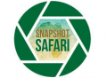

 

# Snapshot_Safari Readme:

In this repository, you will find different useful protocols and functions to analyze camera trap data from the Snapshot Safari Project.
There are some customized functions that can help to process data from the original reports.

[Snapshot Safari project](https://www.zooniverse.org/organizations/meredithspalmer/snapshot-safari) is a large-scale international camera
trap network to study and monitor the diversity and ecological dynamics of southern and eastern African mammals (see [Pardo et al 2021](https://sajs.co.za/article/view/8134)).

The project is coordinated in South Africa by Nelson Mandela University’s Wildlife Ecology Lab. The images collected by the CTs 
(as much as thousands per site) are sent to the United States (University of Minnesota) to be processed via a citizen science platform 
(Zooniverse) and machine learning (a popular IT field that allows automatized recognition of elements in an image).

Contents (main scripts)

`1_Snapshot_source_functions`   

This is a set of customized functions created to analyze camera trap data, which includes:  
	  	1. standardize names, columns, and filter non-mammals (among others)   
	  	2. get only independent records of 60 mins (you can change this)  
	  	3. Calculate RAI and species number analysis (general reports)  
	  	4. put coordinates into the reports, create final outputs  
	  	5. add the scientific name to each row  
	  	6. function to put Digikam format to snapshot format  
	  	7. create detection histories  
	  	8. create a standard procedure for biodiversity analysis  
	  	9. other simple but useful functions including general visualizations  

Most of these functions are used in other scripts included in this repository

`2_species_exploration`    
	This is a protocol with the most important steps to analyze a typical Snapshot or other camera trap report. Useful to understand the general patterns in the community. Includes functions to do mapping of richness and events (not standardize by effort), calculate survey effort and others useful exploratory plots of species records. This is a workable version with comments.

`3a_gral_biodiv_analysis`  
	This is a general (gnral) protocol for creating a basic biodiversity report based on species records (camtrap records).
	This includes all codes and outputs details as well as some useful visualizations. It is the commented code for 3b_clean_report script

*note: if your species records come from Digikam/CamTrapR, first convert this table into snapshot format first using the "digi_snap" function. 
e.g. 
  	newrep <- digi_snap(rep_MTZ, sitecode = "GOE")    
 		1 st arg = object with the original digikam report format  
 		2 nd arg = new col with the code of the site, e.g "GOE" will be the string for the whole col  
			with this run the independance before starting richness and RAI analysis  

`3b_clean_biodiv_report`   
  This is similar to the above, but this one generates a clean report with only selected outputs in HTML or PDF format (only some results, no code or process are shown). For other useful tables and helpful outputs use the working version above.
		

`4_DwC-FBIP_format_from_Digikam`   
This code transforms a manually generated species records from Digikam into the Darwin Core Format (used by FBIP)

`5_DwC-FBIP_format_from_snap_form`   
This will transform a typical Snapshot Safari report of species records to Darwin Core Format (used by FBIP)

`6_create_detection_histories`  

Create detection history for single species and multiple species in the  correct format for multispecies occupancy modeling. The results is either one csv for each species 
or one csv with all species stacked together needed for some analyses.

7. A general protocol for EDA (Exploratory Data Analysis) of covariates  
(pending)

8. Biodiversity_analysis   
(pending)

# Useful vignettes to have an idea of what some scripts do   

[2_species_exploration](https://rpubs.com/lepardov/819360)   
[3a_gral_biodiv_analysis](https://rpubs.com/lepardov/819625)  
[3b_clean_biodiv_report](https://rpubs.com/lepardov/819667)  
[4_DwC-FBIP_format_from_Digikam](https://rpubs.com/lepardov/819892)  
[5_DwC-FBIP_format_from_snap_form](https://rpubs.com/lepardov/819884)  

Note that some scripts might be interconnected so the input data might come from other scripts, so it is important to get familiar with each
output. Scripts ending in "md" provide the output of the chunks so you can see right away what the code does.

Me (Lain Pardo) nor Snapshot Safari project, take any responsibility for the use of this repository. This is meant to be a tool for
students and researchers to help them exploring and analyzing Snapshot Data, but it is their responsibility to understand the functions correctly and implement the alternatives suggested according to their needs.   

This is a work in process. If you find errors or/and want to improve this workflow, please feel free to reach out to me at Lain.Pardo@mandela.ac.za and/or commit changes directly in GitHub.  

We look forward to collaborating  

ps. if you use this repository please provide credits to the people or institutions mentioned above

